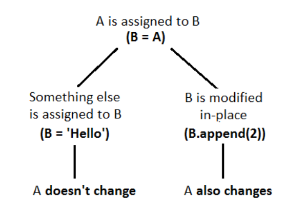

# Arguments
---


It is also possible to define functions with a variable number of arguments. There are __three forms__, which can be combined.

### Default Argument Values
---

```python
def greet(name, msg="Good morning!"):
    """ This function greets to the person with the provided message.
	    If the message is not provided, it defaults to "Good morning! """

    print("Hello", name + ', ' + msg)

greet("Kate")
greet("Bruce", "How do you do?")

#>Hello Kate, Good morning! 
#>Hello Bruce, How do you do?
```


The default values are evaluated at the point of function definition in the _defining_ scope, so that
```python
i = 5

def f(arg=i):
    print(arg)

i = 6
f()

#> 5
```

The default value is evaluated only once. This makes a difference when the default is a mutable object such as a list, dictionary, or instances of most classes. For example, the following function accumulates the arguments passed to it on subsequent calls:

```python
def f(a, L=[]):
    L.append(a)
    return L

print(f(1))
print(f(2))
print(f(3))

#>[1]
#>[1, 2]
#>[1, 2, 3]
```
Check out [[#Pass by Reference and Pass by value in Python]] section for more clarity on this! Highly suggested.


### Keyword Arguments (Named Arguments)
---
Functions can also be called using [keyword arguments](https://docs.python.org/3/glossary.html#term-keyword-argument) of the form `kwarg=value`.

```python
def greet(name, msg):
    print (f'Hello, {name} says {msg}')

greet(msg = 'Get outta here', name = 'Ryan') #Order doesn't matter

#>Hello, Ryan says Get outta here
```

>We can mix positional arguments with keyword arguments during a function call. ___In a function call, keyword arguments must follow positional arguments.___

```python
def greet(name, msg, department):
    print (f'Hello, {name} from {department} says {msg}')

greet("Bob", department= 'Systems', msg = "It's working") #Positional Arguments first, Then comes the keyword arguments!

#This should be kept in mind while creating the function definition, order the parameters such that keyword arguments come last. See next code

#>Hello, Bob from Systems says It's working
```

```python
# If we wanted name and department to be positional args and msg to be keyword arg

def greet(name,department, msg):
    print (f'Hello, {name} from {department} says {msg}')

greet("Bob",'Systems',msg = "It's working") 

#>Hello, Bob from Systems says It's working
```


No argument may receive a value more than once.
```python
def function(a):
    pass

function(0, a=0)

#>TypeError: function() got multiple values for argument 'a'
```


### Special parameters
---
For readability and performance, it makes sense to restrict the way arguments can be passed so that a developer need only look at the function definition to determine if items are passed by position, by position or keyword, or by keyword.

>Strictly  Follow this convention

```syntax
def f(pos1, pos2, /, pos_or_kwd, *, kwd1, kwd2):
      -----------    ----------     ----------
        |             |                  |
        |        Positional or keyword   |
        |                                - Keyword only
         -- Positional only
```
where `/` and `*` are optional. If used, these symbols indicate the kind of parameter by how the arguments may be passed to the function: positional-only, positional-or-keyword, and keyword-only.

If `/` and `*` are not present in the function definition, arguments may be passed to a function by position or by keyword.

```python
def func(pos1, pos2,/,pos_or_key,*,kwd1, kwd2):
    pass

func(1,2,pos_or_key=2,kwd1=1,kwd2=10)
```

```python
def standard_arg(arg):
    print(arg)

def pos_only_arg(arg, /):
    print(arg)

def kwd_only_arg(*, arg):
    print(arg)

def combined_example(pos_only, /, standard, *, kwd_only):
    print(pos_only, standard, kwd_only)
```

>As guidance:
>
>* Use positional-only if you want the name of the parameters to not be available to the user. This is useful when parameter names have no real meaning, if you want to enforce the order of the arguments when the function is called or if you need to take some positional parameters and arbitrary keywords.
>
>* Use keyword-only when names have meaning and the function definition is more understandable by being explicit with names or you want to prevent users relying on the position of the argument being passed.
>
>* For an API, use positional-only to prevent breaking API changes if the parameter’s name is modified in the future.


### Arbitrary Argument Lists (\*args  and \**kwargs)
---

#### \*args
---
* __\*args__ are arbitrary number of non-keyword arguments (positional)
- Note that args in not a keyword hence any valid identifier can be used in its place.

```python
def adder(*args):
    sum = 0
    
    for n in args:
        sum = sum + n

    print("Sum:",sum)

adder(3,5)
adder(4,5,6,7)
adder(1,2,3,5,6)

#>Sum: 8  
#>Sum: 22
#>Sum: 17
```

\*args are taken as Tuple in python
```python
def foo(*args):
    print("\nData type of argument:",type(args))
    print(args)

foo(1,2,3,100)

#>Data type of argument: <class 'tuple'> 
#>(1, 2, 3, 100)
```

Passing \*\*args from one function/Class to another (same applies to [[#* *kwargs]])
```python
class Demo:
    def __init__(self):
        pass

    def foo(self, **kwds):
        print(kwds)
        temp = Sub(**kwds)    # the keyword arg's are being passed as parameter for another class
        self.bla(**kwds)    #the keyword arg's are passed as parameters for another function

    def bla(self, **new):
        print(new)

class Sub:
    def __init__(self, **kwds):
        print(kwds)

obj = Demo()
obj.foo(key1 = 1, key2 = 2)

#>{'key1': 1, 'key2': 2} 
#>{'key1': 1, 'key2': 2} 
#>{'key1': 1, 'key2': 2}
```


#### \*\*kwargs
---
* \*\*kwargs are arbitary number of keyword arguments.
* Note that kwargs in not a keyword hence any valid identifier can be used in its place.

```python
def intro(**data):
    for key, value in data.items():
        print("{} is {}".format(key,value))

intro(Firstname="Sita", Lastname="Sharma", Age=22, Phone=1234567890)


#> Firstname is Sita 
#> Lastname is Sharma 
#> Age is 22 
#> Phone is 1234567890
```

\*\*kwargs are taken as Dictionaries in pyhton
```python
def foo(**kwargs):
    print("\nData type of argument:",type(kwargs))
    print(kwargs)

foo(key1 = 1, key2 = 100, key3 = 18)

#>Data type of argument: <class 'dict'> 
#>{'key1': 1, 'key2': 100, 'key3': 18}
```


# Pass by Reference and Pass by value in Python

- There is no concept of pass by value and pass by reference in python! (I am guessing)
- Refer this for more information [python - How do I pass a variable by reference? - Stack Overflow](https://stackoverflow.com/questions/986006/how-do-i-pass-a-variable-by-reference)
- Remember this simplified version on how the way Python treats variables and parameters. It doesn't matter if A is mutable or not. If you assign something different to B, _A doesn't change_. If an object is mutable, you can mutate it, sure. But that has nothing to do with assignment directly to a name.




```python
def passBy(data):
    data = 1000
    print("value of data inside the function scope: ", data)

data = 1
print("value of data initially: ", data)

passBy(data)
print("value of data finally: ", data)

"""
Output :
value of data initially: 1 
value of data inside the function scope: 1000 
value of data finally: 1

"""
```

```python
def passBy(data):
    data = [1000]
    print("value of data inside the function scope: ", data)

data = [1]
print("value of data initially: ", data)

passBy(data)
print("value of data finally: ", data)


"""
Output :
value of data initially: [1] 
value of data inside the function scope: [1000] 
value of data finally: [1]

"""
```

```python
def passBy(data):
    data.append(1000)    #Inplace
    print("value of data inside the function scope: ", data)

data = [1]
print("value of data initially: ", data)

passBy(data)
print("value of data finally: ", data)

"""
Output :
value of data initially: [1] 
value of data inside the function scope: [1, 1000] 
value of data finally: [1, 1000]

"""
```

> What confuses most people is assignment to a subscription; e.g. `B[0] = 2`, vs. direct assignment, `B = 2`.
> Refer [Martijn Pieters's comment in Zenadix's answer in this url](https://stackoverflow.com/questions/986006/how-do-i-pass-a-variable-by-reference)) 

```python
class Test:
    def __init__(self):
        self.attr = [1,2,3]
        print(self.attr)
    
    def tryin(self)->None :
        cur = self.attr
        cur = [100,200,300]   #Direct assignment won't change self.attr
        print(self.attr)

obj = Test()
obj.tryin()

"""
Output :
[1, 2, 3] 
[1, 2, 3]
"""
```

```python
class Test:
    def __init__(self):
        self.attr = [1,2,3]
        print(self.attr)
    
    def tryin(self)->None :
        cur = self.attr
        cur[0] = 100      #Assignment on subscription changes self.attr
        cur[1] = 200
        cur[2] = 300 
        print(self.attr)

obj = Test()
obj.tryin()

"""
Output:
[1, 2, 3] 
[100, 200, 300]
"""
```


# Lambda Expressions
---
* Small anonymous functions can be created with the [`lambda`](https://docs.python.org/3/reference/expressions.html#lambda) keyword.
* They are syntactically restricted to a single expression.
* Lambda functions can be used wherever function objects are required.
* Like nested function definitions, lambda functions can reference variables from the containing scope:

```syntax
lambda arguments : expression
```

```python
def get_longer(collection1:list[int], collection2:list[int])->list[int]:
    if len(collection1) > len(collection2):
        return collection1
    else:
        return collection2

print(get_longer([1,2],[1,2,3,4]))

>[1,2,3,4]
```

```python
#can have more than one argument
get_longer = lambda collection1, collention2: collection1 if len(collection1) > len(collention2) else collention2
print(get_longer([1,2],[1,2,3,4]))

>[1,2,3,4]
```


```python
pairs = [(2, 'two'), (3, 'three'),(1, 'one'),  (4, 'four')]

pairs.sort(key = lambda pair:pair[0])

print(pairs)

>>>[(1, 'one'), (2, 'two'), (3, 'three'), (4, 'four')]
```


# Docstrings
---
Here are some conventions about the content and formatting of documentation strings.

* Here are some conventions about the content and formatting of documentation strings.
* This line should begin with a capital letter and end with a period.
* If there are more lines in the documentation string, the second line should be blank, visually separating the summary from the rest of the description. The following lines should be one or more paragraphs describing the object’s calling conventions, its side effects, etc.
* the first line is generally adjacent to the string’s opening quotes

```python
def my_function():
    """Do nothing, but document it.

    No, really, it doesn't do anything.
    """
    pass

print(my_function.__doc__)


> Do nothing, but document it.

    No, really, it doesn't do anything.
```

Observe the indentation in the output, to know how it works checkout [4. More Control Flow Tools — Python 3.11.1 documentation](https://docs.python.org/3/tutorial/controlflow.html#documentation-strings)

# Function Annotations
---
- [Function annotations](https://docs.python.org/3/reference/compound_stmts.html#function) are completely optional metadata information about the types used by user-defined functions (see [**PEP 3107**](https://peps.python.org/pep-3107/) and [**PEP 484**](https://peps.python.org/pep-0484/) for more information).
	
-  [Annotations](https://docs.python.org/3/glossary.html#term-function-annotation) are stored in the `__annotations__` attribute of the function as a dictionary and have no effect on any other part of the function.

```python
def is_present(nums:list[int], target:int) -> bool :
    """Return True if target present in nums."""

    if target in nums:
        return True
    else:
        return False

print(is_present([1,2,3],0))

#>False
```