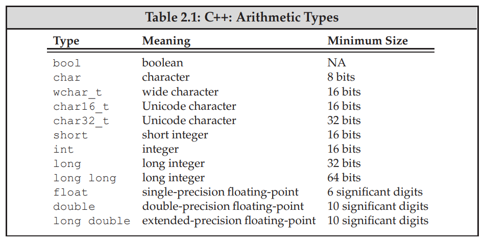

C++ defines a set of primitive types that include the __arithmetic types__ and a special type named __void__.

## 2.1.1 Arithmetic Types



<br/>

#### Signed and Unsigned types

> Make notes

<br/>

## 2.1.2 Type conversions

Among the operations that many types support is the ability to convert objects of the given type to other, related types.
- Type conversions happen automatically when we use an object of one type where an object of another type is expected

```cpp
bool b = 42;   // bis true
int i = b;     // ihas value 1
i = 3.14;      // ihas value 3
double pi = i; // pihas value 3.0
unsigned char c = -1; // assuming 8-bit chars, chas value 255 signed char c2 = 256; 
signed char c2 = 256; // assuming 8-bit chars, the value ofc2is undefined
```

<br/>
<br/>

## 2.1.3 Literals

- when a value is self evident it is a literal.
- Every literal has a type. The form and value of a literal determine its type.

<br/>

### Integer and Floating-Point Literals

- We can write an integer literal using decimal, octal, or hexadecimal notation.
- Normal integers are decimal
	```
	20
	```
- Integer literals that begin with 0 (zero) are interpreted as octal.
	```
	024
	```
- Those that begin with either 0x or 0X are interpreted as hexadecimal. 
	```
	0x14
	```


- Although integer literals may be stored in signed types, technically speaking, the value of a decimal literal is never a negative number. If we write what appears to be a negative decimal literal, for example, -42, the minus sign is not part of the literal. The minus sign is an operator that negates the value of its (literal) operand.

- Floating-point literals include either a decimal point or an exponent specified using scientific notation. Using scientific notation, the exponent is indicated by either E or e:
	```
	3.14159 3.14159E0 0. 0e0 .001
	```

<br/>

### Character and Character String Literals

- A character enclosed within single quotes is a literal of type char.
	```
	’a’ // character literal
	```
- Zero or more characters enclosed in double quotation marks is a string literal:
	```
	"Hello World!" // string literal
	```

<br/>

### Escape Sequences

Our programs cannot use any of these characters directly. Instead, we use an escape sequence to represent such characters. An escape sequence begins with a backslash.


| Escape Sequence     | symbol |
| ----------- | ----------- |
| Newline   | \n       |
| Horizontal tab   | \t        |
| Vertical Tab | \v |
| alert (bell) | \a |
| Backspace | \b |
|Double quote | \\" |
| Single Quote | \\' |
| Backslash | \\\ |
| Carriage Return | \r |


<br/>

### Boolean and Pointer Literals

- The words true and false are literals of type bool
- The word nullptr is a pointer literal

<br/>
<br/>
<br/>
