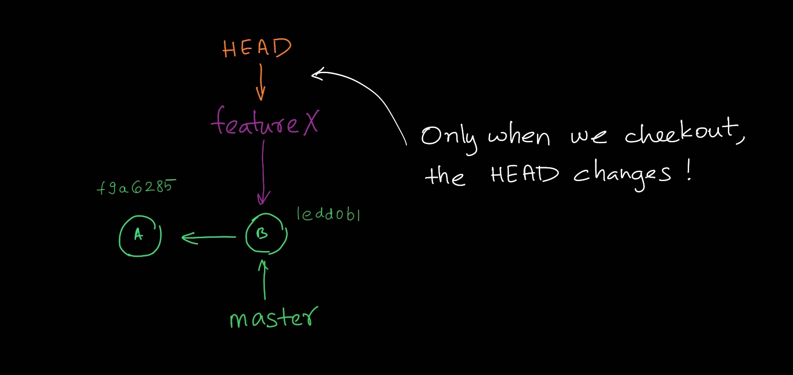
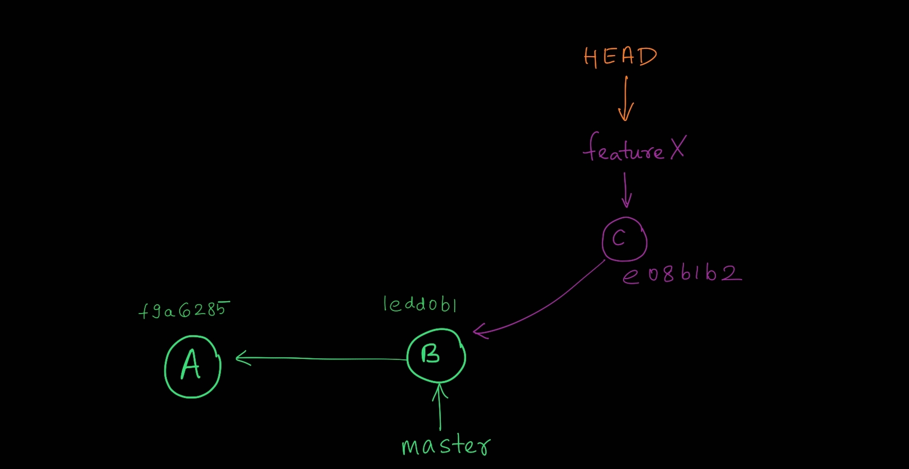

- A branch is a set of commits that trace back to the project's first commit.
- By default there is a single branch called ***master*** 
- Branches enable experimentation, team development, support multiple versions

<br>

- 

<br>

1. Branches are reffered to as ***Topic*** if it is short lived, example: feature branch, bugfix branch etc
2. Branches are reffered to as ***Base Branch*** if it is long lived, example: master branch, dev branch, release branch etc

<br>

- 

<br>
<br>


# View branches

The following command will list all the branches in the repo with the current branch in green color.
```
git branch
```

```
$ git branch
* master
```
<br>

# Creating a branch

- Creating a branch essentially creates a reference to the current commit. It doesn't modify the HEAD!

    ```
    git branch <name>
    ```

- Let us create a topic branch named featureX so that we can try to add a feature using `git branch featureX` 

    ```
    $ git branch featureX

    $ git log --oneline
    1edd0b1 (HEAD -> master, tag: header, featureX) Added module header
    f9a6285 created moviedb.py
    ```
<br>

- 

<br>
<br>


# Checkout

- To change the branch (i.e. HEAD), we have to checkout to that branch.

- Checkout does 2 things:
    1. Updates the HEAD reference from current commit to the checkedout branch label
    2. Updates the working tree with the commit's files

```
git checkout <branch or commit SHA-1>
```

- Let's checkout to the featureX branch 

    ```
    $ git checkout featureX
    Switched to branch 'featureX'   
    ```
- See the current branch using `git branch`
    ```
    $ git branch
    * featureX
    master
    ```
- View the log
    ```
    $ git log --oneline
    1edd0b1 (HEAD -> featureX, tag: header, master) Added module header
    f9a6285 created moviedb.py  
    ```

<br>

- 

<br>


> <br>
> We can create and checkout to that branch in a single command using `git checkout -b <name>` <br>
> <br>


<br>


- Let us add the function for classifying genre (our featureX), commit it and then view log

    ```
    $ git add . && git commit -m "added featureX"
    [featureX e08b1b2] added featureX
    1 file changed, 4 insertions(+), 1 deletion(-) 

    $ git log --oneline --graph
    * e08b1b2 (HEAD -> featureX) added featureX
    * 1edd0b1 (tag: header, master) Added module header
    * f9a6285 created moviedb.py
    ```
<br>

- 

<br>

# Deleting a branch

deleting a branch is basically deleting the branch label!

```bash
git branch -d <name>
```
<br/>
<br>

# Renaming a branch

```
git checkout <branch>
git branch -m <old name> <new name>
```


<br/>
<br>


# Detached head

- When HEAD directly points to a SHA-1 hash instead of a reference like master, it's a detached HEAD.

- We use `git checkout HEAD~`

    ```
    $ git checkout HEAD~
    Note: switching to 'HEAD~'.

    You are in 'detached HEAD' state. You can look around, make experimental
    changes and commit them, and you can discard any commits you make in this
    state without impacting any branches by switching back to a branch.

    If you want to create a new branch to retain commits you create, you may
    do so (now or later) by using -c with the switch command. Example:

    git switch -c <new-branch-name>

    Or undo this operation with:

    git switch -

    Turn off this advice by setting config variable advice.detachedHead to false

    HEAD is now at 1edd0b1 Added module header
    ```

- 

<br>
<br>

# Dangling commits

- dangling commits are those commits present in a branch that was deleted before merging.

- If we delete our featureX branch, we'll end up with dangling commits. So let's do that using 

    ```
    git branch -d featureX
    ```

    ```
    $ git branch -d featureX
    error: The branch 'featureX' is not fully merged.
    If you are sure you want to delete it, run 'git branch -D featureX'.

    $ git branch -D featureX
    Deleted branch featureX (was 7faf96e).

    $ git log --oneline --graph
    * 1edd0b1 (HEAD, tag: header, master) Added module header
    * f9a6285 created moviedb.py
    ```

- 

<br>
<br>

# Undoing an accidental branch delete

- `git reflog` displays a local list of recent HEAD commits.
- Find the SHA-1 of the dangling commit from that list
- create the branch and checkout using `git checkout -b <name> <SHA-1>`


    ```
    $ git checkout -b featureX e08b1b2
    Previous HEAD position was 1edd0b1 Added module header
    Switched to a new branch 'featureX'

    $ git log --oneline --graph
    * e08b1b2 (HEAD -> featureX) added featureX
    * 1edd0b1 (tag: header, master) Added module header
    * f9a6285 created moviedb.py
    ```

<br/>