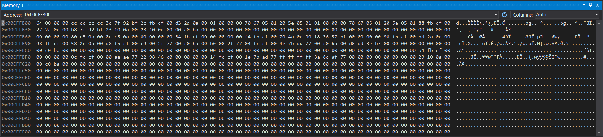
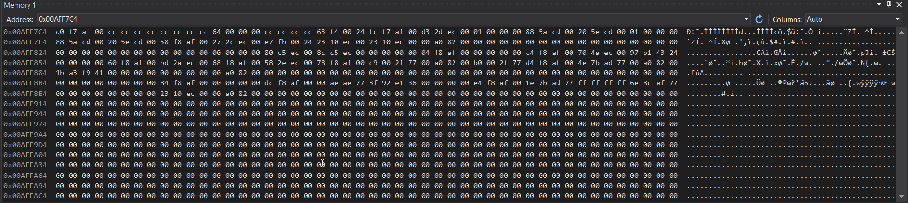

# Accessing the memory viewer panel

- Insert breakpoints and run debugging.
- It can be found under Debug > Windows > Memory
- To see the value in a memory address, insert the address (hex notation, with prefix 0x)

<br>
<br>

# Illustrations

- Viewing int values in memory

  ```cpp
  int main()
  {
      int num = 100;
      cout << &num << endl;   //00CFFB00
      cout << "This is a dummy expression so that debugger stays here while I view memory." << endl;
  }
  ```

  

  - In the memory view if we input 0x00CFFB0 (the address we got from cout), we can see that the value **64** is present, 64 is the hexadecimal here and it is 100 in decimal.
  - We can also observe that since int takes up 4 bytes of memory, we see that 3 bytes beside **64** are 00. i.e. 64 00 00 00.

<br>
<br>

- Viewing string values.

  ```cpp
  int main()
  {
      string name = "Stevie";
      cout << &name << endl;   //006FF87C
      cout << "This is a dummy expression so that debugger stays here while I view memory." << endl;
  }
  ```

  

  - After entering the memory address of name, we can see "Stevie" on the right side of the memory panel.

<br>
<br>

- Viewing pointer values (address) in the memory

  ```cpp
  int main()
  {
      int num = 100;
      int* ptr = &num;
      cout << ptr << endl;  //00AFF7D0
      cout << &ptr << endl; //00AFF7C4
      cout << "This is a dummy expression so that debugger stays here while I view memory." << endl;
  }
  ```

- 

  - If we observe the value stored in the address of the pointer ptr (0x00AFF7C4), we see the address of _num_ but kinda backwards (d0 f7 af 00), not aware more than this!
