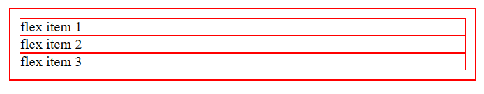
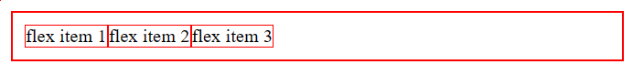
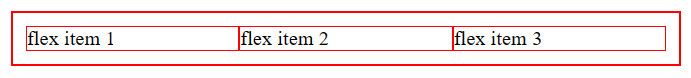
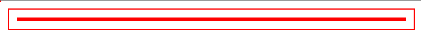
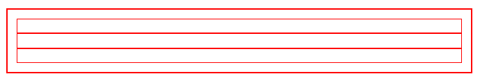

- Flexbox is a way to arrange items into rows or columns. These items will flex (i.e. grow or shrink) based on some simple rules that you can define.

- Some of these properties belong on the **flex container**, while some go on the **flex items**.

<br>

- A flex container is any element that has `display: flex` on it.
- A flex item is any element that lives directly inside of a flex container.

* Note that any element can be both flex container and flex items.

* Container without display property:

  ```js
  div.container {
  padding: 10px;
  }
  ```

  

* Container with `display:flex `
  ```css
  div.container {
    display: flex;
    padding: 10px;
  }
  ```
  

<br>
<br>

# Growing and Shrinking

- The `flex` declaration is actually a shorthand for 3 properties (`flex-grow`, `flex-shrink` and `flex-basis`) that you can set on a flex item.
- `flex:1` (`flex: 1 1 0`) equates to `flex-grow: 1`, `flex-shrink : 1`, `flex-basis:0`.
- `flex:auto` equates to `flex-grow: 1`, `flex-shrink : 1`, `flex-basis:auto`.

<br>

> Shorthand properties are CSS properties that let you set the values of multiple other CSS properties simultaneously. Using a shorthand property, you can write more concise (and often more readable) stylesheets, saving time and energy.

<br>

- setting flex:1 on flex item 1

  ```css
  div.container {
    display: flex;
    padding: 10px;
  }

  div#item1 {
    flex: 1;
  }

  div#item2 {
  }

  div#item3 {
  }
  ```

  

* setting `flex:1` on all items:

  ```css
  div.container {
    display: flex;
    padding: 10px;
  }

  div#item1 {
    flex: 1;
  }

  div#item2 {
    flex: 1;
  }

  div#item3 {
    flex: 1;
  }
  ```

  

<br>

## `flex-grow`

- It is used in Flexbox layouts to control how much an element should grow in proportion to the available space within a flex container.
- If we instead add `flex: 2` to just one of the divs, then that div would grow to 2x the size of the others.

<br>

## `flex-shrink`

- flex-shrink is a CSS property used in Flexbox layouts to control how much an element should shrink in relation to its flex container when the available space in the container is insufficient to accommodate all the flex items at their specified sizes.

## `flex-basis`

- The flex-basis property accepts a value that represents the initial size of the flex item, from which the growing and shrinking occurs.
- the shortand `flex:1` interprets the flex-basis as `flex-basis:0%`, this will ignore the `width` property (if any is present)
- Using `flex-basis:auto` tells the item to check for a width declaration (ex:`width: 250px`).

  <br>
  <br>

# Axes (Orientation)

- We can control the orientation of items within a flex container using `flex-direction`.
- `flex-direction:column` flex's the items vertically

* One thing to note is that in this example, flex-direction: column would not work as expected if we used the shorthand flex: 1. Try it out now (i.e. go change the flex value on the flex: 1 1 auto; line).

* The reason for this is that the flex shorthand expands flex-basis to 0, which means that all flex-growing and flex-shrinking would begin their calculations from 0. Empty divs by default have 0 height, so for our flex items to fill up the height of their container, they don’t actually need to have any height at all.

* Empty div flex items would collapse in the following scenario as explained above

  ```css
  div.container {
    display: flex;
    flex-direction: column;
    padding: 10px;
  }

  div#item1 {
    flex: 1;
  }

  div#item2 {
    flex: 1;
  }

  div#item3 {
    flex: 1;
  }
  ```

  

* Giving some height to the parent container and setting flex:1 would flex it:

  ```css
  div.container {
    display: flex;
    flex-direction: column;
    padding: 10px;
    height: 50px;
  }
  div#item1 {
    flex: 1;
  }
  div#item2 {
    flex: 1;
  }
  div#item3 {
    flex: 1;
  }
  ```

  

    <br>
    <br>

# Allignment

- `justify-content` is used to align items across the **main axis**.
- `align-items` is used to align items along the **cross axis**.
- Note that to allign items we must remove the flex property from the **flex items** and add either of the above mentioned properties to the **_parent container_**.

<br>

## `justify-content`

- `justify-content: start`

  ```css
  div.container {
    display: flex;
    padding: 10px;
    justify-content: start;
  }
  ```

  

- `justify-content: end`

  ```css
  div.container {
    display: flex;
    padding: 10px;
    justify-content: end;
  }
  ```

  

- `justify-content: center`

  ```css
  div.container {
    display: flex;
    padding: 10px;
    justify-content: center;
  }
  ```

  

- `justify-content: space-between`

  ```css
  div.container {
    display: flex;
    padding: 10px;
    justify-content: space-between;
  }
  ```

  

- `justify-content: space-around`

  ```css
  div.container {
    display: flex;
    padding: 10px;
    justify-content: space-around;
  }
  ```

  

<br>

## `align-items`

- `align-items:start`

  ```css
  div.container {
    display: flex;
    padding: 10px;
    align-items: start;
  }
  ```

- `align-items:end`

  ```css
  div.container {
    display: flex;
    padding: 10px;
    align-items: end;
  }
  ```

- `align-items:center`

  ```css
  div.container {
    display: flex;
    padding: 10px;
    align-items: center;
  }
  ```

- `align-items:space-between`

  ```css
  div.container {
    display: flex;
    padding: 10px;
    align-items: space-between;
  }
  ```

- `align-items:space-around`
  ```css
  div.container {
    display: flex;
    padding: 10px;
    align-items: space-around;
  }
  ```
