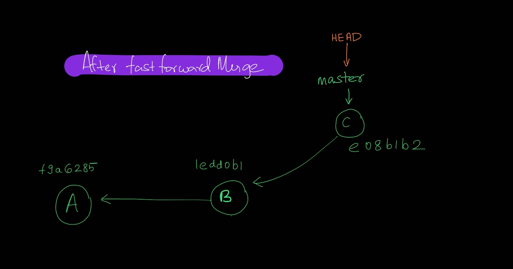
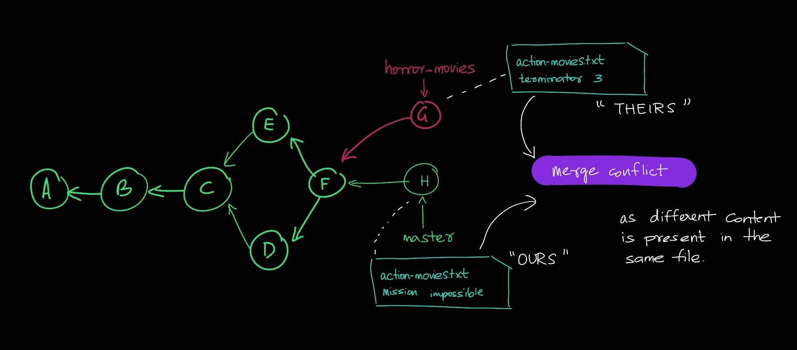

- There are 4 types of merges:
    1. fast forward merge
    2. merge commit
    3. squash commit
    4. rebase

<br>
<br>

# 1 Fast forward merge 

- Moves the base branch label to the tip of the topic branch.
- Condition: This type of merge is possible only if no other commits have been made to the base branch since branching. i.e. git will not allow this merge if this condition is not satisfied.
- fast-forward merge is the default merge, if not possible then it defaults to merge commit.

    ```bash
    git checkout <basebranch>
    git merge <topicbranch>
    git branch -d <topicbranch>
    ```

    ```
    $ git checkout master
    Switched to branch 'master'

    $ git merge featureX
    Updating 1edd0b1..e08b1b2
    Fast-forward
    moviedb.py | 5 ++++-
    1 file changed, 4 insertions(+), 1 deletion(-)

    $ git branch -d featureX
    Deleted branch featureX (was e08b1b2).

    $ git log --oneline --graph
    * e08b1b2 (HEAD -> master, featureX) added featureX
    * 1edd0b1 (tag: header) Added module header
    * f9a6285 created moviedb.py
    ```

- 

<br>
<br>

# 2 Merge Commit

- merge commit combines the commits at the tips of the merged branches and places the result in the merge commit.
- git automatically defaults to merge commit if fast-forward merge is not possible.
- Performing merge commit is exactly like performing fast-forward merge.

    ```bash
    git checkout <basebranch>
    git merge <topicbranch>
    git branch -d <topicbranch>
    ```

- Say we create and checkout a new branch called *featureY*, we commit in that branch after adding the feature. Assume at the same time there were commits made in the master branch (to do this we first checkout to *master*). Say we added action-movies.txt and then commited the changes in the master branch. Now when we merge the *featureY* branch to *master*, it'll be merge commit!


    ```
    $ git merge featureY
    Merge made by the 'ort' strategy.
    moviedb.py | 3 +++
    1 file changed, 3 insertions(+)

    $ git log --oneline --graph
    *   9a5026d (HEAD -> master) Merge branch 'featureY'
    |\
    | * b732142 (featureY) Added featureY
    * | b754768 action-movies.txt added!
    |/
    * e08b1b2 added featureX
    * 1edd0b1 (tag: header) Added module header
    * f9a6285 created moviedb.py
    ```


- 
- 

<br>

## Forcing merge commit

In a scenario where fast-forward merge is possible but we want merge commit, we can force it:

```bash
git checkout <basebranch>
git merge --no-ff <topicbranch>
git branch -d <topicbranch>
```


<br>
<br>


# Merge Conflicts

Merge conflict occurs when we try to merge commit and the same entity (or entities) is modified in different ways. Better understood with the following illustration.

- Let's create and checkout to a new branch called horror-movies. 
- Firstly, lets add a txt file horror-movies.txt and add couple of horror movies.
- Secondly, lets modify the existing empty action-movies.txt with one entry of *terminator*
- Now Say someone from the master branch added a commit where they entered *mission impossible* to the empty action-movies.txt file. (Note that master branch is isolated and has a different working tree from the horror-movies branch)
- Now, when we try to merge we get a merge conflict as action-movies.txt is different in the 2 commits.

    ```
    $ git merge horror-movies
    Auto-merging action-movies.txt
    CONFLICT (content): Merge conflict in action-movies.txt
    Automatic merge failed; fix conflicts and then commit the result.
    ```
    
- The following is shown in the code editor, The stuff in between <<<<<<< and ======= is "OURS" and stuff between ======= and >>>>>>> is "THEIRS", we have to manually modify the file to resolve the confict.
    ```
    <<<<<<< HEAD
    mission impossible
    =======
    terminator3
    >>>>>>> horror-movies
    ```

-  After resolving the merge conflict in the code editor:
    ```
    $ git log --oneline --graph
    *   c218084 (HEAD -> master) Merge branch 'horror-movies'
    |\
    | * dca5bc1 (horror-movies) Added horror-movies.txt
    * | e87568a modified action-movies.txt
    |/
    *   9a5026d Merge branch 'featureY'
    |\
    | * b732142 Added featureY
    * | b754768 action-movies.txt added!
    |/
    * e08b1b2 added featureX
    * 1edd0b1 (tag: header) Added module header
    * f9a6285 created moviedb.py
    ```

- 