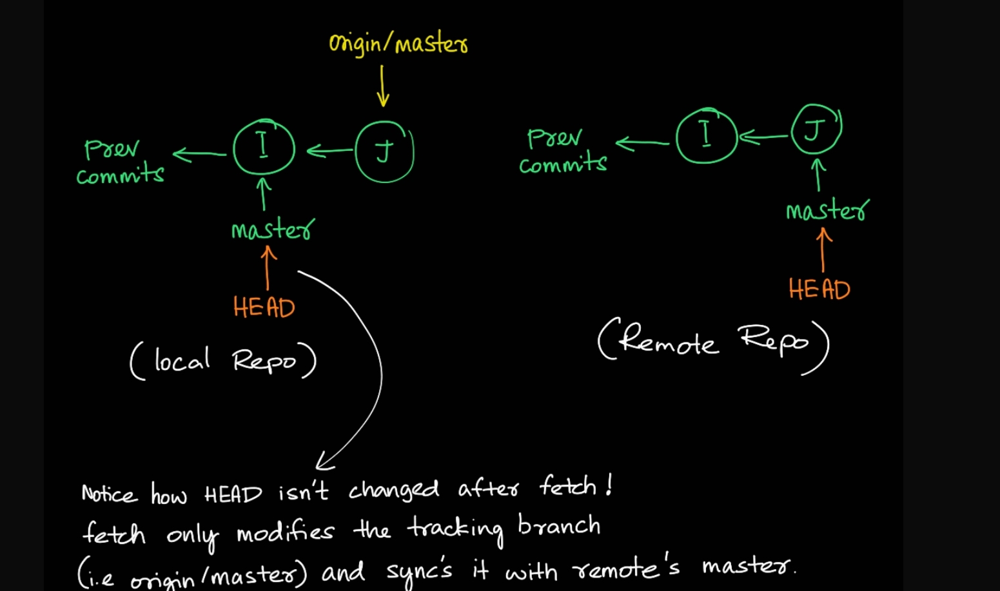

# Network Commaands

Network commands communicate with the remote repo.

1. Clone - Copies the remote repo as local repo.
2. Fetch - Retrieves new objects and references from the remote repo.
3. Pull - Fetches and Merge commits locally.
4. Push - Adds new objects and references to the remote repository.

<br>
<br>

# Fetch

```
git fetch <repo>
```

- The git fetch command downloads commits, files, and refs from a remote repository into the local repo.
- It essentially changes the tracking branch reference and syncs it with the remote repo.

- We can see that the HEAD, master and the tracking branch reference origin/master all point to the same commit

    ```
    $ git log origin/master --oneline --graph
    *   c218084 (HEAD -> master, origin/master) Merge branch 'horror-movies'
    |\
    | * dca5bc1 (horror-movies) Added horror-movies.txt
    * | e87568a modified action-movies.txt
    |/
    *   9a5026d Merge branch 'featureY'
    |\
    | * b732142 Added featureY
    * | b754768 action-movies.txt added!
    |/
    * e08b1b2 added featureX
    * 1edd0b1 (tag: header) Added module header
    * f9a6285 created moviedb.py
    ```

<br>

- 

<br>

- Now if there is any commits made in the remote repo, the master aswell as the HEAD references will change. In our case let's create a file called comedy-movies.txt and commit it in github.

<br>

- 

<br>

- Now if we try to push again, we get error

    ```
    $ git push -u origin main
    error: src refspec main does not match any
    error: failed to push some refs to 'https://github.com/agneshraok/moviedb.git'
    ```

- Running `git fetch`,

    ```
    $ git fetch 
    remote: Enumerating objects: 4, done.
    remote: Counting objects: 100% (4/4), done.
    remote: Compressing objects: 100% (2/2), done.
    remote: Total 3 (delta 1), reused 0 (delta 0), pack-reused 0
    Unpacking objects: 100% (3/3), 657 bytes | 5.00 KiB/s, done.
    From https://github.com/agneshraok/moviedb
    c218084..d819e15  master     -> origin/master
    ```
- Running `git log origin/master --oneline --graph` :

    ```
    $ git log origin/master --oneline --graph
    * d819e15 (origin/master) Create comedy-movies.txt
    *   c218084 (HEAD -> master) Merge branch 'horror-movies'
    |\
    | * dca5bc1 (horror-movies) Added horror-movies.txt
    * | e87568a modified action-movies.txt
    |/
    *   9a5026d Merge branch 'featureY'
    |\
    | * b732142 Added featureY
    * | b754768 action-movies.txt added!
    |/
    * e08b1b2 added featureX
    * 1edd0b1 (tag: header) Added module header
    * f9a6285 created moviedb.py
    ```

<br>

- 

<br>

- At this point only the tracking branch reference is updated and the master branch aswell as the HEAD reference are not updated. Running `git status` will show that branch is behind origin/master.

    ```V
    $ git status
    On branch master
    Your branch is behind 'origin/master' by 1 commit, and can be fast-forwarded.
    (use "git pull" to update your local branch)

    nothing to commit, working tree clean
    ```

<br>
<br>

# Pull

```
git pull <repo> <branch>
```

- git pull combines git fetch and git merge FETCH_HEAD, FETCH_HEAD is an alias for the tip of the tracking branch.

- This is exactly similar to a topic branch merging into a base branch.

<br>

## pull options

| Option | Description | 
|---|---|
| --ff (default) | fast forward if possible otherwise merge commit. |
| --no--ff | always merge commit |
| --ff--only | cancel instead of doing merge commit |
| --rebase | \<see rebase docs\> |

<br>

## Pull with fast forward

- In our case, since there are not commits in the master branch of the local repo, we can pull the remote repo commits with fast forward merge. Running `git pull`,

    ```
    $ git pull
    Updating c218084..d819e15
    Fast-forward
    comedy-movies.txt | 1 +
    1 file changed, 1 insertion(+)
    create mode 100644 comedy-movies.txt


    $ git log --oneline --graph
    * d819e15 (HEAD -> master, origin/master) Create comedy-movies.txt
    *   c218084 Merge branch 'horror-movies'
    |\
    | * dca5bc1 (horror-movies) Added horror-movies.txt
    * | e87568a modified action-movies.txt
    |/
    *   9a5026d Merge branch 'featureY'
    |\
    | * b732142 Added featureY
    * | b754768 action-movies.txt added!
    |/
    * e08b1b2 added featureX
    * 1edd0b1 (tag: header) Added module header
    * f9a6285 created moviedb.py

    ```

> Note that if we have any uncommited changes in the working tree before the pull, git will abort the merge so as to not loose the progress and will ask to commit or stash the files! 

<br>

## Pull with merge commit

- If master is updated in the remote repo (Let's add Mr Bean in comedy-movies.txt in github) and some commits are done on master branch of local repo (Let's add a function in the moviedb.py file called leaderboard()), Now fast forward is not possible when we git pull,

    ```
    $ git pull
    remote: Enumerating objects: 5, done.
    remote: Counting objects: 100% (5/5), done.
    remote: Compressing objects: 100% (2/2), done.
    remote: Total 3 (delta 1), reused 0 (delta 0), pack-reused 0
    Unpacking objects: 100% (3/3), 666 bytes | 1024 bytes/s, done.
    From https://github.com/agneshraok/moviedb
    d819e15..c03e60f  master     -> origin/master
    Merge made by the 'ort' strategy.
    comedy-movies.txt | 3 ++-
    1 file changed, 2 insertions(+), 1 deletion(-)


    $ git log --oneline --graph
    *   945e777 (HEAD -> master) Merge branch 'master' of https://github.com/agneshraok/    moviedb
    |\
    | * c03e60f (origin/master) Added Mr Bean in comdey-movies.txt
    * | d1c4596 Added leaderboard function to moviedb.py
    |/
    * d819e15 Create comedy-movies.txt
    *   c218084 Merge branch 'horror-movies'
    |\
    | * dca5bc1 (horror-movies) Added horror-movies.txt
    * | e87568a modified action-movies.txt
    |/
    *   9a5026d Merge branch 'featureY'
    |\
    | * b732142 Added featureY
    * | b754768 action-movies.txt added!
    |/
    :
    ```

<br>
<br>

# Push

```
git push [-u] <repo> <branch>
```
