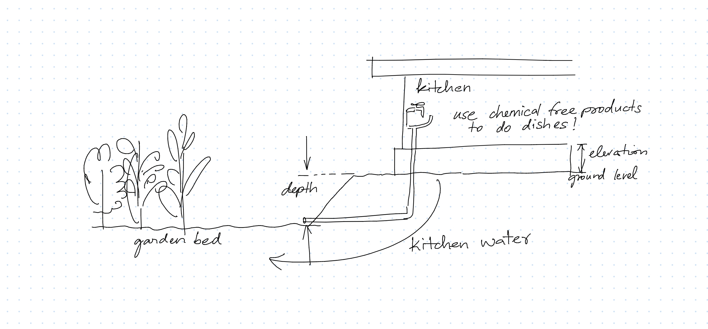

# Home Design

Thoughts on designing and planning a good home.

## Sustainability

### Kitchen

- The drain pipe in the kitchen sink must be seperated to flow to a nearby garden. Using chemical free products in the kitchen is better for all.

  
