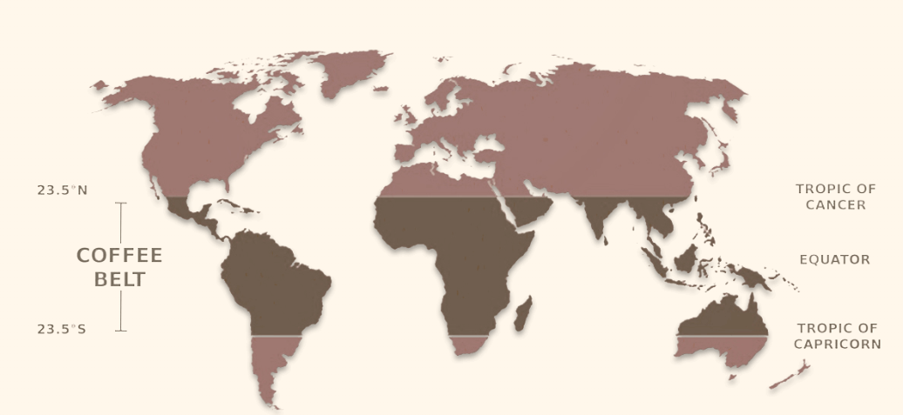

# Coffee

 
 
 

## History

- A popular Ethiopian legend says coffee is discovered by a herder named Kaldi, who found his goats full of energy after eating the red fruit of the coffee shrub.

- Coffee cultivation and trade began on the Arabian Peninsula and by the 16th century, it was known in Persia, Egypt, Syria, and Turkey. Ottoman Turks introduced coffee to the glorious power center of Constantinople. Historians believe that rapidly emerging coffee shops of Constantinople have been the first ones in this part of the world.

 
 
 

## Beans

- The coffee plant prefers fertile soil and mild temperatures, with lots of rain and shaded sun. That is why all the world’s coffee is grown in a band around the middle of the globe, the Equatorial zone called The "Bean Belt".

  

* Coffee beans determine the taste and flavor of the coffee, it is equally vital where they come from and learning about the different roasts and their effects.

- Among plenty of coffee species, commerically we drink mostly Arabica and Robusta.

* Robusta beans are pale green with a bit of brown tint and contain twice as much caffeine as Arabica.

* Arabica beans are deep green, slightly larger and contain more acidity than Robusta.
  - Roasts made from Arabica are often pricier because of high quality.

 
 
 

## Flavor

1. Taste refers to the senses inside out mouth.
1. Aroma refers to our sense of smell.
1. Flavor is how our brains merge aromas, taste and texture into an overall fulfilling experience.

 
 
 

## Roast

 
 
 

## Brew

There are essentially two ways to manually brew your coffee. one is by way of "full immersion" and the other is "pour-over".

 
 

### Full immersion

Immersion brewing is similar to brewing tea. Grounds are fully submerged into the water and once the target brew time has been reached, the grounds are filtered from the coffee.

 
 

### Pour-over brewing

Pour-over brewing is more complex than immersion - it requires more control and technique. Instead of soaking all the grounds all at once (like when brewing by immersion), the grounds are loaded into a filter and water is slowly added throughout the brewing process. The benefit of pour-over brewing is that you're in control, the disadvantage - you're in control

 

Checkout this [website](https://voltagecoffee.com/brewing-coffee-101/) for brewing methods.

 
 
 

## Reference

- Checkout this [website](https://voltagecoffee.com/coffee/)
