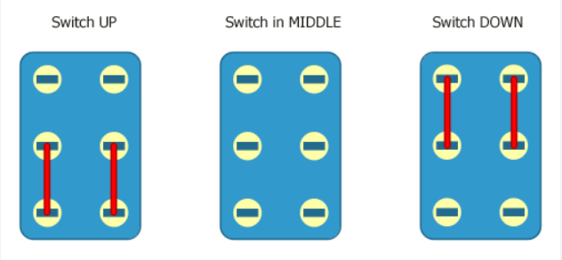

## Types of switches

Important terminology:

* Switch Pole : A switch pole describes the number of separate circuits that the switch or relay controls at a given instant.
* Switch Throw : A switch throw describes the number of output connections each pole of the switch can have.

 
 

### SPST Switch

* Single Pole Single Throw is the simplest form of a switch.
* SPST is a two terminal switch, with one source terminal connecting to one output terminal.
* SPST has one circuit which can either be "ON" or "OFF", Hence embraces "ON-OFF" control.

 

### SPDT Switch

* Single Pole Double Throw switch.
* SPDT is a three terminal switch, with one source terminal connecting to one of two output terminals.
* SPDT has one circuit which is "ON" in both cases, connects source terminal to output 1 in "ON-1" and to output 2 in "ON-2". Hence embraces "ON-ON" control.
* SPDT can also have a third condition which doesn't connect the source to any of the outputs. In this case it embraces "ON-OFF-ON" control.

 

### DPST Switch

* Double Pole Single Throw switch.
* DPST is a four terminal switch, with two source terminals connecting it's respective isolated output terminals.
* DPST has two seperate circuits, which can either be "ON" or "OFF", Hence embraces "ON-OFF" control.
* Functionally, a DPST switch is the same as two SPST switches actuated in tandem. The main advantage of a DPST switch is that both circuits are completely isolated from each other. 

 

### DPDT Switch

* Double Pole Double Throw switch.
* DPDT is a six terminal switch, with two source terminals connecting to one of it's two respective isolated output terminals.
* DPDT has two seperate circuits and can embrace three different types of control.
  * DPDT switch with "ON-ON" control.    
    

  * DPDT switch with "ON-OFF-ON" control.  
    

  * DPDT switch with "ON-ON-ON" control.  
    
  

 
