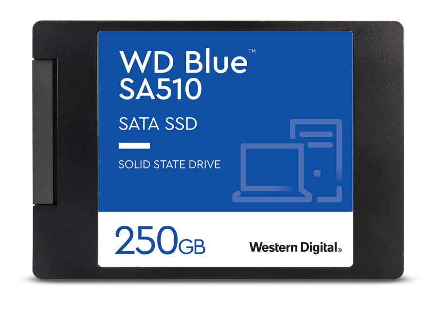
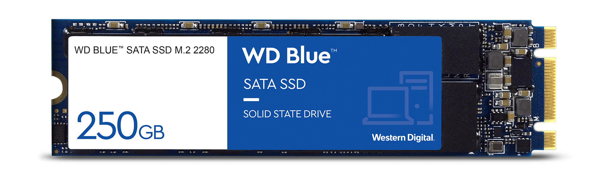
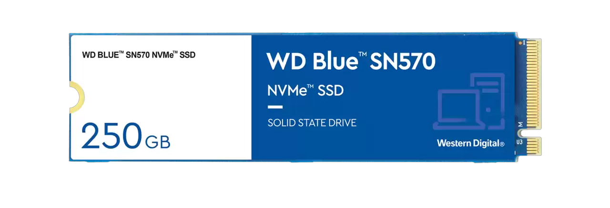

# SSD

- SSD is abreviation for Solid State Drive.
- Storage devices which are more faster, reliable and efficient than HDD.

 

### Difference between HDD and SSD

Unlike traditional Hard Disk Drives (HDDs), which store data on spinning magnetic disks, SSDs use NAND flash memory to store data.

 
 

## Form Factors of SSD

 

### 2.5 Inch SSD

- These come in 2.5 inch form factor and most likely have a SATA interface. (Hence, generally called as SATA SSD)
- They are generally known as SATA SSD.
  

 

### M.2 SSD

- These come in a much smaller form factor, mostly 22 mm wide with different lengths.
- They connect directly to the motherboard via an M.2 slot, eliminating the need for data and power cables.
- M.2 SSDs can use either the SATA interface with it's transfer protocol or PCIe interface with NVMe tansfer protocol.
- M.2 SSD with SATA interface. There are 2 notches in the connector.
  

- M.2 SSD with PCIe interface (with NVMe protocol). There is only one notch in the connector part.
  

 

Saying that M.2 SSDs are faster than 2.5 inch SSDs are not fully accurate as M.2 SSD with a SATA interface has mostly the same as 2.5 inch SSD (with SATA interface)

 
 

## References

- Refer my notes about storage interfaces and transfer protocols.
- Watch [this](https://youtu.be/5Mh3o886qpg?si=KdX4ustWKgQW6Rg1) video for deatailed explanation about the working of SSDs.
- Watch [explainingcomputers](https://youtu.be/EXLfErPEYiw?si=KfFFken6bC9z6Kgu) explain SSDs in detail.
