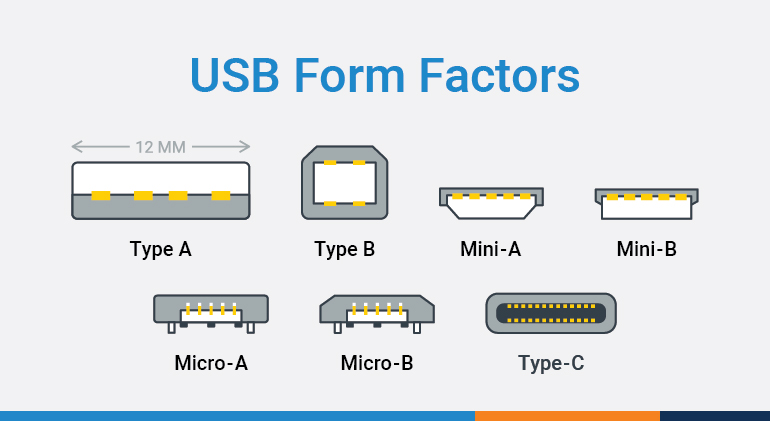
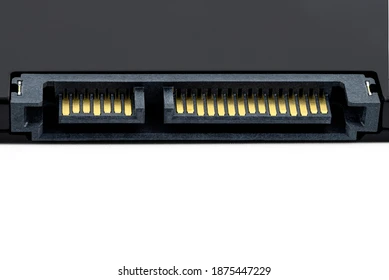
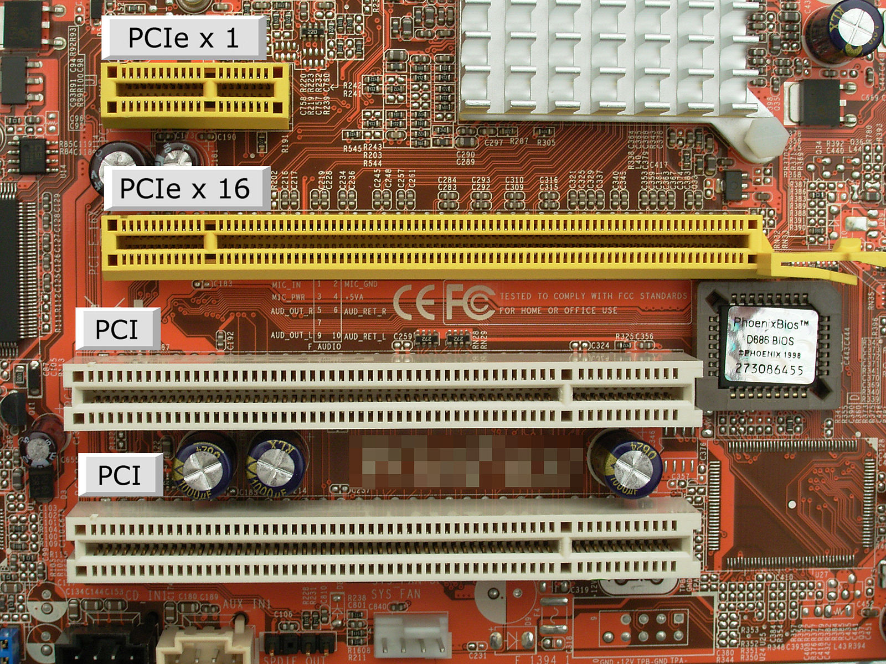
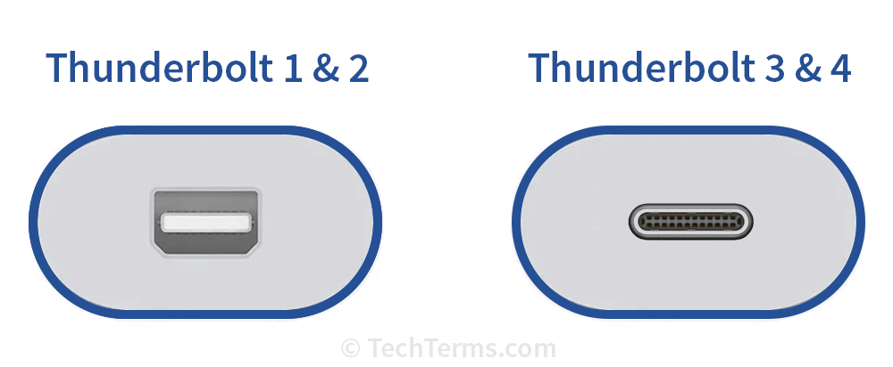

## Transfer Protocol

 

### USB (Universal Serial Bus) Protocol

- It is used by USB interfaces.

 

### NVMe (Non-Volatile Memory Express) Protocol

- It is the communication protocol or interface specification optimized for NAND flash and solid state technologies.
- It leverages the PCIe architecture to deliver performance enhancements over Advanced Host Controller Interface (AHCI), the standard that defines the operation of Serial ATA (SATA).

 
 

## Storage Interfaces

It refers to the **_physical means_** or **_physical connection_** by which a device interacts with it's storage devices.

 

### USB (Universal Serial Bus) Interface

- USB is a versatile interface used for connecting external storage devices like USB flash drives, external hard drives, and SSDs.
- The USB interface uses the USB protocol.
- There are different types of USB interfaces.

  

 

### SATA (Serial Advanced Technology Attachment)

- SATA is a widely used interface for connecting internal HDD and SSD to a computer's motherboard.
- The SATA interface typically uses either the ACHI protocol, IDE protocol.

- Following is a SATA interface, the first 7 pins are the DATA pins and the rest 15 pins are POWER pins.
  

 

### PCIe (Peripheral Component Interconnect Express)

- PCIe is a general-purpose interface used for various components like GPU, storage devices, network cards etc.
- PCIe supports NVMe transfer protocol.
- PCIe supercedes SATA.
- There are different versions of PCIe.
  

 

### Thunderbolt

- Thunderbolt is another high-speed interface used for connecting external storage devices, displays, and other peripherals to computers.
- It combines PCIe and DisplayPort technologies for high bandwidth and versatility.
- Thunderbolt uses thunderbolt protocols.
  - Display port protocol for video signals
  - Display port protocol or USB protocol for audio signals.
  - PCIe or USB protocol for data transfer.
- There are different versions of thunderbolt.
  

 
 

## References

- Check this to understand the difference between [PCIe vs NVMe](https://prodigytechno.com/are-pcie-and-nvme-the-same/)
