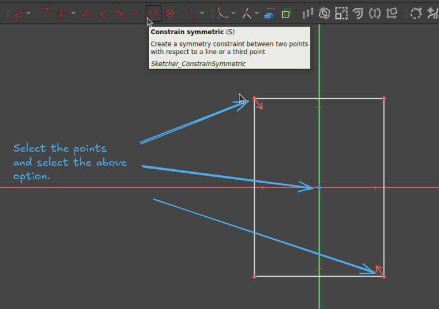
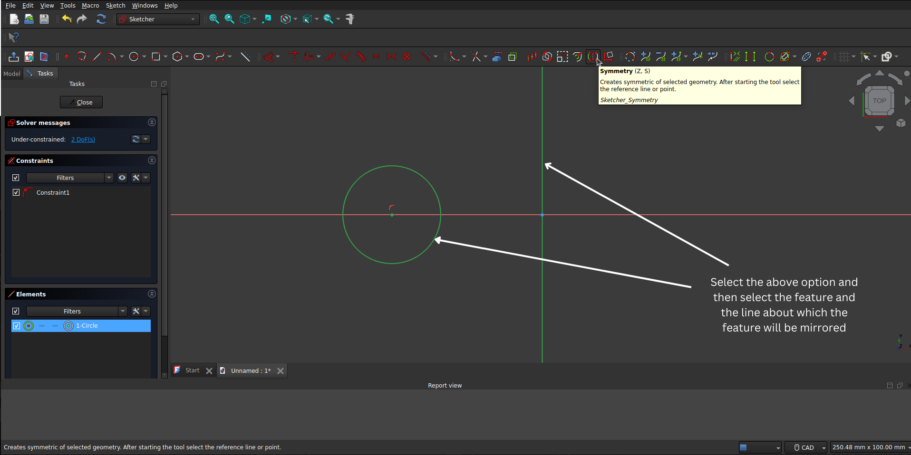

# Contents

- [Freecad](#freecad)
  - [Sketching](#sketching)
    - [Constraint symmetric](#constraint-symmetric)
    - [Symmetry](#symmetry)

 
 
 

# Freecad

 
 
 

## Sketching

 
 

### Constraint symmetric

To make entities symmetric about something.

 
 

### Symmetry

To mirror a feature about a line.

