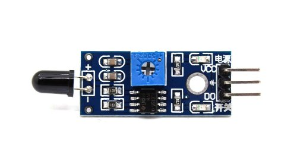

# Flame Sensor

A sensor to detect flame.

 

## Types of Flame Sensors

Primarily flame sensors can be either UV flame sensor, IR flame sensor or combination.

 
 

## IR Flame Sensor

### Working Principle of IR Flame Sensor

**_Flames emit characteristic wavelengths of infrared radiation_**, and these sensors are designed to detect those wavelengths.

 

### Hardware Details of IR Flame Sensor

#### Pins

The pins of the IR flame sensor are:

1. VCC : Power Supply Voltage.
2. GND : Ground.
3. DO : This pin provides a Digital Output signal. It typically outputs a high or low signal based on whether the sensor detects a flame.
4. AO : This pin provides an analog output signal. The voltage level on this pin may vary based on the intensity or distance of the flame detected.

- IR sensors without AO pin are also available.

 

#### Pot

The potentiometer on a flame sensor is used to adjust the sensitivity of the sensor. Specifically, it allows you to set a threshold for the digital output signal or adjust the analog signal level based on the intensity of the flame being detected.

 
 
