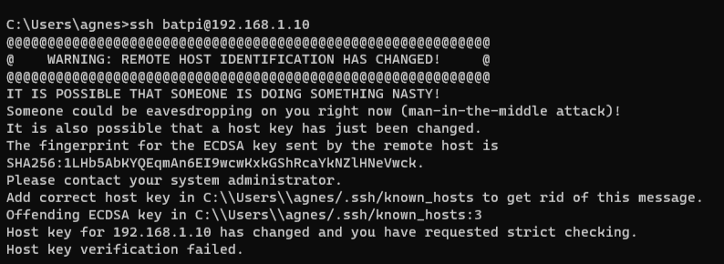

# SSH

## Install and Enable ssh

- update and install openssh-server

  ```sh
  sudo apt update
  sudo apt install openssh-server
  ```

- check the status

  ```sh
  sudo systemctl status ssh
  ```

- allow through firewall
  ```sh
  sudo ufw allow ssh
  ```

<br>

## SSH Remote Host Identification Has Changed error

- A common error that I encounter every time i change the ip address but keep the hostname same.

* The specific error is as shown here

  

- Refer [How To Fix the "Warning: Remote Host Identification Has Changed" Error (kinsta.com)](https://kinsta.com/knowledgebase/warning-remote-host-identification-has-changed/), In short clear the txt in known_hosts file present in C:\\Users\\{user}\\.ssh\\

<br>
<br>

# IP address, Gateway and DNS address

- Finding the current IP address

  ```shell
  hostname -I
  ```

- Find the routers gateway IP address

  ```shell
  ip r | grep default
  ```

- Find the DNS IP address

  ```shell
  sudo nano /etc/resolv.conf
  ```

<br>
<br>

# Enabling static IP address

- Edit the dhcpcd.conf file

  ```shell
  sudo nano /etc/dhcpcd.conf
  ```

* enter the following in the dhcpcd.conf file (uncomment if already present)

  ```
  interface {wlan0 or eth0}
  static ip_address= {ip address}/24
  static routers= {gateway address}
  static domain_name_servers= {dns server address}
  ```
