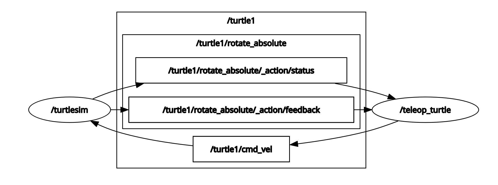

# Topics

Topics are one of the main ways in which data is moved between nodes and therefore between different parts of the system.

- A node may publish data to any number of topics and simultaneously have subscriptions to any number of topics.

<br/>
<br/>
<br/>

## rqt graph

rqt graph is a graphical introspection tool used to visualize the changing nodes and topics and the connection between them.

- Use this command to show the graph.

  ```sh
  ros2 run rqt_graph rqt_graph
  ```

* The following is the illustration

  
  - `/teleop_turtle` node publishes the keystrokes to `/turtle1/cmd_vel` topic which the `/turtlesim` node is subscribed to.

<br>
<br>
<br>

## List topics

The following command lists all the topics currently active in the system.

```bash
ros2 topic list
```

- Running the above command after executing `ros2 run turtlesim turtlesim_node` and `ros2 run turtlesim turtle_teleop_key`.

  ```
  /parameter_events
  /rosout
  /turtle1/cmd_vel
  /turtle1/color_sensor
  /turtle1/pose
  ```

<br>

The following command lists all the topics currently active in the system with the topic type appended.

```sh
ros2 topic list -t
```

- Running the above command after executing `ros2 run turtlesim turtlesim_node` and `ros2 run turtlesim turtle_teleop_key`.

  ```
  /parameter_events [rcl_interfaces/msg/ParameterEvent]
  /rosout [rcl_interfaces/msg/Log]
  /turtle1/cmd_vel [geometry_msgs/msg/Twist]
  /turtle1/color_sensor [turtlesim/msg/Color]
  /turtle1/pose [turtlesim/msg/Pose]
  ```

<br/>
<br/>
<br/>

## Echo topic

To see the data being published on a topic

```bash
ros2 topic echo <topic_name>
```

- After executing `ros2 run turtlesim turtlesim_node` and `ros2 run turtlesim turtle_teleop_key`. Run the below command and then move the turtle using the teleop terminal we'll get subsequent results

  ```
  ros2 topic echo /turtle1/cmd_vel
  ```

  ```
  linear:
  x: 2.0
  y: 0.0
  z: 0.0
  angular:
  x: 0.0
  y: 0.0
  z: 0.0
  ---
  ```

<br/>
<br/>
<br/>

## Getting topic info

Topics don’t have to only be one-to-one communication; they can be one-to-many, many-to-one, or many-to-many.

```bash
ros2 topic info <topic name>
```

- Running `ros2 topic info /turtle1/cmd_vel` will return

  ```
  Type: geometry_msgs/msg/Twist
  Publisher count: 1
  Subscription count: 2
  ```

<br>

For more detailed information, use the verbose flag

```sh
ros2 topic info <topic-name> --verbose
```

<br/>
<br/>
<br/>

# Get the details of topic message

Nodes send data over topics using messages. Publishers and subscribers must send and receive the same type of message to communicate.

- `cmd_vel` topic has the type: `geometry_msgs/msg/Twist`, [see](#list-topics). This means that in the package `geometry_msgs` there is a `msg` called `Twist`.
- To get the interface (structure of the data the message expects), run the following.

  ```bash
  ros2 interface show <msg tyoe>
  ```

* Running `ros2 interface show geometrymsgs/msg/Twist`

  ```
  This expresses velocity in free space broken into its linear and angular parts.

      Vector3  linear
              float64 x
              float64 y
              float64 z
      Vector3  angular
              float64 x
              float64 y
              float64 z
  ```

  - It means that the `/turtlesim` node is expecting a message with two vectors, `linear` and `angular`, of three elements each. Running `ros2 topic echo /turtle1/cmd_vel` and checking the values after moving the turtle.

<br/>
<br/>
<br/>

## Publishing to a topic

```bash
ros2 topic pub <topic_name> <msg_type> '<args>'
```

- The `'<args>'` argument is the actual data that will be passed to the topic, according to it's interface.
- It’s important to note that this argument needs to be input in YAML syntax.

```bash
ros2 topic pub --once /turtle1/cmd_vel geometry_msgs/msg/Twist "{linear: {x: 2.0, y: 0.0, z: 0.0}, angular: {x: 0.0, y: 0.0, z: 1.8}}"
```

Note that args something like x:2.0 will give error, it must be x: 2.0 (space in between)

- Here `--once` is an optional argument meaning “publish one message then exit”.
- To steadily operate the robot, we can use `--rate 1` for 1 Hz

<br/>
<br/>
<br/>

## The gist

```bash
ros2 topic list
ros2 topic list -t
ros2 topic echo <topic_name>
ros2 topic info <topic name>
ros2 interface show <msg type>
ros2 topic pub --once <topic name> <msg type> <args>
```
