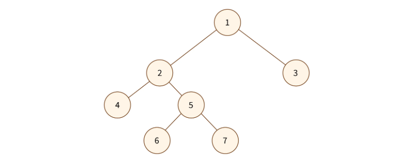
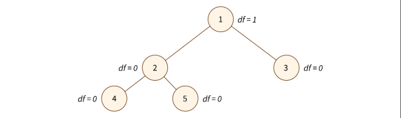

# Binary Tree

_When a tree has at the most two children, then it’s called ***binary tree***._

<br>
<br>

## Equations related to Binary Tree

<br>

### Maximum number of nodes for a given height

<div style="height: 1px; background-color: #808080;"></div>

The maximum number of nodes at a given height is $2^h$. The maximum number of nodes at a given height can be calculated by summing up all the nodes at previous height's i.e $ 2^h + 2^{h-1} + 2^{h-2} + ... + 1 $. This is a geometric series and the sum of a geometric series is given by the formula:

$$ S = a \left( \frac{1- r^n }{1- r } \right)$$

In our case, $ a = 2^h$, $r = 1/2$ and $n = h+1$. Therefore,

$$ S = 2^{h+1} -1 $$

Hence, For a tree with height $h$,

$$ \text{The maximum number of nodes in the tree} = N = 2^{h+1} -1 $$

<br>

### Height of the tree for number of nodes

<div style="height: 1px; background-color: #808080;"></div>

If $N$ is the maximum number of nodes and $h$ is the height of the tree, from [proof](#maximum-number-of-nodes-for-a-given-height) we know that:

$$ N = 2^{h+1} -1 $$

Solving for h in the above equation,

$$ h = \log_2{(N+1)}-1 $$

Hence, For a tree with $N$ nodes,

$$ \text{The height of the tree = h =} floor(log_2(N))$$

<br/>

### Indices when represented as an array

<div style="height: 1px; background-color: #808080;"></div>

When the tree is represented as an array, for node at index $i$,

$$ \text{Index of left child} = 2\times{i}+1 $$
  $$ \text{Index of right child} = 2\times{i} +2$$
$$ \text{Index of parent} = floor((i-1)/2)$$

<br/>
<br/>

## Types of Binary Tree

<br>

### Types of Binary Tree based on number of children

<div style="height: 1px; background-color: #808080;"></div>

<br>

#### Full Binary Tree

_A full binary tree is a special type of binary tree in which every node other than the leaves has exactly two children._



<br>

#### Degenerate Binary Tree

_A degenerate binary tree is a type of binary tree in which each parent node has only one associated child node._


- Also known as a pathological tree or a skewed tree.
- They are esentially a linked list.

<br>
<br>

### Types of Binary Tree based on completion levels

<div style="height: 1px; background-color: #808080;"></div>

<br>

#### Perfect Binary Tree

_A perfect binary tree is a type of binary tree in which all interior nodes have exactly two children and all leaf nodes are at the same level or depth._


- Perfect binary trees have precisely (2^k) - 1 nodes, where k is the last level of the tree (starting with 1).
- Perfect binary tree is a balanced binary tree where every level is filled with the maximum number of nodes possible.
- A perfect binary tree is always complete binary tree.

<br>

#### Complete Binary Tree

_A complete binary tree is a type of binary tree in which all levels of the tree are completely filled except possibly for the last level, which is filled from left to right._


- A complete tree is not always perfect tree.

<br>

#### Balanced Binary Tree

_A balanced binary tree is a type of binary tree in which the heights of the left and right subtrees of every node differ by at most one._



<br>
<br>

## Binary Tree Traversals

<br/>

### In-Order Traversal

_Inorder traversal is a depth-first tree traversal algorithm that visits the left subtree, then the current node, and finally the right subtree_

```py
# Given a binary tree in array form
def in_order_traversal(arr):

    def get_left_child_index(parent_index):
        return 2 * parent_index + 1

    def get_right_child_index(parent_index):
        return 2 * parent_index + 2

    def exists(index):
        if index < len(arr):
            return True
        else:
            return False

    res = []
    stack = []
    cur = 0

    while True:
        if exists(cur):
            stack.append(cur)
            cur = get_left_child_index(cur)
        elif stack:
            cur = stack.pop()
            res.append(arr[cur])
            cur = get_right_child_index(cur)
        else:
            break
    return res


nums = [1, 3, 10, 4, 2, 5]
print(in_order_traversal(nums))

# [4, 3, 2, 1, 5, 10]
```

<br/>

### Pre-Order Traversal

_Preorder traversal is a depth-first tree traversal algorithm that visits the current node, then the left subtree, and finally the right subtree._

```py
def pre_order_traversal(arr):
    def get_left_child_index(parent_index):
        return 2 * parent_index + 1

    def get_right_child_index(parent_index):
        return 2 * parent_index + 2

    def exists(index):
        if index < len(arr):
            return True
        else:
            return False

    res = []
    stack = [0] if arr else []

    while stack:
        cur = stack.pop()
        res.append(arr[cur])
        if exists(get_right_child_index(cur)):
            stack.append(get_right_child_index(cur))

        if exists(get_left_child_index(cur)):
            stack.append(get_left_child_index(cur))

    return res


nums = [10, 8, 5, 12, 16, 1]
print(pre_order_traversal(nums))

# [10, 8, 12, 16, 5, 1]
```

<br/>

### Post-Order Traversal

Postorder traversal is a depth-first tree traversal algorithm that visits the left subtree, then the right subtree, and finally the current node.

```py
def post_order_traversal(arr):
    def get_left_child_index(parent_index):
        return 2 * parent_index + 1

    def get_right_child_index(parent_index):
        return 2 * parent_index + 2

    def exists(index):
        if index < len(arr):
            return True
        else:
            return False

    res = []
    stack = [0] if arr else []

    while stack:
        cur = stack.pop()
        res.append(arr[cur])
        if exists(get_left_child_index(cur)):
            stack.append(get_left_child_index(cur))

        if exists(get_right_child_index(cur)):
            stack.append(get_right_child_index(cur))

    return res[-1::-1]


nums = [10, 8, 5, 12, 16, 1]
print(post_order_traversal(nums))

# [12, 16, 8, 1, 5, 10]
```

<br/>

### Level-Order Traversal (BFS)

_Level order traversal, also known as breadth-first traversal, visits nodes level by level from left to right, starting from the root level and moving to deeper levels._

```py
def level_order_traversal(arr):
    def get_left_child_index(parent_index):
        return 2 * parent_index + 1

    def get_right_child_index(parent_index):
        return 2 * parent_index + 2

    def exists(index):
        if index < len(arr):
            return True
        else:
            return False

    res = []
    q = [0] if arr else []

    while q:
        cur = q.pop(0)
        res.append(arr[cur])
        if exists(get_left_child_index(cur)):
            q.append(get_left_child_index(cur))
        if exists(get_right_child_index(cur)):
            q.append(get_right_child_index(cur))
    return res


nums = [12, 16, 8, 1, 5, 10]
print(level_order_traversal(nums))

# [12, 16, 8, 1, 5, 10]
```

<br/>
<br/>

## Implementation

//TODO - Write the complete class

```python
#This is a method of class BinarySearchTree
def in_order(self, root = None, must_return = "values"):
    "in order is DFS hence use a stack, left -> root ->right"
    #---------------------------------------------------------------------------------
    #consider self.root as defualt parameter
    if root == None:
        cur = self.root
    else:
        cur = root
    #---------------------------------------------------------------------------------
    #in-order traversal of an empty tree is []
    if cur == None:
        return []
    #---------------------------------------------------------------------------------
    #logic
    nodes = []                  #nodes is a list of Nodeobjects
    stack = []
    while True:
        if cur:
            stack.append(cur)
            cur = cur.left
        elif stack:
            cur = stack.pop()
            nodes.append(cur)
            cur = cur.right
        else:
            break
    #---------------------------------------------------------------------------------
    #returning nodes
    if must_return == "nodes":
        return nodes
    #---------------------------------------------------------------------------------
    #returning values
    elif must_return == "values":
        values = []                     #values is a listof Node values
        for node in nodes:
            values.append(node.val)
        return values
    #---------------------------------------------------------------------------------
```

```python
#This is a method of class BinarySearchTree

def pre_order(self,root = None, must_return = "values"):
        "pre order is DFS, root -> left -> right"
        #----------------------------------------------------------------------------------
        #consider self.root as defualt parameter

        if root == None:
            cur = self.root
        else:
            cur = root

        #----------------------------------------------------------------------------------
        #preOrder traversal of empty tree is []
        if cur == None:
            return []

        #----------------------------------------------------------------------------------
        #logic
        stack = [cur]
        nodes = []                          #nodes is a list of Node objects
        while stack:
            cur = stack.pop()
            nodes.append(cur)               #we are appending the Node objects itself.
            if cur.right:
                stack.append(cur.right)     #Right child must be appended first!
            if cur.left:
                stack.append(cur.left)

        #----------------------------------------------------------------------------------
        #returning nodes

        if must_return == "nodes":
            return nodes                    #Return based on the must_return parameter.

        #----------------------------------------------------------------------------------
        #returning values

        if must_return == "values":
            values =[]                          #values is a list of Node values
            for node in nodes:
                values.append(node.val)

            return values
        #----------------------------------------------------------------------------------
```

```python
#This is a method of class BinarySearchTree
def post_order(self, root = None, must_return = "values"):
        "post order is a DFS hence use a stack; left ->right -> root"
        #---------------------------------------------------------------------------------
        #consider self.root as defualt parameter
        if root == None:
            cur = self.root
        else:
            cur = root
        #---------------------------------------------------------------------------------
        #postOrder traversal of empty tree is []
        if cur == None:
            return []
        #---------------------------------------------------------------------------------
        #logic
        stack = [cur]
        nodes = []
        while stack:
            cur = stack.pop()
            nodes.append(cur)
            if cur.left:
                stack.append(cur.left)          #Leftchild must be added first!
            if cur.right:
                stack.append(cur.right)
        nodes = nodes[::-1]                     #what wewant is actually the reverse!
        #---------------------------------------------------------------------------------
        #returning nodes
        if must_return == "nodes":
            return nodes
        #---------------------------------------------------------------------------------
        #returning values
        elif must_return == "values":
            values = []
            for node in nodes:
                values.append(node.val)
            return values
        #---------------------------------------------------------------------------------
```

```py
# This is a method of class BinarySearchTree


def level_order(self, root=None, must_return="values", return_type="list(list)"):
    """level order is a BFS hence use queue."""
    # ----------------------------------------------------------------------------------
    if root == None:
        cur = self.root  # consider self.root as defualt parameter
    else:
        cur = root
    # ----------------------------------------------------------------------------------
    if cur == None:
        return []  # level order for an empty tree is []
    # ----------------------------------------------------------------------------------
    # logic
    q = [cur]
    multi_nodes = []  # multi_nodes is a list of list of Node objects
    while q:
        levels = []
        for node in q.copy():
            levels.append(node)
            q.pop(0)
        multi_nodes.append(levels)
        for node in multi_nodes[-1]:
            if node.left:
                q.append(node.left)
            if node.right:
                q.append(node.right)
    # ----------------------------------------------------------------------------------
    # list(list) means [[], [], [], ...]
    if return_type == "list(list)":
        if must_return == "nodes":
            return multi_nodes
        elif must_return == "values":
            multi_values = []  # multi_values is a list of list of Node values.
            for node_list in multi_nodes:  # nodes is of the type [[]]
                values_list = []
                for node in node_list:
                    values_list.append(node.val)
                multi_values.append(values_list)
            return multi_values
    # ----------------------------------------------------------------------------------
    # list means []
    elif return_type == "list":
        nodes = []  # nodes is a list of Node objects
        for node_list in multi_nodes:
            for node in node_list:
                nodes.append(node)
        if must_return == "nodes":
            return nodes
        elif must_return == "values":
            values = []  # values is a list of Node values.
            for node in nodes:
                values.append(node.val)
            return values
    # ----------------------------------------------------------------------------------
```
