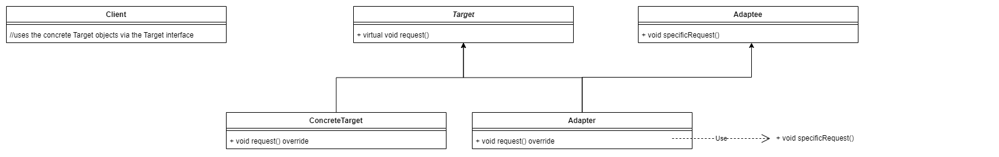

# Adapter Pattern

_The Adapter design pattern is a structural pattern that allows objects with incompatible interfaces to work together._

<br>
<br>

## About the Adapter Pattern

### Implementations

1. Adapter can be implemented as a class adapter using multiple inheritance.

   

1. Adapter can be implemented as an object adapter using composition instead of multiple inheritance.

   

<br>

### Components

1. **Target** defines the domain specific interface that the client uses.
1. **Client** collaborates with objects conforming to the Target interface.
1. **Adaptee** defines an existing interface that needs adapting.
1. **Adapter** adapts the interface of Adaptee to the Target interface.

<br>

### Applicability

1. To use a class whose interface doesn't match the needs.
1. To create reusable classes that cooperates with unrelated or unforseen classes.

<br>

### Benefits

Class adapter has the following benefits:

1. Class adapter can override the adaptee's behaviour since Adapter **_is a_** Adaptee.
1. Introduces only one object and no pointer indirection is needed to get to the adaptee.

Object adapter has the following benefits:

1. Facilitates capability to adapt many adaptee's. Thus the adaptee and all it's subclasses (if any) can be adapted.

<br>

### Consequences

Class adapter has the following consequences:

1. Class adapters cannot adapt the subclasses (if any) of the Adaptee as inheritance is used.

Object adapter has the following consequences:

1. Object adapters make it harder to override Adaptee behaviour.

<br>
<br>

## Illustration


```cpp
#include <iostream>

class I_LegacyDatabase {
public:
	virtual void establishConnection(const std::string connection_id="") = 0;
};

class LegacyDB : public I_LegacyDatabase {
public:
	void establishConnection(const std::string connection_id) override {
		std::cout << "simulating connection mechanism for legacy db" << "\n";
	}
};

class ModernDB {
public:
	void connect(int port) {
		std::cout << "simulating connection mechanism for modern db" << "\n";
	}
};

class DatabaseAdapter : public I_LegacyDatabase {
private:
	ModernDB* modern_db;
public:
	void establishConnection(const std::string connection_id) override {
		int port = getPort();
		modern_db->connect(port);
	}
	int getPort() {
		//implement the API
		return 123;
	}
};

int main() {
	I_LegacyDatabase* db1 = new LegacyDB();
	db1->establishConnection("uniquestring"); //simulating connection mechanism for legacy db

	I_LegacyDatabase* db2 = new DatabaseAdapter();
	db2->establishConnection();	//simulating connection mechanism for modern db
}
```

<br>

### Illustration about components

1. `I_LegacyDatabase` is the Target.
1. The client code is in the `main` function.
1. `ModernDB` is the Adaptee.
1. `DatabaseAdapter`is the Adapter.

<br>

###
