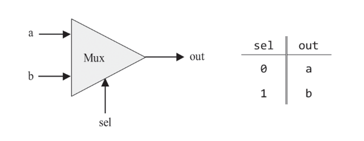
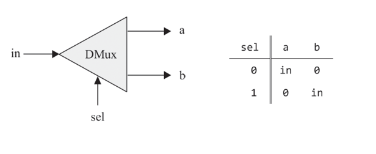

# Boolean Logic

 
 

## 1.4 Specificatoin

 

### 1.4.1 Nand Gate

All the other gates and chips will be built from Nand gate.

- The Truth Table:
  | a | b | Nand(a,b) |
  | --- | --- | --------- |
  | 0 | 0 | 1 |
  | 0 | 1 | 1 |
  | 1 | 0 | 1 |
  | 1 | 1 | 0 |

- API Style :

  | Attribute | Value                                           |
  | --------- | ----------------------------------------------- |
  | Chip Name | Nand                                            |
  | Input     | a, b                                            |
  | Output    | out                                             |
  | Function  | if((a==1) and (b==1)) then out = 0 else out = 1 |

 

### 1.4.2 Basic Gates

#### Not Gate (Inverter)

| Attribute | Value                                |
| --------- | ------------------------------------ |
| Chip Name | Not                                  |
| Input     | in                                   |
| Output    | out                                  |
| Function  | if(in==1) then out = 0, else out = 1 |

 

#### And Gate

| Attribute | Value                                            |
| --------- | ------------------------------------------------ |
| Chip Name | And                                              |
| Input     | a,b                                              |
| Output    | out                                              |
| Function  | if((a==1) and (b==1)) then out = 1, else out = 0 |

 

#### Or Gate

| Attribute | Value                                            |
| --------- | ------------------------------------------------ |
| Chip Name | Or                                               |
| Input     | a,b                                              |
| Output    | out                                              |
| Function  | if((a==0) and (b==0)) then out = 0, else out = 1 |

 

#### Xor Gate

| Attribute | Value                               |
| --------- | ----------------------------------- |
| Chip Name | Xor                                 |
| Input     | a,b                                 |
| Output    | out                                 |
| Function  | if(a!=b) then out = 1, else out = 0 |

 

#### Multiplexer (Mux)

| Attribute | Value                                 |
| --------- | ------------------------------------- |
| Chip Name | Mux                                   |
| Input     | a,b,sel                               |
| Output    | out                                   |
| Function  | if(sel==0) then out = a, else out = b |

 

#### DeMultiplexer (Dmux)

| Attribute | Value                                           |
| --------- | ----------------------------------------------- |
| Chip Name | Dmux                                            |
| Input     | in, sel                                         |
| Output    | a,b                                             |
| Function  | if(sel==0) then a=in and b=0, else a=0 and b=in |

 
 

### 1.4.3 Multi-Bit versions of basic gates

Computer hardware is often designed to process multi-bit values—for example, computing a bitwise And function on two given 16-bit inputs.

- HDL programs treat multi-bit values like single-bit values, except that the values can be indexed in order to access individual bits. For example, if `in` and `out` represent 16-bit values, then `out[3] = in[5]` sets the 3rd bit of out to the value of the 5th bit of in. The bits are indexed from right to left, the rightmost bit being the 0’th bit and the leftmost bit being the 15’th bit (in a 16-bit setting).

 
 

## The Implementation
