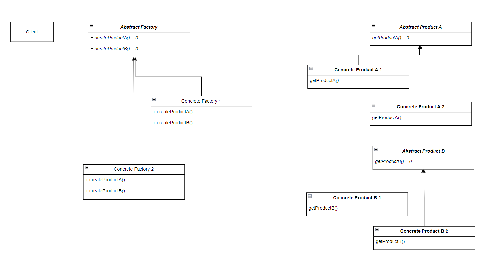
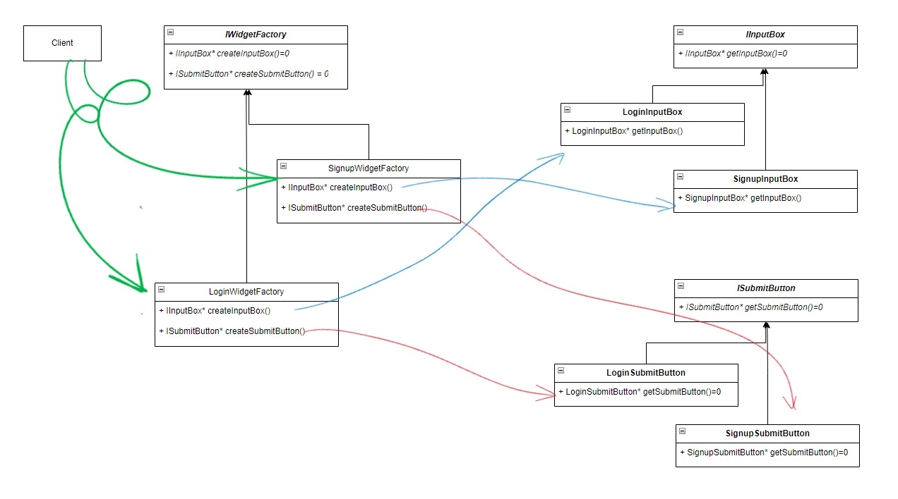

# Abstract Factory Pattern

//TODO - Add the basic details like definition of this pattern, what is products and what is concretefactory

- The UML diagram

  

- The UML diagram for an example

  

//TODO - Write these up so as to understand

- Applicability:

  - a system should be independent of how its products are created, composed, and represented
  - a system should be configured with one of multiple families of products
  - a family of related product objects is designed to be used together, and you need to enforce this constraint.
  - you want to provide a class library of products, and you want to reveal just their interfaces, not their implementations.

- Consequences :

  - It Isolates Concrete Classes.
  - It makes exchanging product families easy.
  - Promotes consistency amond products.
  - Supporting new kinds of products is difficult.

- The C++ code

  ```cpp
  #include <iostream>

  //This is Abstract class for Input Box________________________
  class IInputBox {
  public:
      virtual IInputBox* getInputBox() = 0;
  };

  //Concrete class of Input Box for Login UI
  class LoginInputBox : public IInputBox {
      LoginInputBox* getInputBox() {
          std::cout << "Input Box of Login UI" << std::endl;
          return this;    //Imagine it returns a widget
      }
  };

  //Concrete class of Input Box for Signup UI
  class SignupInputBox : public IInputBox {
      SignupInputBox* getInputBox() {
          std::cout << "Input Box of Signup UI" << std::endl;
          return this;    //Imagine it returns a widget
      }
  };


  //Abstract class for Submit Button___________________________
  class ISubmitButton {
  public:
      virtual ISubmitButton* getSubmitButton() = 0;
  };

  //Concrete class of Submit Button for Login UI
  class LoginSubmitButton : public ISubmitButton {
      LoginSubmitButton* getSubmitButton() {
          std::cout << "Submit Button of Login UI" << std::endl;
          return this;    //Imagine it returns a widget
      }
  };

  //Concrete class of Submit Button for Signup UI
  class SignupSubmitButton : public ISubmitButton {
      SignupSubmitButton* getSubmitButton() {
          std::cout << "Submit Button of Signup UI" << std::endl;
          return this;    //Imagine it returns a widget
      }
  };


  //This is Abstract Factory_________________________________
  class IWidgetFactory {
  public:
      virtual IInputBox* createInputBox() = 0;
      virtual ISubmitButton* createSubmitButton() = 0;
  };

  //This is Concrete Factory
  class LoginWidgetFactory : public IWidgetFactory{
  public:
      IInputBox* createInputBox() {
          IInputBox* input_box_widget = new LoginInputBox();
          return input_box_widget->getInputBox();
      }
      ISubmitButton* createSubmitButton() {
          ISubmitButton* submit_btn_widget = new LoginSubmitButton();
          return submit_btn_widget->getSubmitButton();
      }
  };

  //This is Concrete Factory
  class SignupWidgetFactory : public IWidgetFactory{
  public:
      IInputBox* createInputBox() {
          IInputBox* input_box_widget = new SignupInputBox();
          return input_box_widget->getInputBox();
      }
      ISubmitButton* createSubmitButton() {
          ISubmitButton* submit_btn_widget = new SignupSubmitButton();
          return submit_btn_widget->getSubmitButton();
      }
  };


  //This is client code_____________________________
  int main(){
      LoginWidgetFactory my_login_ui = LoginWidgetFactory(); //Say client wants to render Login UI Widgets
      my_login_ui.createInputBox();
      my_login_ui.createSubmitButton();
  }

  //Input Box of Login UI
  // Submit Button of Login UI
  ```
