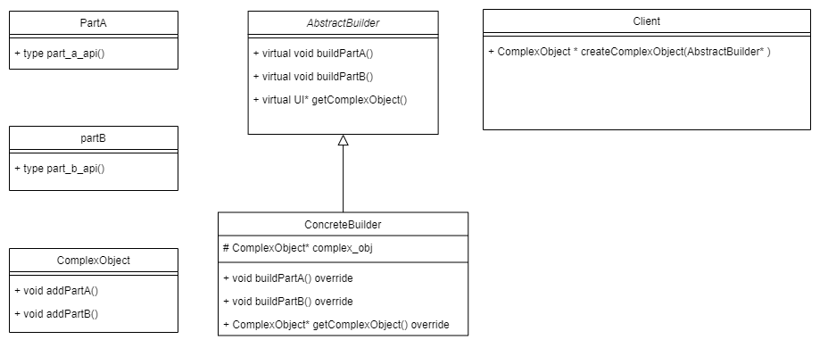

# Builder Pattern

**_The Builder design pattern is a creational pattern that helps creation of a complex object in a step by step fashion without specifying the construction process._**

- Key Components are as follows :
    <ol type="1">
        <li>  Complex Object (Product): Any object that takes a lot of steps in it's construction process. </li>
        <li> Parts: Sub components or sub products of the complex object.</li>
        <li> Abstract Builder: An interface responsible for assembling the complex object step-by-step.</li>
        <li> Concrete Builder: The class responsible for assembling the complex object step-by-step.</li>
        <li> Director: An optional object that uses the builder to construct the product according to specific requirements.</li>
    </ol>

<br>

- The UML diagram for the pattern :

  

<br>

- Applicability :

  - The algorithm for creating a complex object should be independent of the parts that make up the object and how they’re assembled.
  - The construction process must allow different representations for the object that’s constructed

- Advantages :
  - The interface lets the builder hide the representation and internal structure of the product.
  - It isolates code for construction and representation.
  - Facilitates finer control over the construction process.
- Consequences :
  - Requires careful consideration and validation mechanisms to ensure product integrity as there is no common interface in the case pure virtual functions are not implemented.

<br>

- Note that the Gang of four book mentions to not to write the functions in the abstract builder class as pure virtual functions instead to keep them as empty virtual functions so that the child classes can override only what is necessary, However this contradicts the very definition of an abstract class or the interface in C++. I will be ignoring this and focus on the pattern.

<br>
<br>

## Illustration

- The UML diagram for an example

  

- `Label`, `Button`, `UI` : Product classes. They donot have an abstract base class because there is generally no interface that the products can adhere to in builder pattern.
- `I_UIBuilder` : Abstract base class for builder. The functions are not pure pure virtual instead are empty virtual functions so that the concrete classes can override only what is necessary.
- `LoginUIBuilder` : Concrete builder class. Has methods for building the complex object, UI object in our case.
- `App` : Client that uses the concrete builder via the builder interface.

  ```cpp
  #include <iostream>
  using namespace std;

  //products
  class Label {
  public:
      Label(std::string text){}
  };

  class Button {
  public:
      Button(std::string text) {}
  };

  class UI {
  public:
      void addLabel(Label* label){}
      void addButton(Button* label){}
  };

  //abstract builder
  class I_UIBuilder {
  public:
      virtual void buildLabel(std::string ){}
      virtual void buildButton(std::string){}
      virtual UI* getUI() { return 0; }
  };

  class LoginUIBuilder : public I_UIBuilder {
  public:
      LoginUIBuilder() {
          ui = new UI();
      }
      ~LoginUIBuilder() {
          delete ui;
      }
      void buildLabel(std::string text) override{
          Label* label = new Label(text);
          ui->addLabel(label);
      }
      void buildButton(std::string text) override{
          Button* button = new Button(text);
          ui->addButton(button);
      }
      UI* getUI() override {
          return ui;
      }
  protected:
      UI* ui;
  };

  //client
  class App {
  public:
      UI* createLoginUI(I_UIBuilder* builder) {
          builder->buildLabel("Existing User?");
          builder->buildButton("login");
          return builder->getUI();
      }
  };

  int main() {
      App my_app = App();
      UI* login_ui = new UI();
      LoginUIBuilder* login_ui_builder = new LoginUIBuilder();
      login_ui = my_app.createLoginUI(login_ui_builder);
  }
  ```

<br>
<br>

## Difference between Abstract Factory Pattern and Builder Pattern

The Abstract Pattern is very similar to the Builder pattern as it can also create complex objects.

- _The primary difference is that the Builder pattern focuses on constructing a complex object step by step. Abstract Factory’s emphasis is on families of product objects (either simple or complex)._

- Builder returns the product as a final step, but as far as the Abstract Factory pattern is concerned, the product gets returned immediately.
