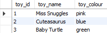
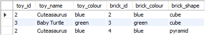
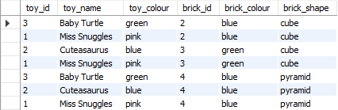
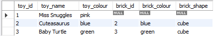
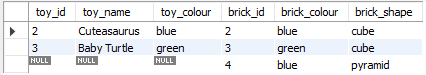
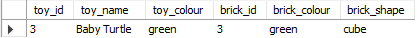
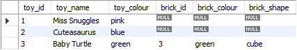

# Joins

- Consider the following tables for the entire illustration.

  ```sql
  create table toys (
  toy_id     integer,
  toy_name   varchar(20),
  toy_colour varchar(10)
  );

  create table bricks (
  brick_id     integer,
  brick_colour varchar(10),
  brick_shape  varchar(10)
  );

  insert into toys values ( 1, 'Miss Snuggles', 'pink' ) ;
  insert into toys values ( 2, 'Cuteasaurus', 'blue' ) ;
  insert into toys values ( 3, 'Baby Turtle', 'green' ) ;

  insert into bricks values ( 2, 'blue', 'cube' );
  insert into bricks values ( 3, 'green', 'cube' );
  insert into bricks values ( 4, 'blue', 'pyramid' );
  ```

* The created tables are

  
  

<br>
<br>
<br>

# Cross Join

- A cross join is an operation in relational database systems that combines every row from one table with every row from another table.
- It is also known as a Cartesian product or a cross product.
- The cross join of a table with 'm' rows and another with 'n' rows results in a 'm\*n' rows.
- We are sticking with ANSI syntax for joins!

  ```sql
  select * from toys
  cross join bricks;
  ```

  

<br>
<br>
<br>

# Inner Join

- An inner join combines rows from two or more tables based on a specified condition or criteria.
- It retrieves only the rows where there is a match between the specified columns in the tables being joined.

  ```sql
  select * from   toys
  inner  join bricks on toy_id = brick_id;
  -- join bricks on toy_id = brick_id; --same as above!

  ```

  

* Join on a column that has repeated values, results in many copies of the matching rows in the joined table.

  

* Join can be made using inequalities.

  ```sql
  select * from toys
  inner join bricks on toy_id <> brick_id;
  ```

  

<br>
<br>
<br>

# Outer Joins

- An outer join combines rows from two or more tables based on a specified condition, just like an inner join. However, unlike an inner join, an outer join includes rows from one or both tables even when there are no matching values in the join condition.
- This means that rows with non-matching values are not excluded from the result, and the result may contain NULL values in columns where there is no match.

<br>
<br>

## Left Outer Join

Retrieves all rows from the left (or first) table and the matching rows from the right (or second) table. If there is no match in the right table, NULL values are included in the result for the right table's columns.

```sql
select * from   toys
left outer join bricks on toy_id = brick_id;
```



<br>
<br>

## Right Outer Join

Similar to the left outer join, but it retrieves all rows from the right table and the matching rows from the left table. If there is no match in the left table, NULL values are included in the result for the left table's columns.

```sql
select * from   toys
right outer join bricks on toy_id = brick_id;
```



<br>
<br>

## Full Outer Join

Retrieves all rows from both tables and includes NULL values in columns where there is no match.

```sql
select * from toys
full join bricks on toy_id = brick_id;
```


<br>
<br>
<br>

# Filtering Joins

- Suppose the usecase needed all the rows from the toys table and only those rows from the brick table that have matching brick_id and color as green.
- If we use a `WHERE` clause after the join, it'll convert the outer join to an inner join. (As seen in subsequent code)

  ```sql
  select * from toys
  left join bricks on toy_id = brick_id
  where toy_colour = 'green';
  ```

  

* For the above usecase, the filtering criteria for the outer joined table must be in the join clause itself.

  ```sql
  select * from toys
  left join bricks on toy_id = brick_id and toy_colour = 'green';
  ```

  
