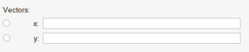
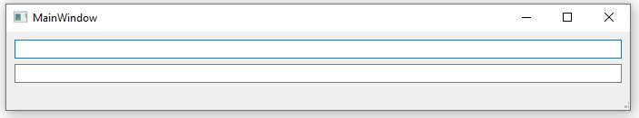
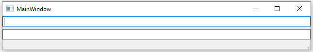

# QGridLayouts

//TODO - Add about QFrame and QLayout and how they are different

Facilates the positioning of widgets in terms of rows and columns.

<br>
<br>

## Spacing in QGridLayout

- Use `setColumnMinimumWidth` and `setRowMinimumHeight` for row and column spacing.

  ```cpp
  void QGridLayout::setColumnMinimumWidth(int column, int minSize);
  ```

  

<br>
<br>

## Troubleshooting

- The following is created using the QGridLayout, The space between the radio buttons and the labels are becuase of the label (with text Vectors) in first row. Increase the span of that label to remove the spacing below.

  

- When a QLayout is set to a QFrame, it is done with some default margin.

  - The following code yields the following GUI

    ```cpp
    MainWindow w;
    QFrame* frame = new QFrame;
    w.setCentralWidget(frame);
    QVBoxLayout* layout = new QVBoxLayout();
    QLineEdit* line_edit_1 = new QLineEdit;
    QLineEdit* line_edit_2 = new QLineEdit;
    layout->addWidget(line_edit_1);
    layout->addWidget(line_edit_2);
    frame->setLayout(layout);
    ```

    

  - The remove the margin, use the following methods.

    ```cpp
    MainWindow w;
    QFrame* frame = new QFrame;
    w.setCentralWidget(frame);
    QVBoxLayout* layout = new QVBoxLayout();
    layout->setContentsMargins(0,0,0,0); //THIS removes the margins
    QLineEdit* line_edit_1 = new QLineEdit;
    QLineEdit* line_edit_2 = new QLineEdit;
    layout->addWidget(line_edit_1);
    layout->addWidget(line_edit_2);
    frame->setLayout(layout);
    ```

    
