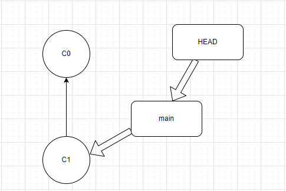

# Git Fundamentals

**_Git is a distributed version control system (VCS) that is widely used for software development and collaboration._**

- git is a distributed VCS while github is a PaaS (Platform as a service) for VCS.

<br/>
<br/>

## Understanding Commit

**_Commits are lightweight snapshots of the project._**

- Once git is initialised in our project, we can store the commits with the progress of the project and switch (access) between them very fast.

<br/>

### Git SHA-1

**_SHA-1 is a 40 character hex string generated for a specific commit, it acts as a unique identifier used to track and reference a specific snapshot of code changes in a Git repository._**

- Git ID, SHA-1, Hash, Object ID and checksum all refer the same concept.
- SHA-1 is the result of mathematical operation of Secure Hash Algorithm-1 based on the modifications in a file.
- Statistically no two unique files have same SHA-1 value.
- SHA-1 is designed to Avalanche, meaning a small change in file content results in drastic change in SHA-1.

<br>
<br>

## Datastructures in git

Internally git uses objects to store 4 types of things:

1. **Commit object** : A small text file contating commit user info, commit message, a reference to commit's parent('s) and a reference to the root tree of the project.

2. **Annotated tag** : A reference to a specific commit

3. **Tree**: Directories and filenames in the project

4. **Blob**: The content of a file in the project.

<br>

### DAG

- Git history is stored in the form of Directed Acyclic Graph (DAG) where commits are represented as nodes and edges point to the parent commit
- A DAG is a directed graph (edges have directions) with no cycles!
- New commits get chained to the previous commits!

- `git log --graph` displays the DAG using \* and lines

<br>
<br>

## Reference

**_A reference is a userfriendly name that points to either a commit SHA-1 hash or another reference._**

- The reference is called a _symbolic reference_ it points to another reference.
- HEAD, master, main etc are references. (See `git log --oneline`)

  ```
  $ git log --oneline
  f9a6285 (HEAD -> master) created moviedb.py
  ```

- We can use the reference instead of SHA-1 hash in all git commands.

- ~ or ~1 is used to refer the parent of current commit. ~~ or ~2 refers to the parent's parent of the current commit

<br>

### HEAD

**_HEAD refers to a symbolic reference that points to the currently checked-out commit in a repository._**

- Generally HEAD will be pointing to the current branch.

  

- The HEAD is said to be detached when it is pointing to a commit directly instead of a branch.
  

<br>

### Relative References

**_Relative References are typically references to references specified in a way relative to the current commit or branch._**

- Moving upward one commit at a time using `^`. (Example: HEAD^, HEAD^^)
- Moving upward a number of commits at a time using `~<number>`. (Example: HEAD ~3)

<br>
<br>

## Git Command Syntax

```bash
git <command> <--flags> <arguments>
```

- flags are also called as switches or options.

- Examples:
  - `git status`, here status is a command.
  - `git log --oneline`, here log is a command and --oneline is a flag.
  - `git add file.txt`, here add is a command and file.txt is an argument.

<br/>
<br/>

## Git Help

- Use the following command to get help for a particular command.

  ```bash
  git help <command>
  ```

- When we use git help to find help with a command, git throws a synopsis of the command along with other useful information. Synopsis for a command will be of the form:

  ```
  git fakecommand (-p | --patch) [<id>] [--] [<paths>...]
  ```

  - -f or --flag is used to change the command's behaviour.
  - | means OR.
  - [] houses optional values.
  - <> serves as place holders and must be replaced by actual values.
  - [<>] means optional placeholders.
  - () are used for grouping to improve clarity.
  - ... means that multiple occurances are possible.

<br/>
<br/>

## Configuring git

```
git config [--local | --global | --system] <key> [<value>]
```

- `--local` flag or no flag applies only to the current repository
- `--global` flag applies to every repo that one uses on his computer
- `--system` flag applies to every repo for all users on the comouter

<br/>

| Operation                  | Syntax                                     | Explanation |
| -------------------------- | ------------------------------------------ | ----------- |
| 1. Set up username         | `git config --global user.name <username>` |             |
| 2. Set up email            | `git config --global user.email <email>`   |             |
| 3. Read/ Check credentials | `git config user.name (or user.email)`     |

<br/>
<br/>
