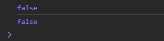

# Hook

_"**Hook**" is a special function that allows addition of stateful logic to functional components._

- They are called "hooks" because they allow developers to "hook into" React state and lifecycle features from functional components, which were traditionally stateless.
- Never update the state manually. React will never know if the state is updated other than the setState function.

<br>
<br>

### Rules for utilizing hooks.

1. Hooks must always be called in the same order.

   - Hence we can't use hooks indside conditional statements, loops.
   - As such it is ideal to place the hook at the top level of a functional component.
   - Moreover hooks are used by their order numbers and not by their names in react.
     
   - It is a good practice to place the return statement after all the hooks in the code.

2. Hooks must be called from react functions.
   - They can't be called from functions inside react component.

<br>
<br>

# State

_"**State**" refers to an internal data structure that allows a component to store and manage data that can change over time._

- It enables components to re-render and update their user interfaces in response to changes in the data.
- Each component has and manages its own state.
- The state of a component is isolated from the state of other components. i.e. change in the state of one component doesn't affect the states of other components.

<br>
<br>

## Creating state

State in a functional component is created using the **useState** hook

```jsx
const [stateValue, setStateValue] = useState(initialValue);
```

- It takes in an initial value as a parameter and returns an array with two elements.
- The two elements are [destructured](../../../../programming-languages/javascript/01-js-fundamentals/js-features/destructuring.md#array-destructuring) to get:

  1. The current state value.
  2. A function to update the state value.

<br>

### A. Creating state using data

The following is an example code illustrating the use of state using useState hook.

```js
import { useState } from "react";

export function Counter() {
  const [count, setCount] = useState(0); //Initial value of count is set to 0.

  const increment = () => {
    setCount(count + 1);
  };

  const decrement = () => {
    setCount(count - 1);
  };

  return (
    <div>
      <button onClick={decrement}>-</button>
      <p>Current Count = {count}</p>
      <button onClick={increment}>+</button>
    </div>
  );
}
```

<br>

### B. Lazy Evaluation (Creating state using a callback)

We can set the state using a callback function.

- The callback must not take any parameters.
- Here, we store the value of state1 in local storage and update it every time state1 changes. When the component mounts (Initially), state2 is gets the value from the localstorage using the callback function. Hence state2 has persistence when the page is refreshed.

  ```jsx
  import { useEffect, useState } from "react";

  export default function App() {
    const [state1, setState1] = useState(false);

    //Setting state2 using the value returned by the callback function
    const [state2, setState2] = useState(function () {
      const fromLS = localStorage.getItem("state1");
      return fromLS;
    });

    useEffect(() => {
      localStorage.setItem("state1", JSON.stringify(state1));
    }, [state1]);

    console.log(state2);

    return (
      <div>
        <p>This is the App</p>
        <button>Change State</button>
      </div>
    );
  }
  ```

<br>

### `useState` runs only once!

It is crucial to know that useState is run only once when the component is mounted.

```jsx
import { useState } from "react";

export default function App() {
  const [state1, setState1] = useState(false);
  const [state2, setState2] = useState(state1); //Using state1 to set state2

  function handleClick() {
    setState1(true);
  }

  console.log(state2);

  return (
    <div>
      <p>This is the App</p>
      <button onClick={handleClick}>Change State</button>
    </div>
  );
}
```

- When the page is loaded is logs false and then when the button is clicked, state1 is changed hence the entire component is re-rendered, However state2 doesn't get the updated value of state1. (See console log).
  

<br>
<br>

## Updating state

- State is immutable and it must be updated using the setter function only.
- Never mutate arrays or objects, always build new arrays or objects during state updates.

<br>

### state updates are asynchronous!

- The code here doesn't log the updated value of count as the state is not updated right away.

  ```js
  const increment = () => {
    setCount(count + 1);
    console.log(count); //logs old value of count
  };
  ```

- The code here updates the count only once because the value of count is not updated when the control reaches the second setCount method.

  ```js
  const increment = () => {
    setCount(count + 1); //count is a state variable and setCount is the setter accordingly
    setCount(count + 1);
  };
  ```

<br>

### Using callback to update state

- Using a callback to set the state is ideal as it gives access the the latest value of the state.

  ```js
  const increment = () => {
    setCount((count) => count + 1); //Better than setCount(count + 1);
  };
  ```

<br>
<br>

## Derived State

In cases where we are setting a state based on another state, see if this can be avoided using a derived state. Now state2 being a variable is initialised with the updated value of state1 on every render.

```jsx
import { useState } from "react";

export default function App() {
  const [state1, setState1] = useState(false);
  const state2 = state1; //state2 is now a derived state

  function handleClick() {
    setState1(true);
  }

  console.log(state2);

  return (
    <div>
      <p>This is the App</p>
      <button onClick={handleClick}>Change State</button>
    </div>
  );
}
```

<br>
<br>

## Lifting Up State

_Moving the state that needs to be shared between components to a common ancestor component and then pass down that state as props to the child components that need it._

- Data always flows downwards from parent to children components in react. If we need to share the data with components in the same hierarchy, we have to use this concept.

- In the code below, we have lifted the states to the parent MyApp component, so that the state variables can be shared by both the children components (which are in same level in terms of hierarchy).

  ```js
  import { useState } from "react";

  export function MyApp() {
    const [inputText, setInputText] = useState("");
    const [outputText, setOutputText] = useState("");

    function handleInputText(text) {
      setInputText(text);
    }

    function handleClick() {
      //clear the input field
      setInputText("");
      // change state of output
      setOutputText((outputText) =>
        !outputText ? outputText + inputText : outputText + "\n" + inputText
      );
    }

    return (
      <>
        <InputPanel
          inputText={inputText}
          handleInputText={handleInputText}
          handleClick={handleClick}
        />
        <OutputPanel outputText={outputText} />
      </>
    );
  }

  function InputPanel({ inputText, handleInputText, handleClick }) {
    return (
      <>
        <input
          value={inputText}
          onChange={(e) => handleInputText(e.target.value)}
        ></input>
        <button onClick={handleClick}>Submit</button>
      </>
    );
  }

  function OutputPanel({ outputText }) {
    return (
      <>
        <div
          style={{
            border: "2px solid black",
            width: "165px",
            height: "200px",
            whiteSpace: "pre-line",
          }}
        >
          {outputText}
        </div>
      </>
    );
  }
  ```

<br>
<br>

## Inverse data flow

- If there is a usecase such that the child component has to update the prop (that is received from the parent), this can be done using the setState method that must also be got from the parent!

<br>
<br>

## State vs Prop

| State                                        | Prop                                                    |
| -------------------------------------------- | ------------------------------------------------------- |
| State is used to make components interactive | Prop is used by parent to configure the child component |
| Internal data, owned by the component        | External data, owned by parent component                |
| Mutable                                      | Immutable                                               |

Whenever a state variable is passed as a prop to child component and the state variable changes in the parent component, then the child component also undergoes rerendering with the parent.
