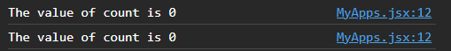
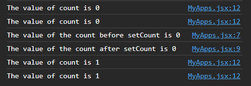

# State

_"State" refers to an internal data structure that allows a component to store and manage data that can change over time._

- It enables components to re-render and update their user interfaces in response to changes in the data.

<br>

### Working of state in react

In React, when a component’s state or props change, the component is **_destroyed_** and **_recreated_** from scratch.

- This includes the variables, functions, and React nodes. The entire component is recreated but this time the latest state value will be returned from useState. This process is called **_rerendering_**. Rerendering is a key feature of React that enables it to efficiently update the user interface in response to changes in the underlying data.

<br>
<br>

## Hook

_"Hooks" are special functions that allows addition of stateful logic to functional components._

- They are called "hooks" because they allow developers to "hook into" React state and lifecycle features from functional components, which were traditionally stateless.
- Rules for utilizing hooks.
  1. Hooks can only be called from the top level of a functional component.
  1. Hooks can’t be called from inside loops or conditions.

<br>
<br>

### `useState` hook

- _A hook that facilitates defining the state in a functional component._

  ```jsx
  const [stateValue, setStateValue] = useState(initialValue);
  ```

  - It takes in an initial value as a parameter and returns an array with two elements.
  - The two elements are **destructured** to get:
    1. The current state value.
    1. A function to update the state value.

- Adding more state variables should be as easy as adding more useState calls.

```jsx
import { useState } from "react";

export function Counter() {
  const [count, setCount] = useState(0); //Initial value of count is set to 0.

  const increment = () => {
    setCount(count + 1);
  };

  const decrement = () => {
    setCount(count - 1);
  };

  return (
    <div>
      <button onClick={decrement}>-</button>
      <p>Current Count = {count}</p>
      <button onClick={increment}>+</button>
    </div>
  );
}
```

<br>
<br>

## Understanding the rendering

```jsx
import { useState } from "react";

export function Counter() {
  const [count, setCount] = useState(0); //Initial value of count is set to 0.

  const increment = () => {
    console.log(`The value of the count before setCount is ${count}`);
    setCount(count + 1);
    console.log(`The value of the count after setCount is ${count}`);
  };

  console.log(`The value of count is ${count}`); //This will run every time react renders the page.

  return (
    <div>
      <button onClick={increment}>+</button>
      <p>Current Count = {count}</p>
    </div>
  );
}
```

The control flow for the above code is briefly explained here:

- When the page loads, the console is logged twice with the count value as 0.

  

- When the increment button is pressed, it calls the increment function, the first console log statement in that function is logged with the count value of 0, the setState increments the count value, However this happens asynchronously (non-blocking code) hence the next console log statement logs the count value of 0 aswell. When the asynchronous function finishes setting the count value, it re-renders the page and thus count value of 1 is logged twice.

  
