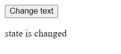

# 1. Rendering

_"**Rendering**" is the process of creating a virtual DOM._

- The term rendering in react doesn't mean representing or displaying.

- Rendering a component will cause all of it's child components to be rendered again.

  - This occurs independent of whether or not the props are updated.

  - This is because react doesn't know whether children will be affected or not, hence it re-renders all the children components.

<br>
<br>

## Virtual DOM

_The "**Virtual DOM**" is a lightweight, in-memory representation of the Real DOM._

- Tree of all react elements created from all instances in the component tree.
- Virtual DOM is a JavaScript object.

<br>
<br>

## Triggering renders

Rendering occurs in 2 situations:

1. **Initial Render** : This occurs when the application loads for the first time.

2. **Re-render** : This occurs whenever the state is updated in one or more react components.

<br>

- Renders are not triggered immediately, but happens asynchronously.

- Renders can be batched when multiple state updates happen.

<br>
<br>

# 2. Reconciliation

Reconcillation is the process of preparing the list of updates for the DOM by comparing the old and the new Virtual DOM in order to reflect the latest state changes.

- Reconciler is the what performs the reconcillation.
- Fibre is the name of the reconciler in react.

<br>
<br>

## Diffing

It is algorithm that determines the differences between the old and the new Virtual DOM.

- Diffing is a specific part of the reconciliation process.

<br>

### Diffing Rules

1. Two elements of different types will produce different trees.
2. Elements with stable key prop stay the same across renders.

<br>

### Diffing Concept Clarity

In the diffing process, while react compares the elements in the current virtual DOM with the previous one, if it finds

1. The same DOM element or React component

   - React will keep the element/React component, it's children and the states as it is.
   - The props and attributes (like classNames) can be different, the DOM element/React component must be same.
   - New props, attributes are passed if they are changed.

2. Different DOM element or React component

   - React will destroy the DOM element/React component, it's children and the states and then create new ones.
   - The state of DOM element/React component will be lost and resest.

<br>

- Run the following code in a react project to understand the 2 points mentioned above by observing the state (`likes`)

  ```jsx
  import { useState } from "react";

  export default function App() {
    const [tab, setTab] = useState(1);

    return (
      <div>
        <Tabs setTab={setTab}></Tabs>

        {tab <= 2 ? (
          <Content tab={tab}></Content>
        ) : (
          <DifferentContent></DifferentContent> //Crucial Code here
        )}
      </div>
    );
  }

  function Tabs({ setTab }) {
    const tabsStyle = { display: "flex", width: "10vw" };
    return (
      <div style={tabsStyle}>
        <button onClick={() => setTab(1)}>Tab 1</button>
        <button onClick={() => setTab(2)}>Tab 2</button>
        <button onClick={() => setTab(3)}>Tab 3</button>
      </div>
    );
  }

  function Content({ tab }) {
    const [likes, setLikes] = useState(0);

    const contentStyle = { border: "3px solid black", width: "9vw" };
    const divStyle = { display: "flex", justifyContent: "center", gap: "10px" };

    return (
      <div style={contentStyle}>
        <p>{`Tab ${tab}'s content.`}</p>
        <div style={divStyle}>
          <div>{likes} ❤</div>
          <button onClick={() => setLikes(likes + 1)}>+</button>
        </div>
      </div>
    );
  }

  function DifferentContent() {
    return <p>This is a different component and the state is reset.</p>;
  }
  ```

  - Switching between tab1 and tab2 doesn't change the state of likes because the React component in is same between renders.

    ```
    App
       Tabs
       Content
    ```

  - Switching to tab3 however resets the state of likes as the React component is changed during renders.

    ```
    App
       Tabs
       DifferentContent
    ```

<br>
<br>

# 3. Updating the Actual DOM

The updates from the reconciliation process is used to update the actual DOM.

- `ReactDOM` is the part of react library that handles all the code that is used for this process.

<br>
<br>

## Keys

_"**Key**" with a unique value makes the React component unique._

- Adding a key for the Content component in the above code will make the component instanes unique and the state is now reset as we change the tabs (re-renders)

  ```jsx
  export default function App() {
    const [tab, setTab] = useState(1);

    return (
      <div>
        <Tabs setTab={setTab}></Tabs>

        {tab <= 2 ? (
          <Content key={tab} tab={tab}></Content> //Added the key here
        ) : (
          <DifferentContent></DifferentContent>
        )}
      </div>
    );
  }

  //Remaining code...
  ```

<br>
<br>

## Batching of State Updates

_"**Batching**" is a process of bundling multiple state updates into a single update._

- Batching improves performance by preventing unnecessary re-renders.

- Understand the following code,

  ```jsx
  import { useState } from "react";

  export default function App() {
    const [state1, setState1] = useState(1);
    const [state2, setState2] = useState(true);
    const [state3, setState3] = useState("default");

    console.log("RENDER");

    function handleClick() {
      setState1(2);
      setState2(false);
      setState3("changed");
    }

    return (
      <div>
        <button onClick={handleClick}>Change State</button>
        <p>
          state1 is {state1}, state2 is {`${state2}`} and state3 is {state3}
        </p>
      </div>
    );
  }
  ```

  - There is a log statement that logs everytime the component renders.
  - There are 3 states that are updated when the button is clicked.
  - However the component is rendered only once when the button is clicked and not thrice because of batching, This can be seen in console.
  - Totally the component is rendered twice, one initial render and one re-render. (`React.StrictMode` is disabled!)

    

- Automatic bathcing of event handlers is a feature of react 17, react 18 automatically batched event handlers, timeouts, promises, native events.

<br>
<br>

## Asynchronous nature of state updates

```jsx
import { useState } from "react";

export default function App() {
  const [text, setText] = useState("default");

  console.log("RENDER");

  function handleClick() {
    setText("changed");
    console.log(text);
  }

  return (
    <div>
      <button onClick={handleClick}>Change text</button>
      <p>state is {text}</p>
    </div>
  );
}
```

- There is a state called `text`
- In the handleClick event handler function, we are changing the state and logging it right away.
- However when we click the button, we see the previous value of `text` i.e. _"default"_ in the console and the updated value i.e. _"changed"_ on the screen.

  
  

- This is because of the asynchronous nature of rendering, the state is not updated as soon as we use setState function. It has to undergo rendering, reconciliation and DOM updation.
- When the control is at console statement, the value of the state in the fibre tree is still "default", then the control flows and the component is rendered (virtual DOM is created), in the reconciliation process the fibre tree is updated with the new value of the state and that is updatd on the DOM.
