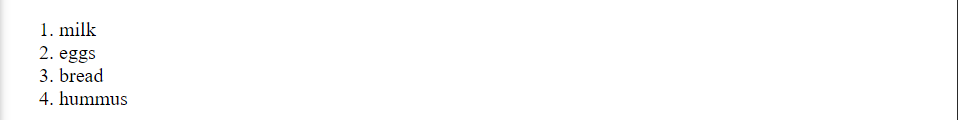
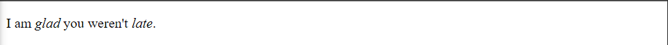
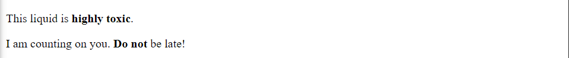

# HTML Text Fundamentals

# Paragraph

- In HTML, each paragraph has to be wrapped in a `<p>` element.

  ```
  <p>I am a paragraph, oh yes I am.</p>
  ```

<br>
<br>
<br>

# Headings

- Headings are wrapped in a heading element.There are six heading elements: h1, h2, h3, h4, h5, and h6. Each element represents a different level of content in the document.

  ```html
  <h1>The Crushing Bore</h1>

  <p>By Chris Mills</p>

  <h2>Chapter 1: The dark night</h2>

  <p>
    It was a dark night. Somewhere, an owl hooted. The rain lashed down on the…
  </p>

  <h2>Chapter 2: The eternal silence</h2>

  <p>
    Our protagonist could not so much as a whisper out of the shadowy figure…
  </p>

  <h3>The specter speaks</h3>

  <p>
    Several more hours had passed, when all of a sudden the specter sat bolt
    upright and exclaimed, "Please have mercy on my soul!"
  </p>
  ```

  

<br>
<br>
<br>

# Lists

<br>
<br>

## Unordererd

- Unordered lists are wrapped around `<ul>` element and individual items are wrapped in `<li>`.

  ```html
  <ul>
    <li>milk</li>
    <li>eggs</li>
    <li>bread</li>
    <li>hummus</li>
  </ul>
  ```

  

<br>
<br>

## Ordererd

- Unordered lists are wrapped around `<ol>` element and individual items are wrapped in `<li>`.

  ```html
  <ol>
    <li>milk</li>
    <li>eggs</li>
    <li>bread</li>
    <li>hummus</li>
  </ol>
  ```

  

<br>
<br>

## Nested Lists

- We can nest the list.

  ```html
  <ol>
    <li>Remove the skin from the garlic, and chop coarsely.</li>
    <li>Remove all the seeds and stalk from the pepper, and chop coarsely.</li>
    <li>Add all the ingredients into a food processor.</li>
    <li>
      Process all the ingredients into a paste.
      <ul>
        <li>
          If you want a coarse "chunky" hummus, process it for a short time.
        </li>
        <li>If you want a smooth hummus, process it for a longer time.</li>
      </ul>
    </li>
  </ol>
  ```

  

<br>
<br>
<br>

# Emphasis

We can italicize and make bold by nesting the following elements.

<br>
<br>

## italicize

- Emphasis can be highlighted using `<em>` tag. It italices the text.

  ```html
  <p>I am <em>glad</em> you weren't <em>late</em>.</p>
  ```

  

<br>
<br>

## Bold

- Text can be made bold using `<strong>` tag.

  ```html
  <p>This liquid is <strong>highly toxic</strong>.</p>

  <p>I am counting on you. <strong>Do not</strong> be late!</p>
  ```

  

<br>
<br>
<br>

# Advanced text formatting

- Refer [mdn web docs](https://developer.mozilla.org/en-US/docs/Learn/HTML/Introduction_to_HTML/Advanced_text_formatting)
