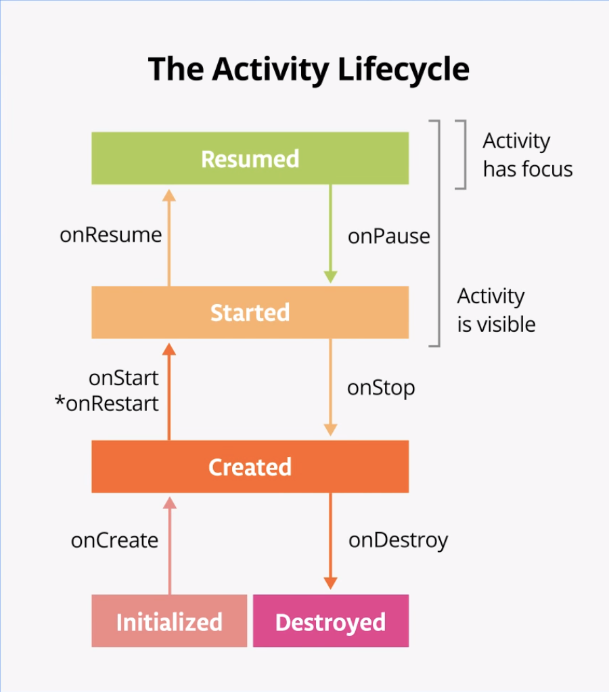

# Activity Lifecycle

Activity lifecycle consists of the different states that an activity can go through, from when the activity first initializes to its destruction, at which time the operating system (OS) reclaims its memory.

- Notice that, an activity can go back and forth between states throughout the lifecycle, instead of only moving in a single direction.
- An Android app can have multiple activities. However, it is recommended to have a single activity.

* The `Activity` class itself, and any subclasses of Activity such as `ComponentActivity`, implement a set of lifecycle callback methods. Android invokes these callbacks when the activity moves from one state to another, and you can override those methods in your own activities to perform tasks in response to those lifecycle state changes. The following diagram shows the lifecycle states along with the available overridable callbacks.

  
  - The asterisk on the onRestart() method indicates that this method is not called every time the state transitions between Created and Started. It is only called if onStop() was called and the activity is subsequently restarted.

 
 
 

## Callbacks

- `onCreate()` is called when the system creates the app but not yet visible to the user.
- `onStart()` is called when the app is visible on the screen but doesn't have focus for the user to be able to interact.
- `onResume()` is called when the app is brought to the foreground and the user is now able to interact with it.
- `onPause()` is called when the app's focus is lost but is still visible (perhaps in the background).
- `onStop()` is called when the app is no more visible to the user.
- `onDestroy()` is called when the app is fully destroyed.

 
 
 

## Configuration changes

A configuration change occurs when the state of the device changes so radically that the easiest way for the system to resolve the change is to completely shut down and rebuild the activity.

- Examples of configuration changes :
  - The user changes the device language.
  - The user plugs the device into a dock or adds a physical keyboard.
  - The device is rotated from portrait to landscape or back the other way.

- `onDestroy()` callback is called on configuration changes and the data is lost.

* To save values during [recompositions](./state.md#recomposition), you need to use `remember`. Use `rememberSaveable` to save values during [recompositions](./state.md#recomposition) and configuration changes.

- `rememberSaveable` function is to be used to save values that is needed if Android OS destroys and recreates the activity.
