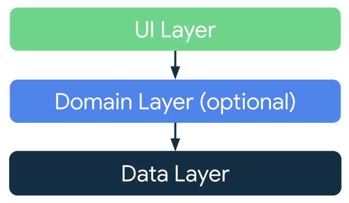
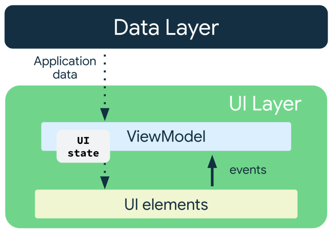

<br>
<br>
<br>

## Seperation of concerns

The separation of concerns is a design principle where the app is divided into classes, files, packages, modules and layers that have clearly defined responsibilities and boundaries.

- Ideal to have UI code and data code in separate layers.

	

<br>
<br>
<br>

## Model driven UI

Model driven UI is a concept where the UI is driven by a persistent model.

- Models are components responsible for handling the data for an app. 
- They're independent from the UI elements and app components, so they're unaffected by the app's lifecycle and associated concerns.

<br>
<br>
<br>


## Unidirectional data flow

A  unidirectional data flow (UDF) is a design pattern in which state flows down and events flow up.

- UDF enables decoupling of composables that display state in the UI from the app data. 

<br>

The UI update loop for an app using unidirectional data flow looks like the following:

- **Event:** Part of the UI generates an event and passes it upward—such as a button click passed to the ViewModel to handle—or an event that is passed from other layers of your app, such as an indication that the user session has expired.
- **Update state:** An event handler might change the state.
- **Display state:** The state holder passes down the state, and the UI displays it.

	

<br>
<br>
<br>


## Data Layer

Using a simple Todo app for illustration, the data layer would consist of the class definition for a Todo Item.

```kt
package com.example.simple_todo  
  
data class TodoItem(  
    val id: String = java.util.UUID.randomUUID().toString(),  
    val title: String = "",  
    var isChecked: Boolean = false  
)
```

<br>
<br>
<br>

## UI Layer

The UI later consists of the UI elements, UI state and also the View Model.

<br>
<br>

### UI State

UI state is what the app says the user should see.
- In Compose, the only way to update the UI is by changing the state of the app. 

<br>

```kt
package com.example.simple_todo  
  
data class AppState(  
    val todos: List<TodoItem> = emptyList(),  
    val userInput: String = ""  
)
```

- In the above example, when the AppState changes it triggers recomposition of the UI.
- The UI state definition in the example above is immutable. Immutable objects provide guarantees that multiple sources do not alter the state of the app at an instant in time. This protection frees the UI to focus on a single role: reading state and updating UI elements accordingly. Violating this principle results in multiple sources of truth for the same piece of information, leading to data inconsistencies and subtle bugs.


<br>
<br>

### View Model

The `ViewModel` component holds and exposes the state the UI consumes. 

- `ViewModel` lets the app follow the architecture principle of driving the UI from the model.
- Unlike the activity instance, `ViewModel` objects are not destroyed. The app automatically retains `ViewModel` objects during configuration changes so that the data they hold is immediately available after the recomposition.

<br>


The following line needs to be added in the "build.gradle.kts" file's dependencies in the app directory. 

```kt
implementation("androidx.lifecycle:lifecycle-viewmodel-compose:2.6.1")
```

<br>

```kt
package com.example.simple_todo  
  
import androidx.compose.runtime.mutableStateOf  
import androidx.compose.runtime.setValue  
import androidx.compose.runtime.getValue  
import androidx.lifecycle.ViewModel  
import kotlinx.coroutines.flow.MutableStateFlow  
import kotlinx.coroutines.flow.StateFlow  
import kotlinx.coroutines.flow.asStateFlow  
import kotlinx.coroutines.flow.update  
  
class AppModel : ViewModel() {  
    //uiState as StateFlow  
    private val _uiState = MutableStateFlow(AppState())  
    val uiState: StateFlow<AppState> = _uiState.asStateFlow()  
  
    //Observable mutable state that makes sense to be stored in the ViewModel  
    var inputError by mutableStateOf<String?>(null)  
        private set  
  
    fun updateUserInput(userText: String){  
        if (inputError != null) inputError = null //clear the error as soon as the user starts typing  
        _uiState.update { currentState->  
            currentState.copy(userInput = userText)  
        }  
    }  
    fun addNewTodo(){  
        val currentInput = _uiState.value.userInput  
        if (currentInput.isBlank()) {  
            inputError = "Todo item cannot be empty!"  
            return  
        }  
        val newTodo = TodoItem(title = _uiState.value.userInput);  
        _uiState.update { currentState ->  
            currentState.copy(  
                todos = currentState.todos + newTodo,  
                userInput = ""  
            )  
        }  
    }  
    fun onTodoChecked(id: String){  
        val updatedTodos = mutableListOf<TodoItem>()  
        for (item in uiState.value.todos) {  
            if (item.id != id) {  
                updatedTodos.add(item)  
            }  
        }  
        _uiState.update { currentState ->  
            currentState.copy(todos = updatedTodos)  
        }  
    }  
}
```


<br>

- [`StateFlow`](https://kotlin.github.io/kotlinx.coroutines/kotlinx-coroutines-core/kotlinx.coroutines.flow/-state-flow/) is a data holder observable flow that emits the current and new state updates. 
	 - `value` is an underlying uiState instance that can be used to access properties (e.g., uiState.value.someProperty). This is data read.
	 -  `update(transform: (T) -> T)` atomically replaces the current value with the result of transform. This is data write but there is no modification in the state object, the old state object is completely replaced with a brand new one.
- `MutableStateFlow` is A mutable, read-write implementation of **`StateFlow`** that allows direct modification of its underlying value.
- `asStateFlow()` is an extension function that converts a mutable `MutableStateFlow` into a read-only `StateFlow`.`


<br>
<br>

## UI Elements

Composables are UI elements.

```kt
package com.example.simple_todo  
  
import android.os.Bundle  
import androidx.activity.ComponentActivity  
import androidx.activity.compose.setContent  
import androidx.activity.enableEdgeToEdge  
import androidx.compose.foundation.layout.Arrangement  
import androidx.compose.foundation.layout.Column  
import androidx.compose.foundation.layout.Row  
import androidx.compose.foundation.layout.fillMaxSize  
import androidx.compose.foundation.layout.fillMaxWidth  
import androidx.compose.foundation.layout.padding  
import androidx.compose.foundation.lazy.LazyColumn  
import androidx.compose.foundation.lazy.items  
import androidx.compose.material3.Button  
import androidx.compose.material3.Card  
import androidx.compose.material3.Checkbox  
import androidx.compose.material3.Scaffold  
import androidx.compose.material3.Text  
import androidx.compose.material3.TextField  
import androidx.compose.runtime.Composable  
import androidx.compose.runtime.collectAsState  
import androidx.compose.runtime.getValue  
import androidx.compose.ui.Alignment  
import androidx.compose.ui.Modifier  
import androidx.compose.ui.graphics.Color  
import androidx.compose.ui.tooling.preview.Preview  
import androidx.compose.ui.unit.dp  
import androidx.lifecycle.viewmodel.compose.viewModel  
import com.example.simple_todo.ui.theme.SimpletodoTheme  
  
  
class MainActivity : ComponentActivity() {  
    override fun onCreate(savedInstanceState: Bundle?) {  
        super.onCreate(savedInstanceState)  
        enableEdgeToEdge()  
        setContent {  
            SimpletodoTheme {  
                Scaffold(modifier = Modifier.fillMaxSize()) { innerPadding ->  
                    TodoScreen(  
                    )  
                }  
            }        
        }          
    }  
}  
  
@Composable  
fun TodoScreen(model: AppModel = viewModel()) { 
 
    //Access the state 
    val state by model.uiState.collectAsState() 
    
    Column(Modifier.fillMaxSize().padding(top = 60.dp, start = 16.dp, end = 16.dp, bottom = 16.dp)) {  
        LazyColumn(  
            modifier = Modifier.weight(1f),  
            verticalArrangement = Arrangement.spacedBy(8.dp)  
        ) {  
            items(state.todos, key = { it.id }) { item ->  
                TodoRow(  
                    todoItem = item,  
                    onCheckedChange = { model.onTodoChecked(item.id) }  
                )  
            }  
        }  
        Row(horizontalArrangement = Arrangement.spacedBy(8.dp)) {  
            TextField(  
                value = state.userInput,  
                onValueChange = model::updateUserInput,  
                placeholder = { Text("Enter a new to-do...") },  
                isError = model.inputError != null,  
                supportingText = {  
                    model.inputError?.let { Text(text = it, color = Color.Red) }  
                },  
                modifier = Modifier.weight(1f),  
                singleLine = true  
            )  
            Button(onClick = model::addNewTodo) {  
                Text("Add")  
            }  
        }    }}  
  
@Composable  
fun TodoRow(  
    todoItem: TodoItem,  
    onCheckedChange: (Boolean) -> Unit,  
    modifier: Modifier = Modifier  
) {  
    Card(modifier.fillMaxWidth()) {  
        Row(  
            Modifier  
                .fillMaxWidth()  
                .padding(start = 16.dp, end = 16.dp, top = 12.dp, bottom = 8.dp),  
            verticalAlignment = Alignment.CenterVertically  
        ) {  
            Text(  
                todoItem.title,  
                modifier = Modifier.weight(1f)  
            )  
            Checkbox(  
                checked = todoItem.isChecked,  
                onCheckedChange = onCheckedChange  
            )  
        }  
    }}  
  
  
@Preview(showBackground = true)  
@Composable  
fun AppPreview() {  
    SimpletodoTheme {  
        TodoScreen()  
    }  
}
```

- `collectAsState()` lets us access the state from the viewmodel for data read purposes.
- the events and the state are driven via the viewmodel.

<br>
<br>
<br>

## Illustration

Have the above code in the four different files and run the project in Android studio.