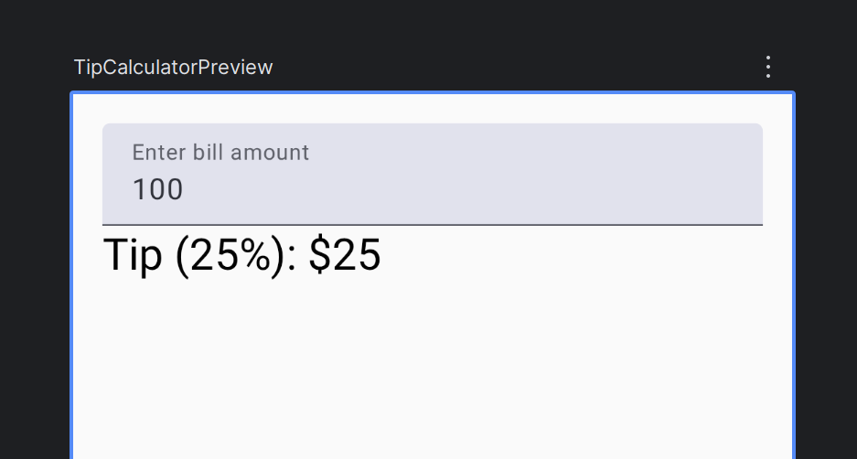

# Contents

- [Introduction](#introduction)
  - [Composable functions](#composable-functions)
    - [Composable function rules](#composable-function-rules)
    - [Illustration](#illustration)
  - [Annotations](#annotations)
    - [Composable annotation](#composable-annotation)

<br>
<br>
<br>


# Introduction

Jetpack Compose is a modern toolkit for building Android UIs.

- Compose simplifies and accelerates UI development on Android with less code, powerful tools, and intuitive Kotlin capabilities.
- With Compose, you can build your UI by defining a set of functions, called composable functions, that take in data and describe UI elements.

<br>
<br>
<br>

## Composable functions

Composable functions are the basic building block of a UI in Compose.

- A composable function:
  - Describes some part of your UI.
  - Doesn't return anything.
  - Takes some input and generates what's shown on the screen.

<br>
<br>

### Composable function rules

- Compose function should return nothing.
- It should have `@Composable` annotation.
- It must be named in Pascal case. (not camelCase).
- The name must be a noun and not a verb, preposition, adjective, adverb but may be prefixed by adjectives.
  - `DoneButton()` is valid as it is a noun.
  - `RoundIcon()` is valid as it a noun prefixed by an adjective.
  - `DrawTextField()` is invalid name as it is a verb.
  - `TextFieldWithLink()` is invalid as it has preposition.
  - `Bright()` is invalid as it is an adjective.
  - `Outside()` is invalid as it is an adverb.

<br>
<br>

### Illustration

- The following is a version of the starter code in Android studio, `UserTipITipCalculatornput` is the composable function that creates a UI with hard coded values.

  ```kt
  package com.example.notes

  import android.os.Bundle
  import androidx.activity.ComponentActivity
  import androidx.activity.compose.setContent
  import androidx.activity.enableEdgeToEdge
  import androidx.compose.foundation.layout.Column
  import androidx.compose.foundation.layout.fillMaxSize
  import androidx.compose.foundation.layout.fillMaxWidth
  import androidx.compose.foundation.layout.padding
  import androidx.compose.foundation.layout.safeDrawingPadding
  import androidx.compose.foundation.text.KeyboardOptions
  import androidx.compose.material3.MaterialTheme
  import androidx.compose.material3.Scaffold
  import androidx.compose.material3.Text
  import androidx.compose.material3.TextField
  import androidx.compose.runtime.Composable
  import androidx.compose.runtime.getValue
  import androidx.compose.runtime.mutableStateOf
  import androidx.compose.runtime.remember
  import androidx.compose.runtime.setValue
  import androidx.compose.ui.Modifier
  import androidx.compose.ui.text.input.KeyboardType
  import androidx.compose.ui.tooling.preview.Preview
  import androidx.compose.ui.unit.dp
  import com.example.notes.ui.theme.NotesTheme

  class MainActivity : ComponentActivity() {
      override fun onCreate(savedInstanceState: Bundle?) {
          super.onCreate(savedInstanceState)
          enableEdgeToEdge()
          setContent {
              NotesTheme {
                  Scaffold(modifier = Modifier.fillMaxSize()) { innerPadding ->
                      TipCalculator(
                          modifier = Modifier.padding(innerPadding)
                      )
                  }
              }
          }
      }
  }
  @Composable
  fun TipCalculator(modifier: Modifier = Modifier) {

      Column(modifier = modifier.fillMaxSize().padding(16.dp)) {
          TextField(
              value = "100",
              onValueChange = {},
              label = { Text("Enter bill amount") },
              modifier = modifier.fillMaxWidth(),
              keyboardOptions = KeyboardOptions(keyboardType = KeyboardType.Number),
              singleLine = true
          )

          Text(
              text = "Tip (25%): $25",
              style = MaterialTheme.typography.headlineSmall
          )
      }
  }


  @Preview(showBackground = true)
  @Composable
  fun TipCalculatorPreview() {
      NotesTheme {
          TipCalculator()
      }
  }
  ```

  

<br>
<br>
<br>

## Annotations

Annotations are means of attaching extra information to code.

- Annotations help tools like the Jetpack Compose compiler, and other developers understand the app's code.
- Annotations is part of Kotlin language syntax.

* Examples :

  ```kotlin
  // Example code, do not copy it over

  @Json
  val imgSrcUrl: String

  @Volatile
  private var INSTANCE: AppDatabase? = null
  ```

* Annotations can have parameters.

  ```kotlin
  @Preview(
    showBackgroung = true,
    name = "My Preview")
  @Composable
  fun GreetingPreview(){
      HappyBirthdayTheme {
          Greeting(name : "Android")
      }
  }
  ```

<br>
<br>

### Composable annotation

Composable annotation annotation informs the Compose compiler that this function is intended to convert data into UI.

```kt
@Composable
fun Greeting(name: String) {
    Text(text = "Hello $name!")
}
```

- Jetpack Compose is built around composable functions.
- Composable functions define the app's UI programmatically by describing how it should look, rather than focusing on the process of the UI's construction.

<br>
<br>
<br>
