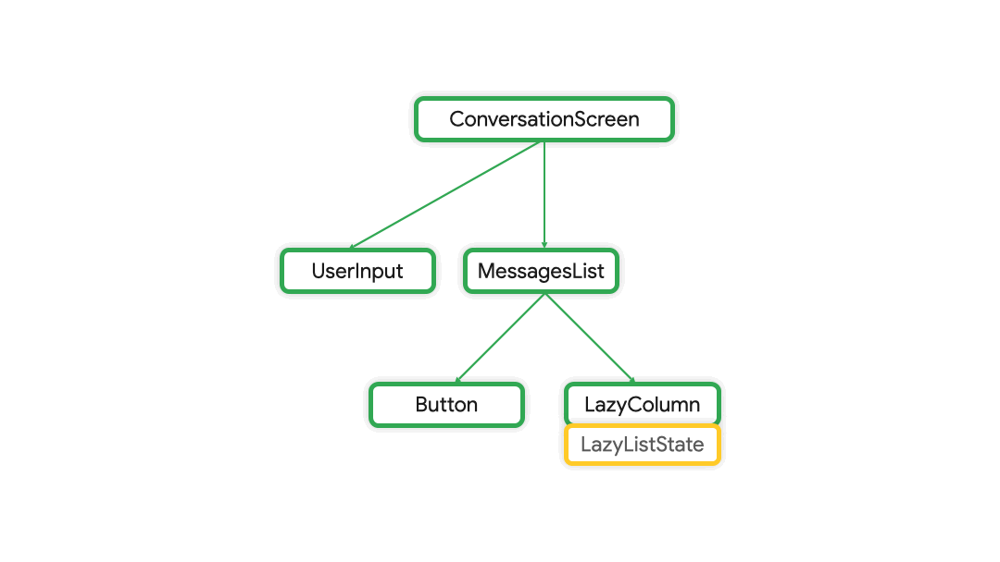

# State

State refers to any data that can change and affect the UI.

<br>
<br>
<br>

## Composition

The Composition is a description of the UI built by Compose when it executes composables.

- Compose apps call composable functions to transform data into UI.

<br>
<br>
<br>

## Recomposition

Recomposition is a process where upon a state change Compose re-executes the affected composable functions and updates the UI.

- The only way to modify the Composition is through recomposition.
- To achieve this Compose needs to know the states to be tracked so that it can schedule the recomposition when it receives an upate. The trackable state is known as [Observable state](#observable-state).

<br>
<br>
<br>

## Observable state

Observable state is a state that is tracked by Compose.

- Observable state can be immutable (read only).
- Observable state can be mutable, Example : `mutableStateOf()`, t receives an initial value as a parameter that is wrapped in a State object, which then makes its value observable.

<br>
<br>
<br>

## State hoisting

State hoisting is a pattern of moving state to its caller to make a component stateless.

When a state needs to be shared by composables to be used in them, The state must be hoisted higher in the hierarchy.



<br>

When applied to composables, this often means introducing two parameters to the composable:

1. A value: `T` parameter, which is the current value to display.
1. An onValueChange: `(T) -> Unit` – callback lambda, which is triggered when the value changes so that the state can be updated elsewhere, such as when a user enters some text in the text box.

<br>
<br>

### illustration

The following illustration showcases state hoisting. Here, the `BillDetailsScreen` contains all the state and UI components coded directly inside it. To modularise this, It is better to break the whole UI to seperate composables. However these children composables need access to the state i.e. `selectedBillOption` here.

```kt
@Composable
fun BillDetailsScreen(modifier: Modifier) {
    val billOptions = listOf("Quotation", "Invoice")
    var selectedBillOption by remember { mutableStateOf(billOptions[0]) }  //state

    Column(
        modifier = Modifier
            .fillMaxSize()
            .padding(start = 40.dp, top = 80.dp, end = 40.dp, bottom = 40.dp)
            .verticalScroll(rememberScrollState()), // Allows scrolling if keyboard covers fields
        verticalArrangement = Arrangement.spacedBy(16.dp)
    ) {
        Text(text = "Select Document Type:", style = MaterialTheme.typography.labelLarge)
        Row(verticalAlignment = Alignment.CenterVertically) {
            billOptions.forEach { text ->
                Row(
                    verticalAlignment = Alignment.CenterVertically,
                    modifier = Modifier.padding(end = 16.dp)
                ) {
                    RadioButton(
                        selected = (text == selectedBillOption),    //state hoisting to be done here
                        onClick = { selectedBillOption = it }       //state hoisting to be done here
                    )
                    Text(text = text, modifier = Modifier.padding(start = 4.dp))
                }
            }
        }
    }
}
```

<br>
<br>

`BillTypeSelector` is a composable which is used in `BillDetailsScreen`. The state is hoisted in the parent composable and the child composable accepts the state data as parameters. `selectedBillOption` is passed as is and `onSelectedBillOption` is passed as a lambda function.

```kt
@Composable
fun BillDetailsScreen(modifier: Modifier) {
    val billOptions = listOf("Quotation", "Invoice")
    var selectedBillOption by remember { mutableStateOf(billOptions[0]) }

    Column(
        modifier = Modifier
            .fillMaxSize()
            .padding(start = 40.dp, top = 80.dp, end = 40.dp, bottom = 40.dp)
            .verticalScroll(rememberScrollState()), // Allows scrolling if keyboard covers fields
        verticalArrangement = Arrangement.spacedBy(16.dp)
    ) {
        BillTypeSelector(
            billOptions,
            selectedBillOption,
            onSelectedBillOption = { selection ->
                selectedBillOption = selection
        })
    }
}


@Composable
fun BillTypeSelector(
    billOptions : List<String>,
    selectedBillOption : String,
    onSelectedBillOption : (String)-> Unit
) {
    Text(text = "Select Document Type:", style = MaterialTheme.typography.labelLarge)
    Row(verticalAlignment = Alignment.CenterVertically) {
        billOptions.forEach { text ->
            Row(
                verticalAlignment = Alignment.CenterVertically,
                modifier = Modifier.padding(end = 16.dp)
            ) {
                RadioButton(
                    selected = (text == selectedBillOption),
                    onClick = { onSelectedBillOption(text) }
                )
                Text(text = text, modifier = Modifier.padding(start = 4.dp))
            }
        }
    }
}
```
