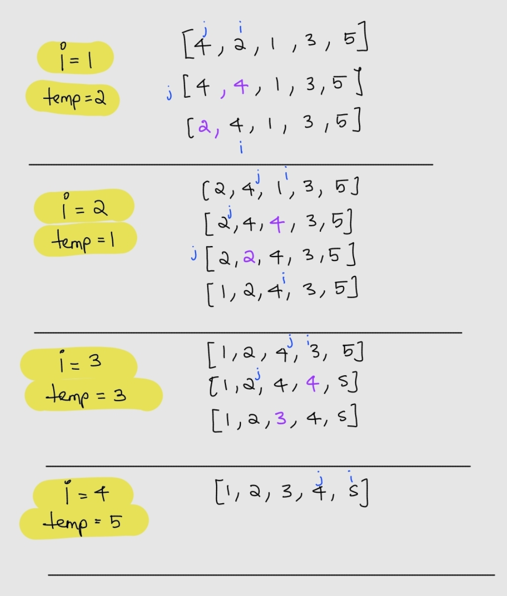
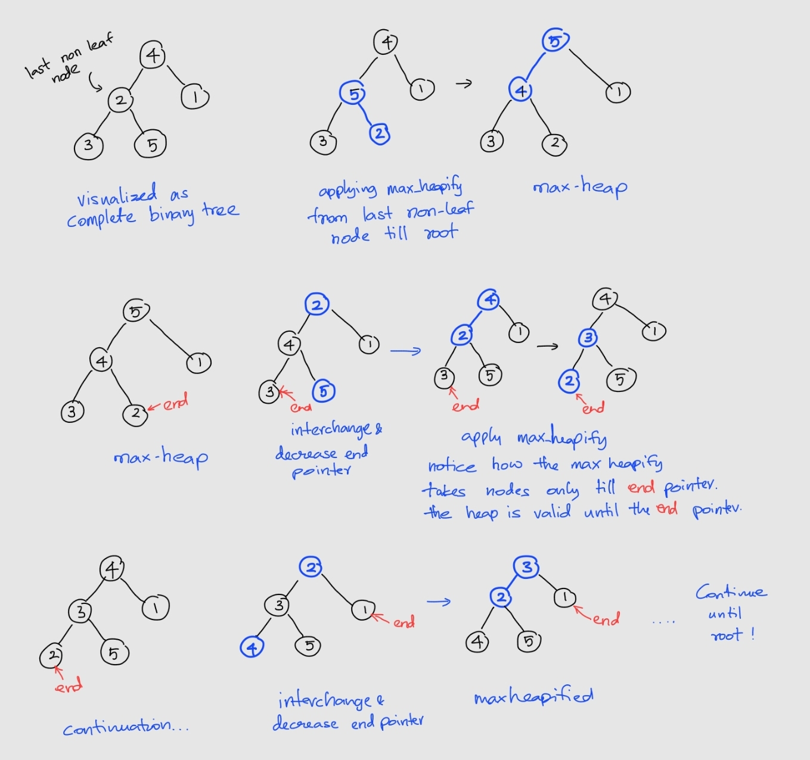

# Array Sorting Algorithms

| Algorithm      | Big Omega (Best Case/Lower Bound) | Big Theta (Average Case/Tight Bound) | Big O, Time Complexity | Big O, Space Complexity |
| -------------- | --------------------------------- | ------------------------------------ | ---------------------- | ----------------------- |
| Insertion Sort | $\Omega(n)$                       | $\theta(n^2)$                        | $O(n^2)$               | $O(1)$                  |
| Merge Sort     | $\Omega(n \log(n))$               | $\theta(n \log(n))$                  | $O(n \log(n))$         | $O(n)$                  |
| Heap Sort      |                                   |                                      | $O(n \log(n))$         | $O(1)$                  |
| Quick Sort     | $\Omega(n \log(n))$               | $\Omega(n \log(n))$                  | $O(n^2)$               | $O(1)$                  |

<br>
<br>

## Insertion Sort

```py
def insertion_sort(nums):
    for i in range(1, len(nums)):
        temp = nums[i]
        j = i - 1
        while j >= 0 and nums[j] > temp:
            nums[j + 1] = nums[j]
            j -= 1
        nums[j + 1] = temp
    return nums
```

- The Time Complexity is $O(n^2)$. In the worst case, the inner loop will run as many times as the size of the array.
- The Space Complexity is $O(1)$. The array manipulation is done in-place.
- Illustration of insertion sort is as shown
  

<br>
<br>

## Merge Sort

```py
def merge_sort(nums):
    if len(nums) > 1:
        mid = len(nums) // 2
        left = nums[:mid]
        right = nums[mid:]

        merge_sort(left)
        merge_sort(right)

        i = j = k = 0
        while i < len(left) and j < len(right):
            if left[i] < right[j]:
                nums[k] = left[i]
                i += 1
            else:
                nums[k] = right[j]
                j += 1
            k += 1

        # Append remaining elements from left, if any
        if i < len(left):
            nums[k:] = left[i:]

        # Append remaining elements from right, if any
        if j < len(right):
            nums[k:] = right[j:]

def apply_merge_sort(nums):
    merge_sort(nums)
    return nums

nums = [38, 27, 43, 3, 9, 82, 10]
print(apply_merge_sort(nums))
# [3, 9, 10, 27, 38, 43, 82]
```

- The Time Complexity is $O(n \log(n))$. The divide and conquer approach scales as $\log(n)$. In the merging step, the subarrays are merged in sorted manner by comparing each element in both the sub arrays, this scales as $O(k+m)$ which is basically $O(n), where k and m are the size of subarrays.$
- The Space Complexity is $O(n)$. During the merging phase of merge sort, temporary arrays are used to merge sorted sub-arrays back together into larger sorted sub-arrays. In the worst-case scenario, merge sort requires additional memory space to store temporary arrays equal to the size of the original input array.

<br>
<br>

## Heap Sort

```py
def max_heapify(array: list[float], index: int, size: int = None) -> None:
    size = len(array) if size is None else size
    left_index = 2 * index + 1
    right_index = 2 * index + 2
    largest = index
    if left_index < size and array[left_index] > array[index]:
        largest = left_index
    if right_index < size and array[right_index] > array[largest]:
        largest = right_index
    if largest != index:
        array[index], array[largest] = array[largest], array[index]
        max_heapify(array, largest, size)

def build_max_heap(array: list[float]) -> None:
    for i in range(len(array) // 2 - 1, -1, -1):
        max_heapify(array, i)

def heap_sort(array: list[float]) -> None:
    build_max_heap(array)
    size = len(array)
    for i in range(size - 1, 0, -1):
        array[0], array[i] = array[i], array[0]
        size -= 1
        max_heapify(array, 0, size)
```

- The time complexity is $O(n*log(n))$. The `build_max_heap` is $O(n)$ and the rest of the code takes $O(n*log(n))$, Overall the time complexity is $O((n) + n*log(n))$, which is $O(n*log(n))$.

- Illustration of insertion sort is as shown

  

<br>
<br>

## Quick Sort

```py
def partition(array, start, end):
    pivot = array[end]
    j = start - 1
    for i in range(start, end):
        if array[i] <= pivot:
            j += 1
            array[i], array[j] = array[j], array[i]
    array[j + 1], array[end] = pivot, array[j + 1]
    return j + 1

def quick_sort(array, start, end):
    if start < end:
        partition_index = partition(array, start, end)
        quick_sort(array, start, partition_index - 1)
        quick_sort(array, partition_index + 1, end)
```

- The worst case time complexity of quick sort is $O(n^2)$. This occurs when the array is sorted, the partions will be unbalanced with $n-1$ items on one side and $0$ items on the other side. The recurrance relation is given as $T(n) = T(n-1) + O(n)$, where $O(n)$ is the time complexity of the `partition` function. This is equvivalent to $O(n^2)$ [proof](./recursion.md#recurrance-relations).
- The best case and average case time complexity is $O(n log(n))$. This occurs when the partitions are balanced. (Refer the textbook for mathematical proofs)
- Quick sort sorts the items in place hence there is no additional space required, $O(1)$. However, there is auxilary space consumed in the form of stack frames because of recursion.
