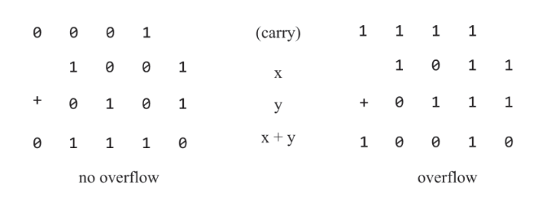
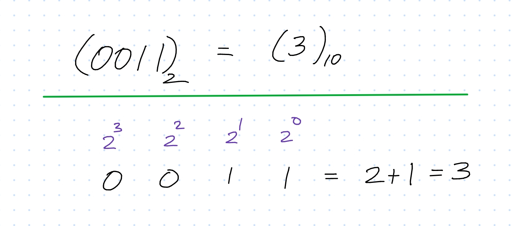
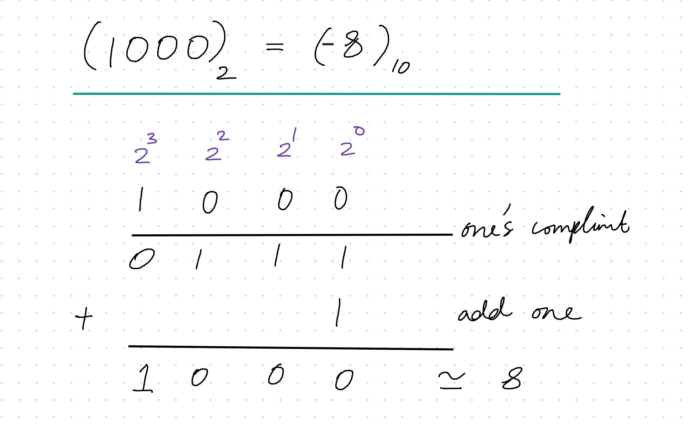
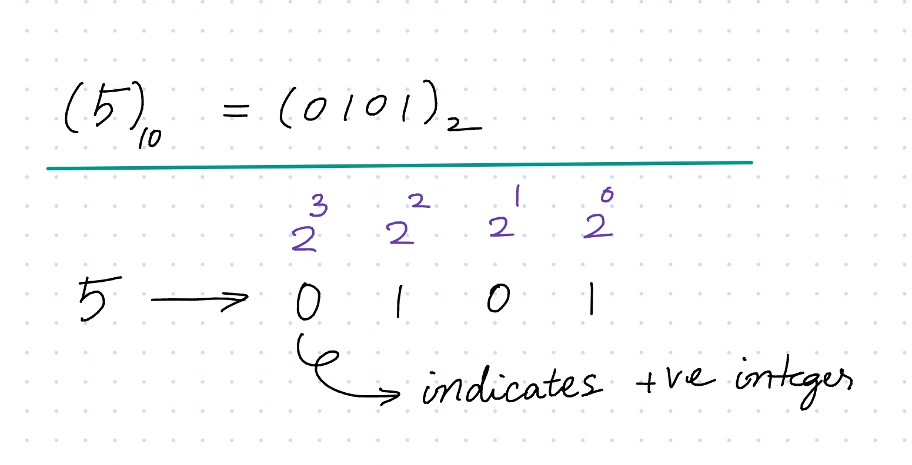
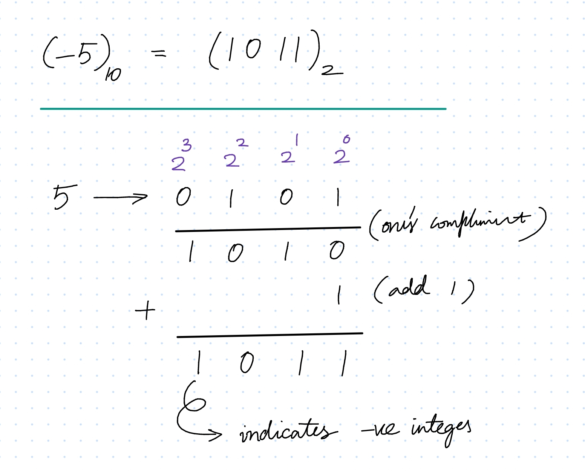
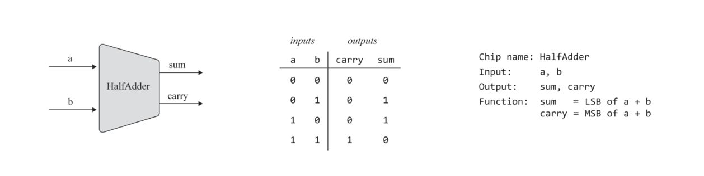
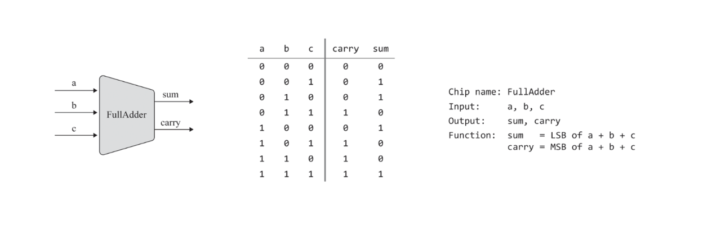
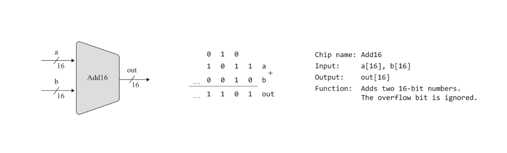

# Binary Numbers

 
 

## Binary Addition

If the most significant bitwise addition generates a carry of 1, we have what is known as overflow. What to do with overflow is a matter of decision, and ours is to ignore it.

- Binary substraction is just Binary Addition with the negative binary number represented in [Two's compliment](#twos-compliment) form. No additional circuitory is needed to deal with negative numbers, this is a major advantage of two's complement.

 
 

## Word Size

- Word size refers to the number of bits that a processor (ALU -> Register) can handle at a time.
- A computer with a 32-bit word size can process data in chunks of 32 bits at a time, while a computer with a 64-bit word size can process data in chunks of 64 bits at a time.

 
 

## Representing Unsigned Integers using Binary Numbers

**_Given a word size of $n$, the total number of unsigned integers that may be stored in the register is $2^n$, with the unsigned numbers being $0 \text{ to } (2^n - 1)$._**

- For example, The total number of unsigned integers that may be stored in a $4$ bit register is $2^4 = 16$ i.e. $0 \text{ to } 15$ as shown in the table.

  | Binary | Decimal |
  | ------ | ------- |
  | 0000   | 0       |
  | 0001   | 1       |
  | 0010   | 2       |
  | 0011   | 3       |
  | 0100   | 4       |
  | 0101   | 5       |
  | 0110   | 6       |
  | 0111   | 7       |
  | 1000   | 8       |
  | 1001   | 9       |
  | 1010   | 10      |
  | 1011   | 11      |
  | 1100   | 12      |
  | 1101   | 13      |
  | 1110   | 14      |
  | 1111   | 15      |

 
 

## Representing Signed Integers using Binary Numbers

- The initial idea was to use the MSB as a sign bit and remaining bits for calculating magnitude in normal fashion. Although it works but it adds unnecessary complexity as it introduces two zeros, a positive and a negative one.

  | Binary | Decimal |
  | ------ | ------- |
  | 0000   | 0       |
  | 0001   | 1       |
  | 0010   | 2       |
  | 0011   | 3       |
  | 0100   | 4       |
  | 0101   | 5       |
  | 0110   | 6       |
  | 0111   | 7       |
  | 1000   | -0      |
  | 1001   | -1      |
  | 1010   | -2      |
  | 1011   | -3      |
  | 1100   | -4      |
  | 1101   | -5      |
  | 1110   | -6      |
  | 1111   | -7      |

 

### Two's compliment

In modern computers, The 2's Compliment Method or the Radix Complement is used to repersent signed integers in binary form.

 

#### Calculating Decimal for a given Two's Compliment Binary

1. Determine wether the binary is a positive or negative number based on the MSB, 0 represents positive and 1 represents negative.
2. Calculate the magnitude by inverting all the remaining bits (1's compliment) and adding 1 to it.

- For illustration, 0011 is 3. As the MSB is 0, we don't have to perform one's complement and add one.
  

- For illustration, 1000 is -8. As the MSB is 1, we have to perform one's complement and add one to get the magnitude.
  

 

#### Calculating Two's Compliment Binary for a given Decimal

1. Determine the MSB value for the binary, if the decimal is positive the MSB is 0 and if the decimal is negative then MSB is 1.
2. Determine the Binary for the magnitude of the Decimal, Then Calculate the magnitude for the Binary by inverting all the remaining bits (1's compliment) and adding 1 to it.

For illustration,-5 (Decimal) is 1011 (Binary) :

- For illustration, 5 is 0101. Because the decimal is positive integer, we don't have to do anything.
  

- For illustration, -5 is 1011. Because the decimal is negative integer, we have to perform one's compliment and add one.
  

 
 

Given a word size of $n$, the total number of signed integers that may be stored in the register is $2^n$ i.e $-2^{n - 1} \text{ to } (2^{n-1} -1)$,
specifically positive numbers being $0  \text{ to } (2^{n-1} -1)$ and negative numbers being $-1 \text{ to } -2^{n - 1}$

- For example, The total number of signed integers that may be stored in a $4$ bit register is $2^4 = 16$ i.e. $-8 \text{ to } 7$. Specifically $0 \text{ to } 7$ positive numbers and $-1 \text{ to } -8$ negative numbers as shown in the table.

  | Binary | Decimal |
  | ------ | ------- |
  | 0000   | 0       |
  | 0001   | 1       |
  | 0010   | 2       |
  | 0011   | 3       |
  | 0100   | 4       |
  | 0101   | 5       |
  | 0110   | 6       |
  | 0111   | 7       |
  | 1000   | -8      |
  | 1001   | -7      |
  | 1010   | -6      |
  | 1011   | -5      |
  | 1100   | -4      |
  | 1101   | -3      |
  | 1110   | -2      |
  | 1111   | -1      |

 
 

 
 

## Adders

 

### Half Adder

 

### Full Adder

 

### Adder (Add 16)

//TODO - Writ HDL for all these and add illustrations to implement
