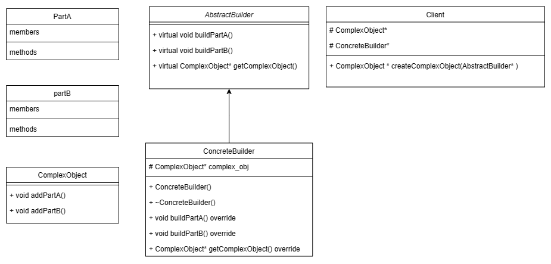
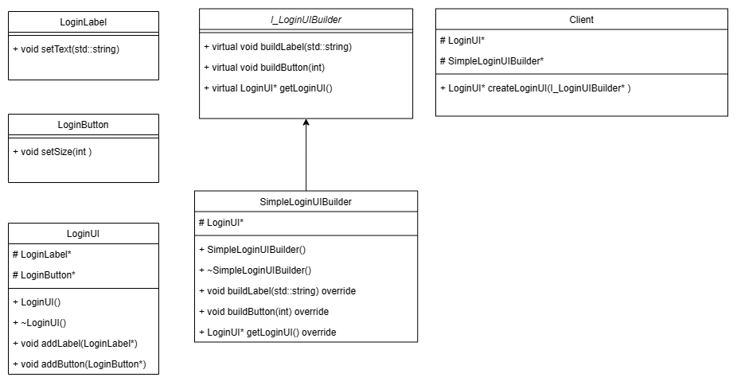

# Builder Pattern

**_The Builder design pattern is a creational pattern that helps creation of a complex object in a step by step fashion without specifying the construction process._**

<br>
<br>

## About Builder Pattern

<br>



### Components

1. Product is the complex object that takes quite a number of steps to construct it. The product most likely constitutes of parts that make it up.

1. The product is constructed using a Builder. Abstract builder serves as an interface and concrete builder "builds" the product (complex object).

1. Optionally, there is a director. However I am directly using the builder in the cient code.

<br>

### Applicability

1. This pattern is useful for creating complex objects where the client is independent of the constituent parts and the assembly process that make up the complex object.
2. This pattern is useful for creating complex objects, whose construction process must allow different representations.

<br>

### Benefits

Beyond its applicability to the above outlined use cases, the pattern offers:

1. Encapsulation of the object construction process.
1. Flexibility to modify existing implementation of object construction.

<br>

### Consequences

1. Requires careful consideration and validation mechanisms to ensure product integrity as technically there is no actual interface!

   - Note that the Gang of four book mentions not to write the functions in the abstract builder class as pure virtual functions instead to keep them as empty virtual functions so that the child classes can override only what is necessary, However this contradicts the very definition of an abstract class or the interface in C++. I will be ignoring this and focus on the pattern.

<br>
<br>

## Illustration



```cpp
#include <iostream>

//Constituent parts of the product
class LoginLabel {
public:
    void setText(std::string text) {
        //Implemention for setting the text for the label
    }
};

class LoginButton {
public:
    void setSize(int size)  {
        //Implementation for event handler for the button click
    }
};


//Complex object (the Product)
class LoginUI {
public:
    LoginUI() :login_button{nullptr}, login_label{nullptr}{}
    ~LoginUI() {
        delete login_label;
        delete login_button;
    }
    void addLabel(LoginLabel* label) {
        login_label = label;
     }
    void addButton(LoginButton* btn) {
        login_button = btn;
     }
protected:
    LoginLabel* login_label;
    LoginButton* login_button;
};

//abstract builder
class I_LoginUIBuilder {
public:
    virtual void buildLabel(std::string) {}
    virtual void buildButton(int size) {}
    virtual LoginUI* getLoginUI() { return 0; }
};


//Concrete
class SimpleLoginUIBuilder : public I_LoginUIBuilder {
public:
    SimpleLoginUIBuilder() {
        ui = new LoginUI();
    }
    ~SimpleLoginUIBuilder() {
        //delete ui;  Not needed as App class is handling the deletion of memory
    }
    void buildLabel(std::string text) override {
        LoginLabel* label = new LoginLabel();
        label->setText(text);
        ui->addLabel(label);
    }
    void buildButton(int size) override {
        LoginButton* button = new LoginButton();
        button->setSize(size);
        ui->addButton(button);
    }
    LoginUI* getLoginUI() override {
        return ui;
    }
protected:
    LoginUI* ui;
};

//Client
class App {
public:
    App() {
        login_ui_builder = new SimpleLoginUIBuilder();
        login_ui = createLoginUI(login_ui_builder);
    }
    ~App() {
        delete login_ui;
        delete login_ui_builder;
    }
protected:
    LoginUI* login_ui;
    SimpleLoginUIBuilder* login_ui_builder;

    LoginUI* createLoginUI(I_LoginUIBuilder* builder) {
        builder->buildLabel("Existing User?");
        builder->buildButton(5);
        return builder->getLoginUI();
    }
};

int main() {
    App my_app = App();
}
```

<br>

### Illustration about Components

1. Product is the complex object that takes quite a number of steps to construct it. The product most likely constitutes of parts that make it up.

   - `LoginUI` is the complex object, the product. `LoginLabel` and `LoginButton` are the constituent parts. They donot contain abstract base classes because there is generally no interface that the product and parts can adhere to in builder pattern.

1. The product is constructed using a Builder. Abstract builder serves as an interface and concrete builder "builds" the product (complex object).

   - `I_LoginUIBuilder` is the abstract builder class that serves as the interface for all concrete SimpleLoginUIBuilder's. The functions are not pure pure virtual instead are empty virtual functions so that the concrete classes can override only what is necessary. `SimpleLoginUIBuilder` is one such concrete builder class.

1. Optionally, there is a director. However I am directly using the builder in the cient code.

   - `App` : Client that uses the concrete builder via the builder interface.

<br>

### Illustration about Applicability

1. This pattern is useful for creating complex objects where the client is independent of the constituent parts and the assembly process that make up the complex object.

   - In this illustration, the UI object is the complex object. LoginLabel and LoginButton are constituent parts that make up the UI. The client code doesn't know the implementation of Labels and the buttons, it justs uses the builder to build it.

2. This pattern is useful for creating complex objects, whose construction process must allow different representations. (In other words: Flexibility to modify existing implementation of object construction.)

   - A new representation of the complex object can be constructed by writing a new concrete builder class because builders are exposed via abstract builder interface.

<br>

### Illustration about Benefits

Beyond its applicability to the above outlined use cases, the pattern offers:

1. Encapsulation of the object construction process.
1. Flexibility to add new constituent parts in the assembly process of the product. (I'm guessing, could be devastatingly wrong!)

<br>

### Illustration about Consequences

1. Requires careful consideration and validation mechanisms to ensure product integrity as technically there is no actual interface!

   - Difficult to fix broken code intriduced on modification of code as there is no actual interfaces for anything other than the builder.

<br>
<br>

## Difference between Abstract Factory Pattern and Builder Pattern

The Abstract Pattern is very similar to the Builder pattern as it can also create complex objects.

- _The primary difference is that the Builder pattern focuses on constructing a complex object step by step. Abstract Factory’s emphasis is on families of product objects (either simple or complex)._

  - The builder interface is setup in such a way that it can accomodate different ways to construct the complex object (the product). From the start we have a fixed intention to create the `LoginUI` and and have no intention to use the pattern say to create a SignupUI.

- Builder returns the product as a final step, but as far as the Abstract Factory pattern is concerned, the product gets returned immediately.

  - Unlike the abstract factory pattern where every _"make"_ method would return a product, In the builder pattern the _"build"_ methods will not return anything but handles the construction process in the implementation and the final _"getProduct"_ (build() is another convention) method returns the product. Also, the build methods can be made chainable by making the return type as the builder's abstract class itself! (See client code)
  - I have also notices that the abstract factory's _"make"_ methods generally don't take any parameters but the builder pattern's _"build"_ method do take parameters. Not sure if it can be designed otherwise for both patterns. (See client code)
