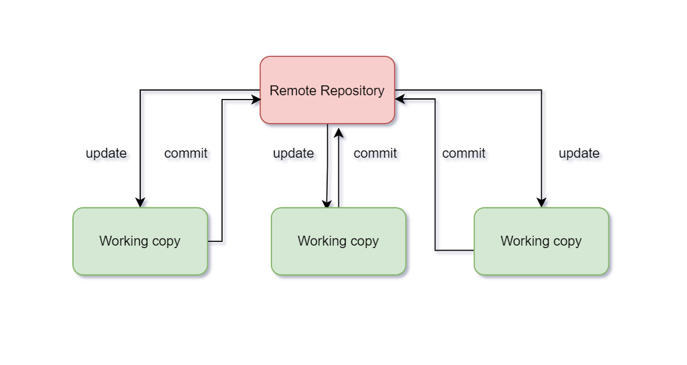

# Version Control Systems

- **_Version control_**, also known as **_source code_** or **_revision control_**, is a system that allows multiple individuals or teams to collaboratively manage and track changes to a collection of files over time.

- A version control system (VCS) is a software tool or platform that facilitates version control.

 
 

## Centralised VCS

In CVCS, there is a central server that stores the entire version history and acts as the authoritative source. Users check out copies of the files from this central repository, make changes, and then commit those changes back to the central server.

- Examples include Subversion (SVN) and Perforce.
- Some Disadvantages are:
  - Single Point of Failure.
  - Slower Performance.
  - Complex branching and merging.

 
 

## Distributed VCS

DVCS allows each user to have a complete copy of the entire repository, including its history, on their local machine. Users commit changes to this local repository and then pull and push the changes to the remote repository.

- Examples include Git and Mercurial.
- Disadvantages are:
  - Learning curve.
  - Lack of granular control.

 
 
