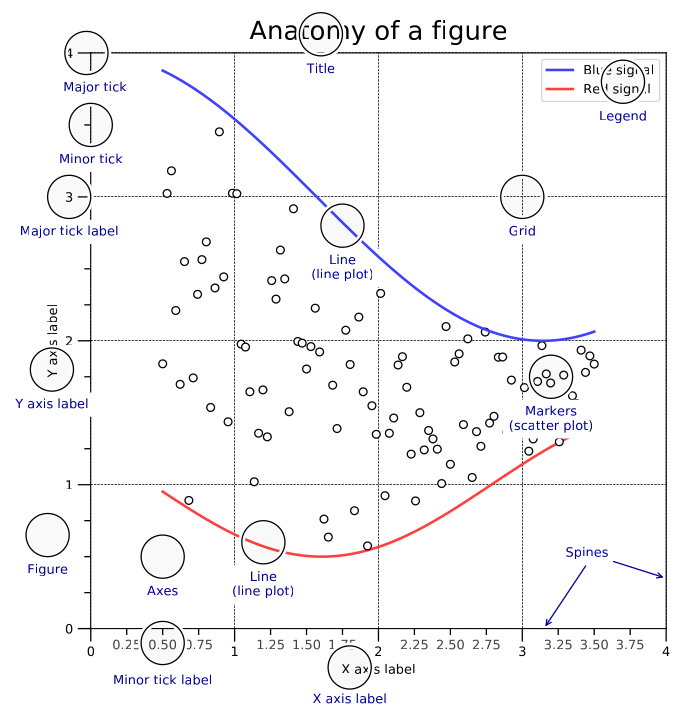
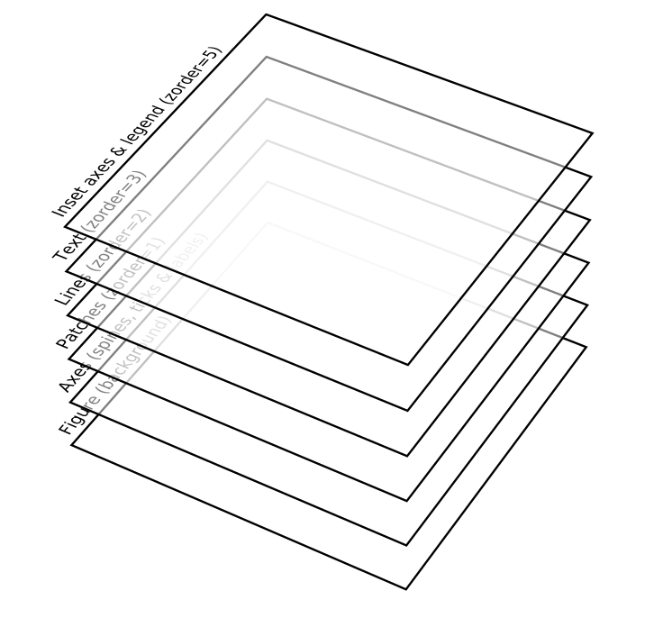

# Figure

Figure is the top level component for all the plot elements.

 
 
 

## Anatomy of figure

 
 
 

## Axes

Element that corresponds to the actual area where your data will be rendered.

- Axes is also called as subplot.
- There can be one to many axes per figure and each is usually surrounded by four edges, called spines.

 
 
 

## Spines

Spines are the lines connecting the axes tick marks and noting the boundaries of the data area.

- Only the left and the bottom spines are decorated by default.

 
 
 

## Axis

Axis are decorated spines.

 
 
 

## Artist

Everything on the figure, including Figure, Axes, and Axis objects, is an artist.

- When the figure is rendered, all of the artists are drawn to the canvas.
- A given artist can only be in one Axes.

 
 
 

## Zorder

Zorder is the porperty that indicates the virtual depth of the primitives.

- zorder value is used to sort the primitives from the lowest to highest before rendering them.
- This allows to control what is behind what

 
 
 

## Backends

- A backend is the combination of a renderer that is responsible for the actual drawing and an optional user interface that allows to interact with a figure.

  | Renderer | Type          | File type                      |
  | -------- | ------------- | ------------------------------ |
  | Agg      | Raster        | Portable Network Graphic (PNG) |
  | PS       | Vector        | Postscript (PS)                |
  | PDF      | Vector        | Portable Document Format (PDF) |
  | SVG      | Vector        | Scalable Vector Graphic (SVG)  |
  | Cairo    | Raster/Vector | PNG/PDF/SVG                    |

- Following interfaces are avialable :

  | Interface | Renderer     | Dependencies           |
  | --------- | ------------ | ---------------------- |
  | GTK3      | Agg or Cairo | AggPyGObject & Pycairo |
  | Qt4       | Agg          | PyQt4                  |
  | Qt5       | Agg          | PyQt5                  |
  | Tk        | Agg          | TkInter                |
  | Wx        | Agg          | wxPython               |
  | MacOSX    | Agg          | OSX (obviously)        |
  | Web       | Agg          | Browser                |
