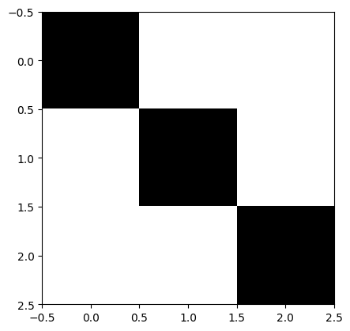
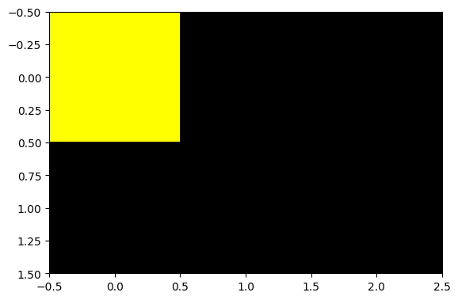
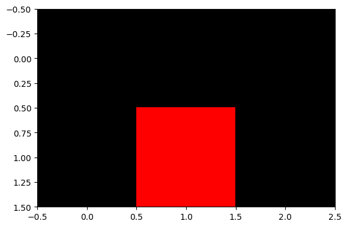

# Images using Matplotlib

- We can use matplotlib to show images as they are multidimensional arrays.
- In Matplotlib, the default color map is called "viridis" (as of version 2.0.0), which is designed to be perceptually uniform and allows for better visualization of data. This color map ranges from a light yellowish color for low values to a dark blue for high values.

## cmap

- We have to set the cmap as "gray".

  ```
  import matplotlib as plt
  plt.set_cmap('gray')
  ```

## Gray Images

- Gray images, also known as grayscale images, are digital images where each pixel's color intensity is represented by a single value ranging from 0 (minimum intensity, black) to 255 (maximum intensity, white).

  ```py
  gray_img = np.array([[0,255,255], [255, 0, 255], [255, 255,0]])
  plt.imshow(gray_img)
  ```

  

<br>
<br>

## RGB Images

- A RGB image is a color image.
- It has three channels (Red, Green, Blue)
- The combination of the pixel values in each channel gives colors.

<br>

- See the array below and understand each axes (dimension).

  ```py
  rgb_img = np.array([[[0, 0, 0], [0,0, 0], [0, 0, 0]], [[0, 0, 0], [0, 0, 0], [0, 0, 0]]])
  print(rgb_img.shape)

  #> (2,3,3)
  ```

- The first axis represents the rows (the above array has 2 rows).
- The second axes represents the colums (the above array has 3 colums).
- The third axes represents the color (by mixing R,G,B values).

> <br> It is convinient to just spot the pixel cell [co-ordinate: (row, column)] and then just set the color for that pixel by manipulating R, G, B.

<br>

- To set the first pixel as Yellow in the above 2\*3 image,

  ```
  img = np.array([[[255, 255, 0], [0,0, 0], [0, 0, 0]], [[0, 0, 0], [0, 0, 0], [0, 0, 0]]])
  plt.imshow(img)
  ```

  

- To set the second row, second column pixel to Red,

  ```py
  img = np.array([[[0, 0, 0], [0,0, 0], [0, 0, 0]], [[0, 0, 0], [255, 0, 0], [0, 0, 0]]])
  plt.imshow(img)
  ```

  
