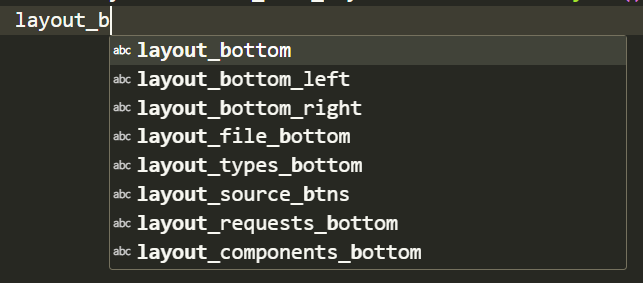

## Advice

- Personally I like to use [Hungarian Notation](../../programming/programming.md#hungarian-notation) for naming QT variables, especially related to GUI. This is helpful when using Tab completion, if we want to add a layout, all the possible layout in the code is organised in tab completion.

  

- When programming QT code, Hook up the things then and there as they are defined. Donot wait for initialising child things. This sounds better than the other approach (initialising all the children and then hooking up) because there is less chance of forgetting things.

  ```cpp
  // Ideal Approach
  QApplication a(argc, argv);
  MainWindow w;
  QFrame* frame = new QFrame;
  w.setCentralWidget(frame);
  QHBoxLayout* layout_main = new QHBoxLayout;
  frame->setLayout(layout_main);  //Set this before the inner layouts are created
  QVBoxLayout* layout_inner = new QVBoxLayout;
  layout_main->addLayout(layout_inner); //Add this before the widgets are added
  QLineEdit* line_edit_input = new QLineEdit;
  layout_inner->addWidget(line_edit_input);
  w.show();
  ```

  ```cpp
  // Not bad code
  QApplication a(argc, argv);
  MainWindow w;
  QFrame* frame = new QFrame;
  w.setCentralWidget(frame);
  QHBoxLayout* layout_main = new QHBoxLayout;
  QVBoxLayout* layout_inner = new QVBoxLayout;
  QLineEdit* line_edit_input = new QLineEdit;
  layout_inner->addWidget(line_edit_input);
  layout_main->addLayout(layout_inner); //Adding this after the widgets are created
  frame->setLayout(layout_main);  //Set after the layout is complete
  w.show();
  ```
