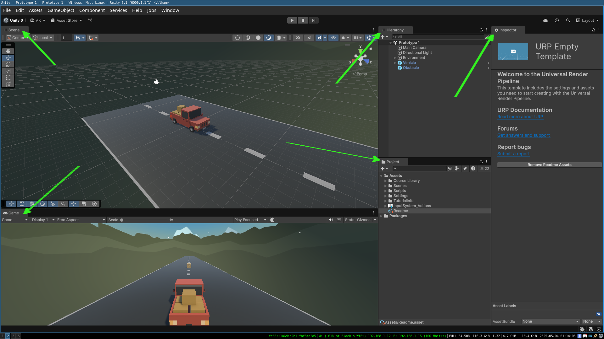

# Basics

 
 
 

## UI

 
 

 

### Game View

- Shows what the player will see during gameplay.

 
 

### Scene View

- Allows you to visually place, move, and manipulate GameObjects in the game world.

 
 

### Hierarchy Window

- Displays a list of all GameObjects in the current scene in a parent-child hierarchy.

 
 

### Inspector Window

- Shows the properties and components of the currently selected GameObject or asset.

 
 

### Project Window

- Shows all assets in your project (scripts, models, textures, etc.).

 
 
 

## Scripts
