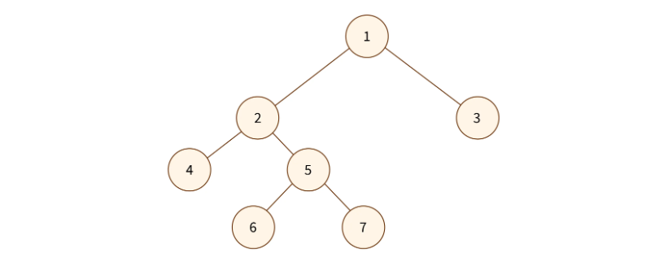
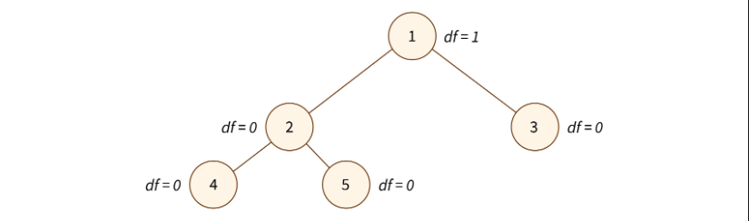

# Binary Tree

_Binary Tree is a Tree where each node can have at most two children._

<br>
<br>
<br>

## Equations related to Binary Tree

<br>
<br>

### Maximum number of nodes for a given height

<div style="height: 1px; background-color: #808080;"></div>

The maximum number of nodes at a given height $h$ is $2^h$. The maximum number of nodes at a given height can be calculated by summing up all the nodes at respective height's i.e $2^0 + 2^1 + 2^2 + ... + 2^h$. This is a [geometric series](../../../../../mathematics/algebra/series.md#geometric-series) and the sum of a geometric series is given by the formula:

$$ S = a \left( \frac{1- r^n }{1- r } \right)$$

In our case, $a = 2^0$, $r = 2$ and $n = h+1$. Therefore,

$$ S = 2^{h+1} -1 $$

Hence, For a tree with height $h$,

$$ \text{The maximum number of nodes in the tree} = N = 2^{h+1} -1 $$

<br>
<br>

### Height of the tree for number of nodes

<div style="height: 1px; background-color: #808080;"></div>

If $N$ is the maximum number of nodes and $h$ is the height of the tree, we know that ([proof](#maximum-number-of-nodes-for-a-given-height)) :

$$ N = 2^{h+1} -1 $$

Solving for h in the above equation,

$$ h = \log_2{(N+1)}-1 $$

Hence, For a tree with $N$ nodes,

$$ \text{The height of the tree = h =} floor(log_2(N))$$

<br/>

### Indices when represented as an array

<div style="height: 1px; background-color: #808080;"></div>

When the tree is represented as an zero indexed array, for node at index $i$,

- Index of left child = $(2\times{i})+1$.
- Index of right child = $(2\times{i}) +2$
- Index of parent = $floor((i-1)/2)$

<br>

When the tree is represented as an one indexed array, for node at index $i$,

- Index of left child = $2\times{i}$.
- Index of right child = $(2\times{i}) +1$
- Index of parent = $floor(i/2)$

<br/>
<br/>

## Types of Binary Tree

<br>

### Types of Binary Tree based on number of children

<div style="height: 1px; background-color: #808080;"></div>

<br>

#### Full Binary Tree

_A full binary tree is a special type of binary tree in which every node other than the leaves has exactly two children._



<br>

#### Degenerate Binary Tree

_A degenerate binary tree is a type of binary tree in which each parent node has only one associated child node._


- Also known as a pathological tree or a skewed tree.
- They are esentially a linked list.

<br>
<br>

### Types of Binary Tree based on completion levels

<div style="height: 1px; background-color: #808080;"></div>

<br>

#### Perfect Binary Tree

_A perfect binary tree is a type of binary tree in which all interior nodes have exactly two children and all leaf nodes are at the same level or depth._


- Perfect binary trees have precisely $(2^k) - 1$ nodes, where k is the last level of the tree (starting with 1).
- Perfect binary tree is a balanced binary tree where every level is filled with the maximum number of nodes possible.
- A perfect binary tree is always complete binary tree.

<br>

#### Complete Binary Tree

_A complete binary tree is a type of binary tree in which all levels of the tree are completely filled except possibly for the last level, which is filled from left to right._


- A complete tree is not always perfect tree.

- This is a complete binary tree.

  ```
            20
          /    \
        18      12
       / \
      9   7

  ```

- This is NOT a complete binary tree. As it is not left leaning when possible.

  ```
            20
          /    \
        18      12
       / \        \
      9   7        1

  ```

<br>

#### Balanced Binary Tree

_A balanced binary tree is a type of binary tree in which the heights of the left and right subtrees of every node differ by at most one._



<br>
<br>

## Tree Traversal Algorithms

Tree traversal algorithms are the only algorithms relevant to binary tree, algorithms to perform operations like searching, inserting or deleting a node is not relevant to binary tree as there is no criteria unlike that of [binary search tree property](03-binary-search-tree.md#binary-search-tree-property).


<br>

#### In Order Traversal

_Inorder traversal is a depth-first tree traversal algorithm that visits the left subtree, then the current node, and finally the right subtree_

- In Order Traversal : 4, 2, 5, 1, 6, 3, 7

<br>

#### Pre Order Traversal

_Preorder traversal is a depth-first tree traversal algorithm that visits the current node, then the left subtree, and finally the right subtree._

- Pre Order Traversal : 1, 2, 4, 5, 3, 6, 7

<br>

#### Post Order Traversal

_Postorder traversal is a depth-first tree traversal algorithm that visits the left subtree, then the right subtree, and finally the current node._

- Post Order Traversal : 4, 5, 2, 6, 7, 3, 1

<br>

#### Level Order Traversal

_Level order traversal, also known as breadth-first traversal, visits nodes level by level from left to right, starting from the root level and moving to deeper levels._

- Level Order Traversal : 1, 2, 3, 4, 5, 6, 7

<br>

<br/>

### Implementation

All traversal algorithms are $O(n)$ algorithms.

```py
class Node:
    def __init__(self, value: float = None, left: "Node" = None, right: "Node" = None):
        self.value = value
        self.left = left
        self.right = right


class BinarySearchTree:
    def __init__(self):
        self.root = Node()

    def in_order_traversal(self, root: Node = None) -> list[float]:
        res = []
        stack = []
        cur = self.root if not root else root

        while True:
            if cur:
                stack.append(cur)
                cur = cur.left
            elif stack:
                cur = stack.pop()
                res.append(cur.value)
                cur = cur.right
            else:
                break
        return res

    def pre_order_traversal(self, root: Node = None) -> list[float]:
        res = []
        cur = self.root if not root else root
        stack = [cur]

        while stack:
            cur = stack.pop()
            res.append(cur.value)
            if cur.right:
                stack.append(cur.right)
            if cur.left:
                stack.append(cur.left)
        return res

    def post_order_traversal(self, root: Node = None) -> list[float]:
        res = []
        cur = self.root if not root else root
        stack = [cur]

        while stack:
            cur = stack.pop()
            res.append(cur.value)
            if cur.left:
                stack.append(cur.left)
            if cur.right:
                stack.append(cur.right)
        return res[::-1]

    def level_order_traversal(self, root: Node = None) -> list[float]:
        res = []
        cur = self.root if not root else root
        q = [cur]

        while q:
            cur = q.pop(0)
            res.append(cur.value)
            if cur.left:
                q.append(cur.left)
            if cur.right:
                q.append(cur.right)
        return res

    def level_order_traversal_diff(self, root: Node = None) -> list[list[Node]]:
        res = []
        cur = self.root if not root else root
        q = [cur]

        while q:
            level = []
            for i in range(len(q)):
                cur = q.pop(0)
                level.append(cur.value)

                if cur.left:
                    q.append(cur.left)
                if cur.right:
                    q.append(cur.right)
            res.append(level)

        return res
```

<br>
<br>

## Refernces

### In Order Traversal wihout Infinite Loop

```py
def in_order_traversal(self, root: Node = None) -> list[float]:
    res = []
    stack = []
    cur = self.root if not root else root
    while cur or stack:
        if cur:
            stack.append(cur)
            cur = cur.left
        else:
            cur = stack.pop()
            res.append(cur.value)
            cur = cur.right
    return res
```

<br>

### Implementation using Arrays

```py
# Given a binary tree in array form

def get_left_child_index(parent_index):
        return 2 * parent_index + 1

def get_right_child_index(parent_index):
    return 2 * parent_index + 2

def exists(index):
    if index < len(arr):
        return True
    else:
        return False

def in_order_traversal(arr):
    res = []
    stack = []
    cur = 0

    while True:
        if exists(cur):
            stack.append(cur)
            cur = get_left_child_index(cur)
        elif stack:
            cur = stack.pop()
            res.append(arr[cur])
            cur = get_right_child_index(cur)
        else:
            break
    return res

def pre_order_traversal(arr):
    res = []
    stack = [0] if arr else []

    while stack:
        cur = stack.pop()
        res.append(arr[cur])
        if exists(get_right_child_index(cur)):
            stack.append(get_right_child_index(cur))

        if exists(get_left_child_index(cur)):
            stack.append(get_left_child_index(cur))

    return res

def post_order_traversal(arr):
    res = []
    stack = [0] if arr else []

    while stack:
        cur = stack.pop()
        res.append(arr[cur])
        if exists(get_left_child_index(cur)):
            stack.append(get_left_child_index(cur))

        if exists(get_right_child_index(cur)):
            stack.append(get_right_child_index(cur))

    return res[-1::-1]

def level_order_traversal(arr):
    res = []
    q = [0] if arr else []

    while q:
        cur = q.pop(0)
        res.append(arr[cur])
        if exists(get_left_child_index(cur)):
            q.append(get_left_child_index(cur))
        if exists(get_right_child_index(cur)):
            q.append(get_right_child_index(cur))
    return res
```

<br/>
<br/>
