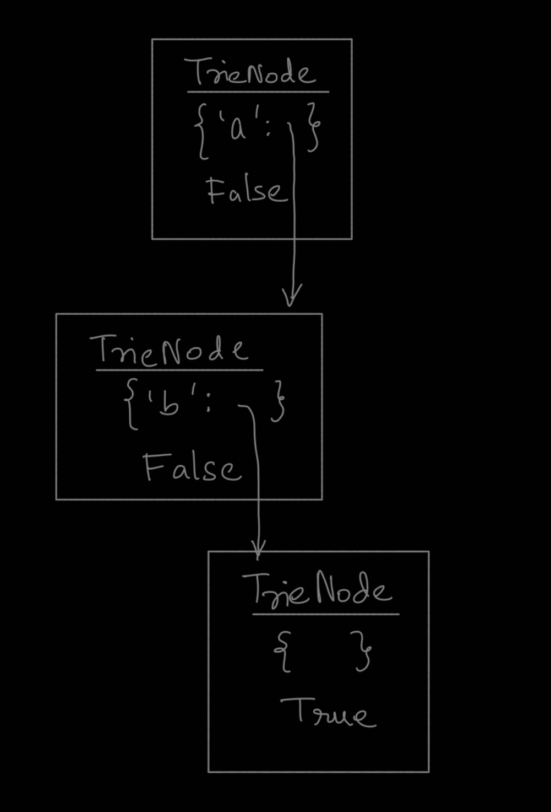

# Contents

- [Trie](#trie)
  - [Implementation](#implementation)
  - [Complexity](#complexity)
  - [Resources](#resources)

<br>
<br>
<br>

# Trie

Trie is a specialized, tree-based data structure used to efficiently store and retrieve keys, usually strings.

- Tries are particularly effective for tasks such as autocomplete, spell checking, and IP routing, offering advantages over hash tables due to their prefix-based organization and lack of hash collisions.

<br>
<br>
<br>

## Implementation

```py
from collections import defaultdict

class TrieNode:
    def __init__(self):
        self.isEnd = False
        self.children = defaultdict(TrieNode)

class Trie:
    def __init__(self):
        self.root = TrieNode()

    def insert(self, word: str) -> None:
        cur = self.root
        for c in word:
            cur = cur.children[c]
        cur.isEnd = True

    def search(self, word: str) -> bool:
        cur = self.root
        for c in word:
            if c not in cur.children:
                return False
            cur = cur.children[c]
        return cur.isEnd


    def startsWith(self, prefix: str) -> bool:
        cur = self.root
        for c in prefix:
            if c not in cur.children:
                return False
            cur = cur.children[c]
        return True


# Your Trie object will be instantiated and called as such:
# obj = Trie()
# obj.insert(word)
# param_2 = obj.search(word)
# param_3 = obj.startsWith(prefix)
```

- Trie trees contain TrieNodes which have two attributes, a map datastructure and a boolean variable.
  - The map contains characters of the strings as keys and subsequent TrieNodes as values, The characters point to the next TrieNode.
  - The boolean variable indicates wether the TrieNode is terminating, meaning end of a word.

* Using a `defaultdict(TrieNode)` makes the implementation much more concise.

- It is important to note that the `isEnd` attribute of a `TrieNode` is set True for the subsequent node of the last character's `TrieNode` and not on itself.
  - The final `TrieNode` represents the 'End State' reached by that character rather than the character itself.
  - If the understanding is that the `isEnd` attribute of `TrieNode` containing the last character for a word itself will be made True, then this means that the character itself is considered, this understanding is faulty as the `TrieNode` consists of other characters as well and it would mean that all those other characters can also be considered terminal, which is not the case!

    

<br>
<br>
<br>

## Complexity

- Time Complexity : This is a linear, $O(m)$ solution in terms of time, where $m$ is the length of the word.
  - Add : This is a linear, $O(m)$ solution in terms of time, where $m$ is the length of the word.
  - Search : This is a linear, $O(m)$ solution in terms of time, where $m$ is the length of the word.
  - Startswith :This is a linear, $O(m)$ solution in terms of time, where $m$ is the length of the word.
  - In every case the algorithm runs for each character of the word throught the Trie-based tree.

- Space Complexity : This is a bi-linear, $O(N)$ solution in terms of space, where $N$ is the number of nodes in the Trie tree.
  - If all words have completely unique characters and no common prefixes, every character of every word will require a new `TrieNode`.
  - The strength of a Trie is prefix sharing. "apple", "apply", and "applied", all share the same first four nodes (a -> p -> p -> l). This significantly reduces the space needed compared to a hash set if many words share common beginnings.
  - In a simple list using linear search, it will be $O(m*l)$ where $m$ is the number of words and $l$ is the average length of the words. However, This is incorrect in the case of Trie because of preffix sharing.

<br>
<br>
<br>

## Resources

- Checkout [Tushar's](https://www.youtube.com/watch?v=AXjmTQ8LEoI) explanation about Trie datastructure.

<br>
<br>
<br>
