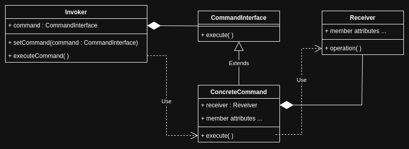
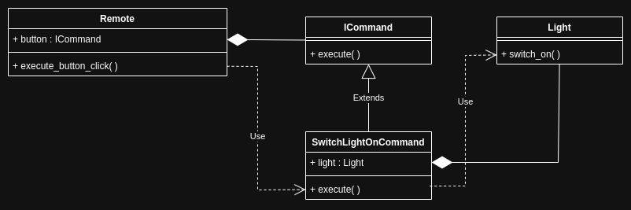
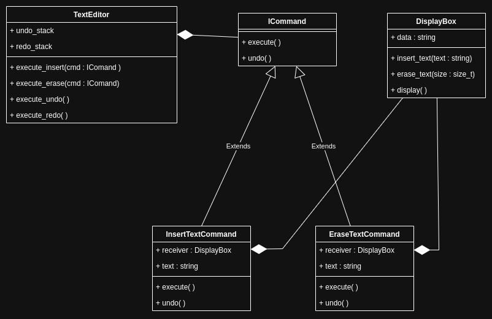

# Command Pattern

<br>
<br>

## Theory

The Command pattern encapsulates a request as an object, thereby letting you parameterize clients with different requests, queue or log requests, and support undoable operations.

- Basically the command pattern encapsulates a function invocation in an object.

<br>



<!-- TODO - update the above image, use snake case for the methods and add client object -->

<br>

### Components

1. Invoker : object that initiates the command. controller, handler, sender can be other names for the same.
1. Command : object that encapsulates the receiver's function call, thus binding a receiver to an action.
1. Receiver : object with the actual function that performs the operation, delegated from the command object.

<br>
<br>

### Applicability

1. decoupling invokers and receivers : loose coupling
1. queuing or logging requests: need to queue commands for later execution, such as a task scheduler.
1. undo redo functionality
1. parameterizing objects with operations : need to be able to dynamically select or switch between different operations at runtime, the Command pattern allows you to treat operations as objects.

<br>

### Advantages

1. facilitates a way to emulate closures (callbacks) in programming langauges that don't support real closures.

<br>

### Disadvantages

1. decrease readability and debuggability due to complexity.

<br>

### Implementations

- Needless to say the pattern can be implemented in different ways:
  - The command object can be injected in the construction of the invoker object itself, thus avoiding the need for a command setter function .

<br>
<br>

## Application 1

<br>



<br>

```cpp
#include <iostream>
#include <memory>

// receiver
class Light
{
public:
    void switch_on()
    {
        std::cout << "light switched on" << '\n';
    }
};

// command interface
class ICommand
{
public:
    virtual ~ICommand() = default;
    virtual void execute() = 0;
};

// command
class SwitchLightOnCommand : public ICommand
{
private:
    Light light;

public:
    SwitchLightOnCommand(Light l) : light{l} {}
    ~SwitchLightOnCommand() override {}
    void execute()
    {
        this->light.switch_on();
    }
};

// invoker
class Remote
{
private:
    std::shared_ptr<ICommand> button;

public:
    Remote(std::shared_ptr<ICommand> cmd) : button{cmd} {}
    ~Remote() {}
    void execute_button_click()
    {
        button->execute();
    }
};

int main()
{
    Light light_device;
    std::shared_ptr<ICommand> switch_light_on_com_obj = std::make_shared<SwitchLightOnCommand>(light_device); // shared pointer facilitates multiple remotes to control the same light
    Remote remote = Remote(switch_light_on_com_obj);

    std::string buffer;
    while (std::getline(std::cin, buffer))
    {
        int res = std::stoi(buffer);
        if (res == 1)
        {
            remote.execute_button_click();
        }
    }

    return 0;
}
```

<br>

### Components

1. Invoker : instance of `ConfigurableRemote`, it initiates the command in `execute_button_click`.

1. Command : `ICommand` and `SwitchLightOnCommand` are interface and concrete classes for command object that encapsulates the receiver's function call i.e `switch_on`, thus binding a receiver to an action.

1. Receiver : instances of `Light` containing the actual function `switch_on` that is encapsulated in command's `execute`.

<br>

Few points:

- The concrete command class `SwitchLightOnCommand` is composed of an instance of receiver `Light`. `SwitchLightOnCommand` **_has a_** `Light` object.
- The invoker `Remote` is composed of an instance of `ICommand` interface. `Remote` **_has a_** `ICommand` object.

<br>

### Applicability

The invoker `Remote` is decoupled from the receiver `Light` by the `ICommand` interface. This abstraction allows the `Remote` to trigger actions without knowing the specific implementation of those actions. Consequently, commands can be modified without changing the `Remote` class.

<br>
<br>

### Advantages

As mentioned [above](#advantages)

<br>
<br>

### Disadvantages

As mentioned [above](#disadvantages)

<br>
<br>

## Application 2

Illustration of undo redo functionality



<!-- TODO - update the above diagram, add client object, rectify the uml lines -->

<br>

```cpp
#include <iostream>
#include <memory>
#include <string>
#include <stack>

// reciever
class DisplayBox
{
public:
    std::string data; // made public for the purpose of illustration
    void insert_text(std::string text)
    {
        this->data += text;
    }
    void erase_text(size_t size)
    {
        if (this->data.size() >= size)
        {
            this->data.erase(data.size() - size, size);
        }
    }
    void display()
    {
        std::cout << this->data << '\n';
    }
};

// command interface
class ICommand
{
public:
    virtual ~ICommand() = default;
    virtual void execute() = 0;
    virtual void undo() = 0;
};

// command
class InsertTextCommand : public ICommand
{
private:
    DisplayBox &receiver;
    std::string text;

public:
    InsertTextCommand(DisplayBox &d, std::string t) : receiver{d}, text{t} {}
    void execute() override
    {
        this->receiver.insert_text(this->text);
    }
    void undo() override
    {
        this->receiver.erase_text(this->text.size());
    }
};

class EraseTextCommand : public ICommand
{
private:
    DisplayBox &receiver;
    std::string erased_text;
    size_t chars_to_delete;

public:
    EraseTextCommand(DisplayBox &d, size_t c) : receiver{d}, chars_to_delete{c} {}

    void execute() override
    {
        this->erased_text = this->receiver.data.substr(this->receiver.data.size() - chars_to_delete, chars_to_delete);
        this->receiver.erase_text(chars_to_delete);
    }

    void undo() override
    {
        this->receiver.insert_text(erased_text);
    }
};

// invoker
class TextEditor
{
private:
    std::stack<std::unique_ptr<ICommand>> undo_stack;
    std::stack<std::unique_ptr<ICommand>> redo_stack;

public:
    TextEditor() {}
    void execute_insert(std::unique_ptr<ICommand> insert_cmd)
    {
        insert_cmd->execute();
        undo_stack.push(std::move(insert_cmd));
        redo_stack = std::stack<std::unique_ptr<ICommand>>(); // clear the stack
    }

    void execute_erase(std::unique_ptr<ICommand> erase_cmd)
    {
        erase_cmd->execute();
        undo_stack.push(std::move(erase_cmd));
    }

    void execute_undo()
    {
        if (!undo_stack.empty())
        {
            std::unique_ptr<ICommand> cur = std::move(undo_stack.top());
            cur->undo();
            undo_stack.pop();
            redo_stack.push(std::move(cur));
        }
    }

    void execute_redo()
    {
        if (!redo_stack.empty())
        {
            std::unique_ptr<ICommand> cur = std::move(redo_stack.top());
            cur->execute();
            redo_stack.pop();
            undo_stack.push(std::move(cur));
        }
    }
};

// assume the following code belongs to an app containig a display box and text editor
int main()
{
    DisplayBox display_box;
    TextEditor text_editor;

    std::unique_ptr<ICommand> cmd1 = std::make_unique<InsertTextCommand>(display_box, "hello");
    text_editor.execute_insert(std::move(cmd1));
    display_box.display();

    std::unique_ptr<ICommand> cmd2 = std::make_unique<InsertTextCommand>(display_box, "-word");
    text_editor.execute_insert(std::move(cmd2));
    display_box.display();

    std::unique_ptr<ICommand> cmd3 = std::make_unique<InsertTextCommand>(display_box, "-bye");
    text_editor.execute_insert(std::move(cmd3));
    display_box.display();

    text_editor.execute_undo();
    display_box.display();
    text_editor.execute_undo();
    display_box.display();
    text_editor.execute_undo();
    display_box.display();

    text_editor.execute_redo();
    display_box.display();
    text_editor.execute_redo();
    display_box.display();
    text_editor.execute_redo();
    display_box.display();

    std::cout << '\n'
              << "illustration of erase commands : " << '\n';
    auto cmd4 = std::make_unique<EraseTextCommand>(display_box, 4);
    text_editor.execute_erase(std::move(cmd4));
    display_box.display();
    auto cmd5 = std::make_unique<EraseTextCommand>(display_box, 5);
    text_editor.execute_erase(std::move(cmd5));
    display_box.display();

    text_editor.execute_undo();
    display_box.display();
    text_editor.execute_redo();
    display_box.display();
}

/*
hello
hello-word
hello-word-bye
hello-word
hello

hello
hello-word
hello-word-bye

illustration of erase commands :
hello-word
hello
hello-word
hello

*/
```

<br>

### Components

1. Invoker : Instance of `TextEditor`, it initiates the commands in `execute_insert`, `execute_erase`, `execute_undo` and `execute_redo`.

1. Command : `ICommand` is the interface, `InsertTextCommand` and `EraseTextCommand` are concrete classes that encapsulates the receiver's function call i.e `insert_text` and `erase_text`, thus binding a receiver to an action.

1. Receiver : instances of `DisplayBox` containing the actual function `insert_text` and `erase_text`.

<br>

Few points:

- Notice that the command classes donot have a redo funcion, they have only execute and undo.
- The invoker has the redo function and also stores a sequence of command objects.
- Understand the usage of stack in the context of undo and redo, notice we need two stacks.
- The illustration will work without the second concrete class i.e. `EraseTextCommand`, it is not mandatory to have it and is not a criteria for undo redo functionality!

<br>

### Applicability

Undo and redo functionality is seamelesly acheived.

<br>
<br>

### Advantages

As mentioned [above](#advantages)

<br>
<br>

### Disadvantages

As mentioned [above](#disadvantages)

<br>
<br>
