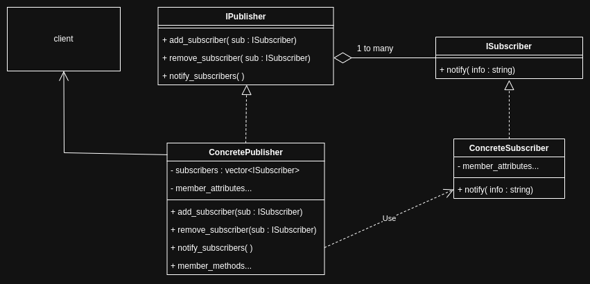
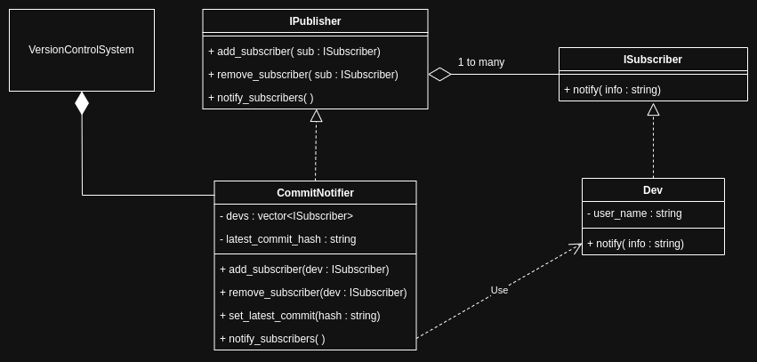

# Observer pattern

<br>
<br>

## Theory

Observer pattern defines a one-to-many dependency between publisher and subscribers so that all the dependant subscribers are notified (optionally updated automatically) when the publisher changes state.

- Also known as dependants, publish-subscribe architecture.

<br>



<br>

### Components

1. Publisher : Component being observed by a list of subscriber objects for change in state.

   - Also known as subject.
   - Implemented via an interface.
   - Generally there is one instance of a concrete publisher class.

1. Subscriber : Component that observes the publisher for change in state.

   - Also known as observer.
   - Implemented via an interface.
   - generally there are many instances of a concrete subscriber class.

1. Client : client is associated with the publisher and subscriber objects.

<br>

### Applicability

1. Change in one component should trigger changes(same or/and unique) in dependant objects.
1. Event driven systems.
1. Broadcast systems.
1. Notifier systems.

<br>

### Advantages

1. Loose [coupling](..//../object-oriented-programming/principles.md#coupling) between publisher and subsciber objects.

1. Adhere to [open-close principle](../../object-oriented-programming/principles.md#open-close-principle).

1. Subscribers can react to publisher's changes differently.

<br>

### Disadvantages

1. Possibility of unpredictable updates in cases where the order of updates are crucial.
1. Subscriber objects may not have knowledge of each other.
1. "push vd pull" dilema, design considration has to be made wether the publisher should push the information to the subscribers or the subscriber's should pull information from the publisher.

<br>

### Implementations

- Push design : In this implementation, the publisher notifies all the subscribers when a change occurs.

- Pull design : Implementaion where the subscriber would query for the state of the publisher and perform some logic.

  - The publisher would have something like `get_state` method and the subscriber's can call it, given they have access to the publisher instance.
  - Nice example is a message system (a subscriber class) that sends messages on a daily basis to people based on the date's by querying a database (publisher). An entry in the database will not trigger broadcast.

- For the purpose of illustration, the interface ISubscriber's notify() takes a simple string, in actual implementation we can either pass the actual publisher object via the interface or have another seperate interface for Information.

<br>
<br>

## Application



<br>

```cpp
#include <iostream>
#include <vector>
#include <string>
#include <memory>
#include <algorithm>

class ISubscriber
{
public:
    virtual ~ISubscriber() = default;
    virtual void notify(std::string info) = 0;
};

class Dev : public ISubscriber
{
private:
    std::string user_name;

public:
    Dev(std::string n) : user_name{n} {}
    void notify(std::string hash) override
    {
        std::cout << "Hello, " << this->user_name << ". A new commit with hash " << hash << " is pushed to the branch" << '\n';
    }
};

class IPublisher
{
public:
    virtual ~IPublisher() = default;
    virtual void add_subscriber(std::shared_ptr<ISubscriber> sub) = 0;
    virtual void remove_subscriber(std::shared_ptr<ISubscriber> sub) = 0;
    virtual void notify_subscribers() = 0;
};

class CommitNotifier : public IPublisher
{
private:
    std::vector<std::shared_ptr<ISubscriber>> devs;
    std::string latest_commit_hash;

public:
    void add_subscriber(std::shared_ptr<ISubscriber> dev) override
    {
        auto find = std::find(devs.begin(), devs.end(), dev);
        if (find == devs.end())
        {
            devs.push_back(dev);
        }
    }
    void remove_subscriber(std::shared_ptr<ISubscriber> dev) override
    {
        auto find = std::find(devs.begin(), devs.end(), dev);
        if (find != devs.end())
        {
            devs.erase(find);
        }
    }
    void set_latest_commit(std::string hash)
    {
        this->latest_commit_hash = hash;
    }
    void notify_subscribers() override
    {
        for (const auto &dev : devs)
        {
            dev->notify(this->latest_commit_hash);
        }
    }
};

//assume the following is a larger version controlsystem which owns the CommitNotifier and has subscribers.
int main()
{
    CommitNotifier commit_notifier_system;
    auto dev1 = std::make_shared<Dev>("lazy_guy");
    auto dev2 = std::make_shared<Dev>("tactical_mike");
    commit_notifier_system.add_subscriber(dev1);
    commit_notifier_system.add_subscriber(dev2);
    std::string c1 = "1adfdafdafdaf"; // assume this is got from an api or something
    commit_notifier_system.set_latest_commit(c1);
    commit_notifier_system.notify_subscribers();
    auto dev3 = std::make_shared<Dev>("coding_machine");
    commit_notifier_system.add_subscriber(dev3);
    commit_notifier_system.remove_subscriber(dev1);
    std::string c2 = "2adfdafdafdaf"; // assume this is got from an api or something
    commit_notifier_system.set_latest_commit(c2);
    commit_notifier_system.notify_subscribers();
}

/*
Hello, lazy_guy. A new commit with hash 1adfdafdafdaf is pushed to the branch
Hello, tactical_mike. A new commit with hash 1adfdafdafdaf is pushed to the branch
Hello, tactical_mike. A new commit with hash 2adfdafdafdaf is pushed to the branch
Hello, coding_machine. A new commit with hash 2adfdafdafdaf is pushed to the branch
*/
```

<br>

### Components

1. Psublisher : `CommitNotifier`, component being observed by a list of subscribers for change in state.

   - Also known as subject.
   - Implemented via an interface `IPublisher`.
   - Generally there is one instance of `CommitNotifier`.

1. Subscriber : `Dev`, component that observes the publisher for change in state.

   - Also known as observer.
   - Implemented via an interface `ISubscriber`.
   - Generally there are many instances of a `Dev`.

1. Client : client is associated with the publisher and subscribers.

   - A VCS sustem has a commit notification subsystem, where the subscribed devs get notified about the latest commit that was pushed to the branch. Illustrated in `main`.

<br>

### Applicability

See [above](#applicability).

<br>

### Advantages

1. Loose [coupling](..//../object-oriented-programming/principles.md#coupling) between publisher and subscribers.

   - Publisher `CommitNotifier` and subscribers of type `Dev` are mostly independant of each other, they interact via the interface's `notify`method.

1. Adhere to [open-close principle](../../object-oriented-programming/principles.md#open-close-principle).

   - The design is open to extension without modifying existing code. The client can have another publisher system "Build Notifer" also adhereing to IPublisher interface where it's notify_subscribers method will send information to "QA" which adheres to Isubscriber interface.

1. Subscribers can react to publisher's changes differently.

   - Different subscriber classes can have different implementations of what to do when publisher broadcasts information.

<br>

### Disadvantages

1. Possibility of unpredictable updates in cases where the order of updates are crucial.

   - The updates are sent in the order of thier place in the vector. However, this can be a solved by implementing priority and injecting it to the subscriber objects. There could be other issues related.

1. Observers might not have knowledge of each other.

   - Inherently observers are completely independant. While implementation can be done in such a way that the subscriber objects have instance of the publisher, potentially having access to the publisher's list of subscribers?

1. "push vd pull" dilema, design considration has to be made wether the publisher should push the information to the observers or the observers should pull information from the publisher.

   - This is design consideration.

<br>
<br>
