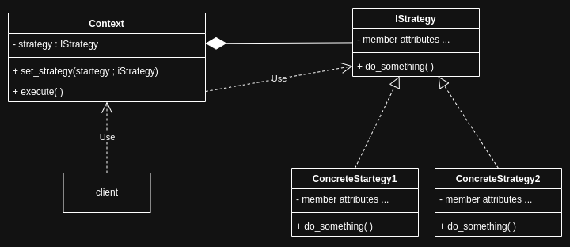
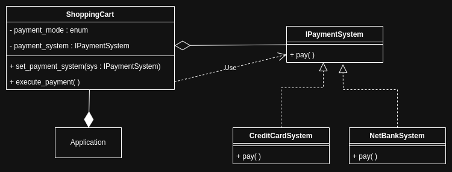

# strategy pattern

<br>
<br>

## theory

the strategy patterm encapsulates a family of interchangable startegies(algorithms) and facilitates the client to select one at runtime.

<br>



<br>

### components

1. context : the component that holds the reference to the selected strategy and logic to execute it.
1. strategy interface : the interface for the family of strategies.
1. concrete strategy : the component containing specific algorithm.
1. client : component that chooses the specific concrete strategy and uses the context to execute it.

<br>
<br>

### applicability

1. choosing a strategy from a family of strategies at runtime.

<br>
<br>

### advantages

1. flexibilty to chose a particular strategy at runtime.
1. facilitates open-close principle (open to extension, close for modification).
1. isolation of implementation of strategy.
1. decoupling of client and strategy code. see [decoupling](../../object-oriented-programming/principles.md#decoupling)

<br>
<br>

### disadvantages

1. client and strategies are not completely decoupled, as the client needs to be aware of the different strategies available to choose the appropriate one.

<br>
<br>

## application

<br>



<br>

```cpp
#include <iostream>
#include <memory>

// interface for strategy
class IPaymentSystem
{
public:
    virtual ~IPaymentSystem() = default;
    virtual void pay() = 0;
};

// concrete strategy
class NetBankSystem : public IPaymentSystem
{
public:
    NetBankSystem() {}
    ~NetBankSystem() override {}
    void pay() override
    {
        std::cout << "simulate payment done using netbank" << '\n';
    }
};

// concrete strategy
class CreditCardSystem : public IPaymentSystem
{
public:
    CreditCardSystem() {}
    ~CreditCardSystem() override {}
    void pay() override
    {
        std::cout << "simulate payment done using credit card" << '\n';
    }
};

// context
class ShoppingCart
{
private:
    std::shared_ptr<IPaymentSystem> payment_processor;

public:
    enum PAYMENT_MODE
    {
        CREDIT_CARD,
        NETBANK
    };
    ShoppingCart()
    {
    }
    ~ShoppingCart() {}
    void set_payment_system(std::shared_ptr<IPaymentSystem> service)
    {
        this->payment_processor = service;
    }
    void execute_payment()
    {
        this->payment_processor->pay();
    }
};

// client, assume this to be an app which "owns a" shoping cart object
int main()
{
    ShoppingCart cart;
    std::cout << "Type 0 for credit card and 1 for netbank" << "\n";
    int mode{};
    std::cin >> mode;
    std::shared_ptr<IPaymentSystem> processor;
    if (ShoppingCart::CREDIT_CARD == mode)
    {
        processor = std::make_shared<CreditCardSystem>();
    }
    else if (ShoppingCart::NETBANK == mode)
    {
        processor = std::make_shared<NetBankSystem>();
    }
    processor->pay();
}
```

<br>

<br>

### components

the family of strategies represents the family of payment systems.

1. strategy interface : the interface for the family of strategies.

   - `IPaymentSystem`is the interface for the family of payment systems.

1. concrete strategy : the component containing specific algorithm.

   - `NetBankSystem` and `CreditCardSystem`.

1. context : the component that holds the reference to the selected strategy and logic to execute it.

   - `ShoppingCart` class has a the `payment_processor`, a referance to a payment system via the `IPaymentSystem` interface and `execute_payment` to execute the payment system's `pay` method.

1. client : component that chooses the specific concrete strategy and uses the context to execute it.

   - `main` function selects the appropriate concrete strategy and uses `ShoppingCart` to `execute_payment`.

<br>
<br>

### applicability

1. choosing a strategy from a family of strategies at runtime.

<br>
<br>

### advantages

1.  flexibilty to chose a particular strategy at runtime.

    - the payment system can be chosen by the user at run time.

1.  facilitates open-close principle (open to extension, close for modification).

    - a new payment system can be added to the system without modifying the existing code.

1.  isolation of implementation of strategy.

    - neither the context nor the client knows about the implementation details of the strategies.

1.  decoupling of client and strategy code. see [decoupling](../../object-oriented-programming/principles.md#decoupling)

    - client is independant from the implementation of the strategies and interacts with it using the interface's `pay` method via context's `execute_payment` method.
    - client and strategies are not completely decoupled. see [below](#disadvantages-1)

<br>
<br>

### disadvantages

1. client needs to be aware of the different strategies available and about choosing the appropriate one.

   - in this particular implementation of the system, it is appropriate for `ShoppingCart` to have an instance of `IPaymentSystem` and hence it contains the enum `PAYMENT_MODE`.
   - nevertheless, client is dependant on the information regarding the number of available payment systems.

<br>
<br>
