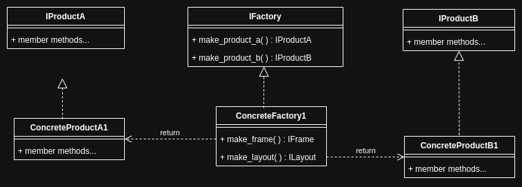
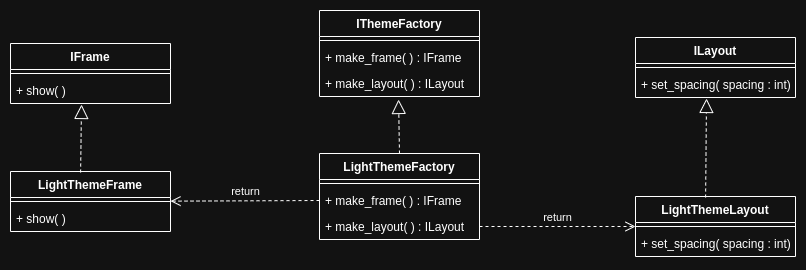
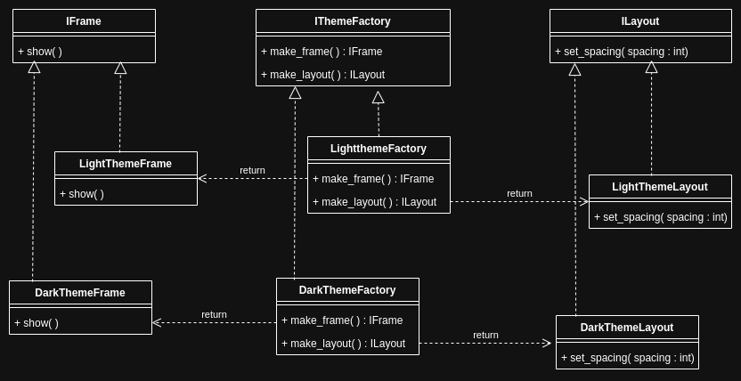

# Abstract Factory Pattern

<br>
<br>

## Theory

The Abstract factory design pattern is a creational pattern that helps creation of families of related objects without specifying their concrete classes.

<br>



<br>

### Components

1. Product : The component created by the factory.

   - Implemented via an interface.
   - Product is a part of a family that have something in common.
   - There are multiple products in a family and there may exist multiple families.

1. Factory : The component that creates a family of related products.

   - Implemented via an interface.
   - Concrete factorties "make" products for the specific family it represents.

1. Client : client is uses with the factory. The relationship could be [association](../../object-oriented-programming/object-relationships.md#association), [aggregation](../../object-oriented-programming/object-relationships.md#aggregation) or [composition](../../object-oriented-programming/object-relationships.md#composition).

<br>

### Applicability

1. Creation of "families of related product that work together".

2. This pattern is helpful in usecases where client is independent of how its products are created, composed, and represented.

<br>

### Advantages

1. Abstraction of implementation of products.

1. Adheres to [open-close principle](../../object-oriented-programming/principles.md#open-close-principle) in the context of addition of a new family, containing the same kind and number of products.

<br>

### Disadvantages

1. Violates [open-close principle](../../object-oriented-programming/principles.md#open-close-principle) in the context of addition of a new product.

   - For this usecase, [builder pattern](./builder.md) would be better choice.

1. Decreased readability and debuggability due to complexity.

<br>
<br>

## Application



<br>

```cpp
#include <iostream>
#include <memory>


//interface of a product
class IFrame
{
public:
    virtual ~IFrame() = default;
    virtual void show() = 0;
};


//concrete product
class LightThemeFrame : public IFrame
{
public:
    ~LightThemeFrame() {}
    void show() override
    {
        std::cout << "light theme frame shown" << '\n';
    }
};


//interface of a product
class ILayout
{
public:
    virtual ~ILayout() = default;
    virtual void set_spacing(int) = 0;
};

//concrete product
class LightThemeLayout : public ILayout
{
public:
    ~LightThemeLayout() {}
    void set_spacing(int spacing) override
    {
        std::cout << "Space of " << spacing << " is set on light themed layout." << '\n';
    }
};

//interface of the factory
class IThemeFactory
{
public:
    virtual ~IThemeFactory() = default;
    virtual std::shared_ptr<IFrame> make_frame() = 0;
    virtual std::shared_ptr<ILayout> make_layout() = 0;
};


//concrete factory
class LightThemeFactory : public IThemeFactory
{
public:
    ~LightThemeFactory() {}
    std::shared_ptr<IFrame> make_frame() override
    {
        return std::make_shared<LightThemeFrame>();
    }
    std::shared_ptr<ILayout> make_layout() override
    {
        return std::make_shared<LightThemeLayout>();
    }
};

//client
int main()
{
    std::unique_ptr<IThemeFactory> factory = std::make_unique<LightThemeFactory>();
    std::shared_ptr<IFrame> frame = factory->make_frame();
    std::shared_ptr<ILayout> layout = factory->make_layout();
    layout->set_spacing(10);
    frame->show();
}

//Space of 10 is set on light themed layout
//light theme frame shown
```

<br>

### Components

1. Product : The component created by the factory, `LightThemeFrame` and `LightThemeLayout`.

   - Implemented via an interfaces `IFrame` and `ILayout`.
   - Product is a part of a family that have something in common, "LightTheme" in this example.
   - There are multiple products in a family and there may exist multiple families, there could be another family like "DarkTheme".

1. Factory : The component that creates a family of related products, `LightThemeFactory`.

   - Implemented via an interface, `IThemeFactory`.
   - Concrete factorties "make" products for the specific family it represents.

1. Client : client is uses with the factory. The relationship could be [association](../../object-oriented-programming/object-relationships.md#association), [aggregation](../../object-oriented-programming/object-relationships.md#aggregation) or [composition](../../object-oriented-programming/object-relationships.md#composition).

<br>

### Applicability

1. Creation of "families of related product that work together".

   - In this illlustration, products of different families can be created based on the theme.

2. This pattern is helpful in usecases where client is independent of how its products are created, composed, and represented.

   - Another way of saying this: Client is isolated from the type of porducts created.

   - Client code doesn't contain any references to concrete classes, it contains the interface classes in the type definitions and just calls the _"make"_ methods of the factory object. Hence doesn't know how the product is created, composed or represented.

<br>

### Advantages

1. Abstraction of implementation of products.

   - The concrete implmentations are abstracted from the client code.

1. Adheres to [open-close principle](../../object-oriented-programming/principles.md#open-close-principle) in the context of addition of a new family, containing the same kind and number of products.

   - A new family can be added by creating a new concrete factory class and using it in the client.

   

<br>

### Disadvantages

1. Violates [open-close principle](../../object-oriented-programming/principles.md#open-close-principle) in the context of addition of a new product.

   - If a new product is the be added, then the interface of the factory must be modified to include a "make" method for the new product, which will break exisiting code.

1. Decreased readability and debuggability due to complexity.
   - Lot of classes are created and might lead to lot of inheritance.
