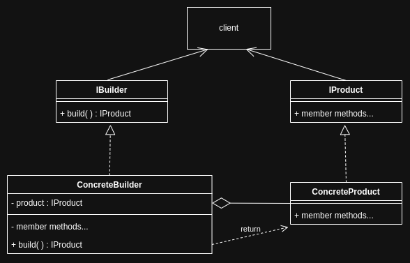
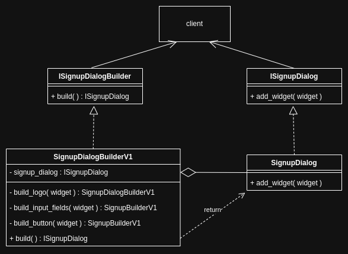

# Builder

<br>
<br>

## Theory

The Builder design pattern is a creational pattern that helps creation of a complex object without specifying the construction process explicitely.

<br>



<br>

### Components

1. Product : Product is the complex object being built.

   - Implemented via an interface.
   - Often it has many parts or configurations.

1. Builder : The builder is the component that "builds" a specific version of product.

   - Implemented via an interface.

1. Director : The director is an optional component orchestrating the construction process.

   - It uses the builder and orchestrates the build process.

1. Client : Client uses the builder (and director, if available) to build the product.

<br>

### Advantages

1. Seperation of concers.
1. Facilitate [abstraction](../../object-oriented-programming/oops.md#abstraction).
1. Flexibility to modify the logic of the construction steps aswell as modify the actual construction steps (extend or elminate the construction steps), adhereing to [open-close principle](../../object-oriented-programming/principles.md#open-close-principle).

<br>

### Disadvantages

1. Adds more complexity.

   - Thus decreases readability.
   - Thus decreases debuggability.

1. Requires careful planning.

<br>
<br>

## Building complex objects with extensible construction process

<br>



<br>

```cpp
#include <iostream>
#include <memory>

//interface for product
class ISignupDialog {
public:
    virtual ~ISignupDialog() = default;
    virtual void add_widget(std::string widget) = 0; //using string parameter type just for illustration
    //contains generalised api's
};

//concrete product
class SignupDialog : public ISignupDialog{
public:
    ~SignupDialog() {}
    void add_widget(std::string widget){
        //logic to add widget
    }
};

//interface for builder
class ISignupDialogBuilder{
public:
    virtual ~ISignupDialogBuilder() = default;
    virtual std::unique_ptr<ISignupDialog> build() = 0;
};

//concrete builder
class SignupDialogBuilderV1 : public ISignupDialogBuilder{
private:
    std::unique_ptr<ISignupDialog> signup_dialog;
public:
    SignupDialogBuilderV1* build_logo(std::string logo){
        signup_dialog->add_widget(logo);
        return this;
    }
    SignupDialogBuilderV1*  build_input_fields(std::string input_fields){
        signup_dialog->add_widget(input_fields);
        return this;
    }
    SignupDialogBuilderV1*  build_button(std::string button){
        signup_dialog->add_widget(button);
        return this;
    }
    std::unique_ptr<ISignupDialog> build(){
        //create the product
        signup_dialog = std::make_unique<SignupDialog>();

        //build it
        this->build_logo("simple logo")
            ->build_input_fields("username and password")
            ->build_button("Sign UP");

        //return it
        return std::move(signup_dialog);
    }
};

//client
int main(){
    std::unique_ptr<ISignupDialogBuilder> builder = std::make_unique<SignupDialogBuilderV1>();
    std::unique_ptr<ISignupDialog> dialog = builder->build();
}
```

<br>

### Components

1. Product : Product is the complex object being built, `SignupDialog`.

   - Implemented via an interface, `ISignupDialog`.
   - Often it has many parts or configurations.

1. Builder : The builder is the component that "builds" a specific version of product `SignupDialogBuilderV1`.

   - Implemented via an interface, `ISignupDialogBuilder`.

1. Client : Client uses the builder (and director, if available) to build the product, code in `main`.

<br>

- Few crucial details about the implementation to achieve [extensible construction](#advantages-2),

  - The product interface `ISignupDialog` must have generic methods like `add_widget` which can be used to add any widget type instead of specific methods like `add_label`!
  - The builder interface has only `build` method as the pure virtual function and not each step of constructon!

- The steps of the construction are implemented as methods in the concrete builder classes, they return pointer to itself. This facilitates chaining of methods.

<br>

### Advantages

1. Seperation of concers.

   - The construction logic and product representation (implementation)

1. Facilitate [abstraction](../../object-oriented-programming/oops.md#abstraction).

   - Only the `build` method is exposed to the client, all the complex logic is abstracted.

1. Flexibility to modify the logic of the construction steps aswell as modify the actual construction steps (extend or elminate the construction steps), adhereing to [open-close principle](../../object-oriented-programming/principles.md#open-close-principle).

   - Modifying the logic present is possible regardless by creating a new concrete builder. Further, it facilitates the modification of the construction steps itself! We can add or eliminate steps as they are not virtual functions. The only virtual function that needs to be written in the `build` method. A new method say `build_check_box` can be added in a new concrete builder without modifing the interface.

<br>

### Disadvantages

1. Adds more complexity.

   - Thus decreases readability.
   - Thus decreases debuggability.

1. Requires careful planning.

<br>
<br>

## Builder vs Abstract Factory

Builder and abstract factory are thought to be same because of the following assumptions :

1. Abstract factory creates family of related products and assuming the family as a complex object.
1. Builder builds a complex object and assuming that that complex object as a family.

<br>

However, the clear differances are listed :

| Abstract Factory                                                                                                                                                                                                                                        | Builder                                                                                                                                                                                                                                                                                                                                                |
| ------------------------------------------------------------------------------------------------------------------------------------------------------------------------------------------------------------------------------------------------------- | ------------------------------------------------------------------------------------------------------------------------------------------------------------------------------------------------------------------------------------------------------------------------------------------------------------------------------------------------------ |
| Abstract factory must be used to create families of related objects. The family has a common theme to it and the objects are related to each other due to this common theme and not just a different versions of the objects unlike in builder pattern. | Builder must be used to create a complex object without specifying the construction process explicitely. Different builders build different versions of the complex object or build the complex object is differnt ways, However the components of the complex objects might not be related or have a common theme unike the abstract factory pattern. |
| The abstract factory implementations generally "make" related objects and they return them individually.                                                                                                                                                | The builder implementations generatlly "build" the entire complex object and return the final result.                                                                                                                                                                                                                                                  |
| Doesn't facilitate extension of products, new products can't be added                                                                                                                                                                                   | Facilitates extension of the construction process                                                                                                                                                                                                                                                                                                      |
| Example : GUIFactory is used to "make" a fixed number of related products adhereing to a GUI family. Concrete factories look like LightThemeWidgetFactory and DarkThemeWidgetFactory, the number of products in both are same.                          | Example : GUIBuilder is used to "build" a complex GUI in different ways. Concrete builders look like SignupUIBuilderV1 and SignupUIBuilderV2, the number of products in these can be different.                                                                                                                                                        |
