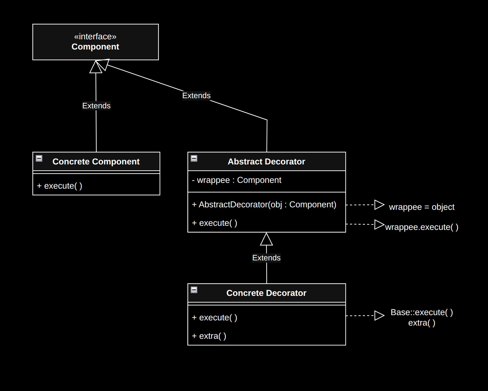
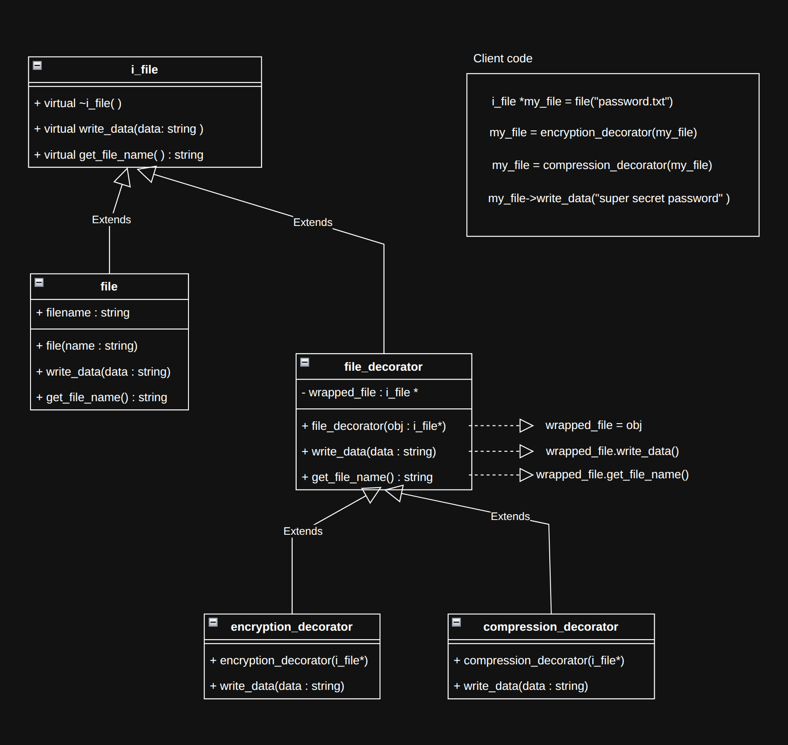

# Decorator pattern

The Decorator design pattern is a structural pattern that dynamically adds new behaviors to an object by wrapping it, without altering its original class or affecting other instances.

<br>
<br>
<br>

## Components

1. Component interface: Defines the common interface for both the basic objects and the decorators so they can be used interchangeably.

1. Concrete component : The original, basic class that provides the core functionality before any extra "decorations".

1. Abstract decorator : An abstract class that implements the "Component" interface and contains a reference to a wrapped "Component" object ([aggregation](../../object-oriented-programming/object-relationships.md#aggregation)).

1. Concrete decorator : The specific classes that override the component methods to add extra behaviours to the wrapped object.

<br>

- The component diagram is as follows:

  

<br>
<br>
<br>

## Implementation

<br>
<br>
<br>

## Applicability

<br>
<br>

### Avoid class explosion

- Class explosion is a software design anti-pattern where an excessive number of classes are created to handle every variation of an object, leading to complex, hard-to-maintain code.
  - This commmonly results from over-using inheritance.

- Use Decorator pattern to "flatten" the hierarchy into individual, stackable components.

* Example illustration : There is no need to create "EncryptedFile", "CompressedFile" or "EncryptedCompressedFile" classes inheriting from `File` class instead behaviours can be stacked.

  ```cpp
  #include <iostream>
  #include <string>
  #include <memory>

  // Component interface
  class i_file{
  public:
      virtual ~i_file() = default;
      virtual void write_data(std::string data) = 0;
      virtual std::string get_file_name() = 0;
  };

  // Concrete component
  class file: public i_file{
  public:
      std::string filename;
      file(std::string name) : filename(name){}
      void write_data(std::string data) override {
          std::cout << "Writing " << data << " to " << filename << "\n";
      }
      std::string get_file_name() override {
          return filename;
      }
  };

  // Abstract decortor
  class file_decorator: public i_file{
  protected:
      std::shared_ptr<i_file> wrapped_file;
  public:
      file_decorator(std::shared_ptr<i_file> object) : wrapped_file(std::move(object)){}
      void write_data(std::string data) override {
          wrapped_file->write_data(data);
      }
      std::string get_file_name() override {
          return wrapped_file->get_file_name();
      }
  };

  //Concrete decorators
  class encryption_decorator: public file_decorator{
  public:
      encryption_decorator(std::shared_ptr<i_file> object) : file_decorator(std::move(object)){};
      void write_data(std::string data) override {
          wrapped_file->write_data(data);
          std::cout << "Encrypting " << wrapped_file->get_file_name() << "\n";
      }
  };

  class compression_decorator : public file_decorator
  {
  public:
      compression_decorator(std::shared_ptr<i_file> object) : file_decorator(std::move(object)){}
      void write_data(std::string data) override {
          wrapped_file->write_data(data);
          std::cout << "Compressing " << wrapped_file->get_file_name() << "\n";
      }
  };

  //Client code
  int main() {
      std::shared_ptr<i_file> my_file = std::make_shared<file>("password.txt");
      my_file = std::make_shared<encryption_decorator>(std::move(my_file));
      my_file = std::make_shared<compression_decorator>(std::move(my_file));
      my_file->write_data("super secret password");
      return 0;
  }
  //Writing super secret password to password.txt
  //Encrypting password.txt
  //Compressing password.txt
  ```

- The class diagrams is as shown here.

  

<br>
<br>

### Temporary behaviour

- When an object needs a special behaviour for a short time and then needs to go back to being "normal".

* This is done by wrapping it for the process and then discard the decorator when the process finishes.
* Example illustration : A game object equips a momentary boost and becomes "Indestructable" only for a short duration.

  ```cpp
  #include <iostream>
  #include <memory>
  #include <string>
  #include <chrono>
  #include <thread>

  // Component interface
  class i_game_object {
  public:
      virtual ~i_game_object() = default;
      virtual void take_damage(int amount) = 0;
      virtual int get_health() = 0;
  };

  // Concrete component
  class player : public i_game_object{
  int health = 100;
  public:
      player(){}
      void take_damage(int damage) override{
          health -= damage;
      }
      int get_health() override{
          return health;
      }
  };

  //Abstract decorator
  class game_object_decorator : public i_game_object{
  private:
      std::shared_ptr<i_game_object> wrapped_game_object;
  public:
      game_object_decorator(std::shared_ptr<i_game_object> object) : wrapped_game_object(std::move(object)){}

      void take_damage(int damage) override {
          wrapped_game_object->take_damage(damage);
      }

      int get_health() override{
          return wrapped_game_object->get_health();
      }

      std::shared_ptr<i_game_object> unwrap(){
          return wrapped_game_object;
      }
  };

  // Concrete decorators
  class indestructable_decorator : public game_object_decorator{
  private:
      int duration = 3000;
      std::chrono::steady_clock::time_point expiry;
  public:
      indestructable_decorator(std::shared_ptr<i_game_object> object) : game_object_decorator(std::move(object)){
          expiry = std::chrono::steady_clock::now() + std::chrono::milliseconds(duration);
      }

      void take_damage(int damage)override{
          std::cout << "No damage taken, player is indestructable" << '\n';
      }

      bool is_expired() {
          return std::chrono::steady_clock::now() > expiry;
      }
  };


  // Client code
  int main(){
      std::shared_ptr<i_game_object> main_character = std::make_shared<player>();
      std::cout << main_character->get_health() << '\n';
      main_character->take_damage(10);
      std::cout << main_character->get_health() << '\n';

      main_character = std::make_shared<indestructable_decorator>(main_character);
      main_character->take_damage(50); //causes no damage

      std::this_thread::sleep_for(std::chrono::seconds(4));

      auto inv = std::dynamic_pointer_cast<indestructable_decorator>(main_character);
      if(inv && inv->is_expired()){
          main_character = inv->unwrap();
      }
      main_character->take_damage(10); //damage works again
      std::cout << main_character->get_health() << '\n';
      return 0;
  }

  //100
  //90
  //No damage taken, player is indestructable
  //80
  ```

<br>
<br>

### Object specific behaviour

- Use this when a specific objects needs special behaviour out of lot of instances.
  - Example : A game object who picks up a "Power Shield" needs the `ShieldDecorator`. Every other player remains a `BasicPlayer`. The code will be similar to the [above](#temporary-behaviour).

<br>
<br>
<br>

## Advantages

- Dynamic responsibility allocation : facilitates the specific behaviours to be added at run time.

- Adhares to [open-close principal](../../object-oriented-programming/principles.md#open-close-principle).

<br>
<br>
<br>

## Disadvantages

- Generally ends up with large number of small objects.

- Complex configuration ("The onion problem") : Can end up in code like

  ```cpp
  auto myCoffee = new Sugar(new Milk(new Cinnamon(new SimpleCoffee())));
  ```

- Difficult debugging : Run time debugging, stepping through the call stack needed.
