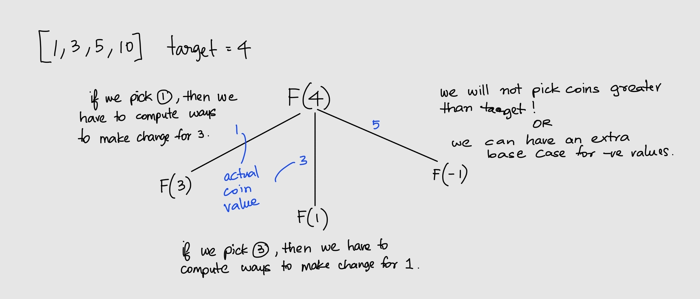
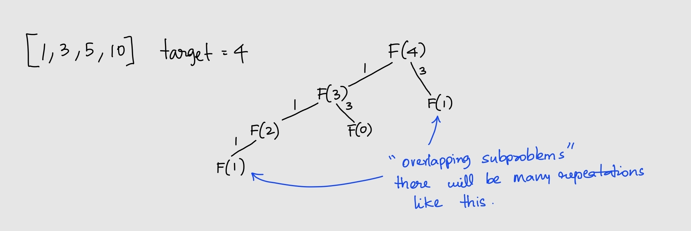

# Dynamic programming

<br>
<br>
<br>

## Optimal substrucutre

<br>
<br>
<br>

## Overlapping subproblems

Overlapping Subproblems means that when solving the problem recursively, we end up computing the same subproblem multiple times.

<br>
<br>
<br>

## Framework for DP

1. Define the Objective Function.
1. Write down the base cases, for which computer is not required.
1. Try to come up with the Recurrance Relation or the Transfer Function.

<br>
<br>
<br>

## Concept Grilling

Understanding different versions of coin change problem.

<br>
<br>

### Number of permutations to make change

- Permutation is the method of selecting items from a set where order is important. Checkout math notes for example.
- Illustration: Given the denominations in terms of coins, [1,3,5,10], The number of permutations to make change of 4 is 3. Specifically (1,1,1,1),(1,3),(3,1).
- Using our framework:
  1. The base case is F(0) = 1, There is 1 way to make change for 0, i.e. by choosing no coins.
  2. Solving couple more base cases like this, for example F(4), we can either choose 1 and then we need to compute the number of ways to make change for 3 i.e. F(3) or we can choose 3 and then compute F(1). Thus, F(n) = F(n-1) + F(n-3) + F(n-5) + F(n-10). In general, F(n) = sum(F(n-j)) where j is the items in coins.
  - 

  - 

<br>

#### Using Recursion

```py
def makeChange(target, coins):
    def dfs(cursum):
        if cursum == 0:
            return 1
        num_ways = 0
        for coin in coins:
            if cursum >= coin:
                num_ways += dfs(cursum - coin)
        return num_ways

    return dfs(target)


coins = [1,3,5,10]
target = 4
print(makeChange(target, coins))
#3
```

- This is a Top Down Approach as we start from the given target.

<br>

#### Using Recursion with Memoization

- Avoiding recalculation for overlapping (repeating) subproblems using cache.

  ```py
  def makeChange(target, coins):
      cache = {}
      def dfs(cursum):
          if cursum == 0:
              return 1
          if cursum in cache:
              return cache[cursum]
          num_ways = 0
          for coin in coins:
              if cursum >= coin:
                  num_ways += dfs(cursum - coin)
          cache[cursum] = num_ways
          return num_ways

      return dfs(target)


  coins = [1,3,5,10]
  target = 4
  print(makeChange(target, coins))
  #3
  ```

<br>

#### Using Dynamic Programming

- This is a Bottom up Approach.

  ```py
  def makeChange(target, coins):
      dp = [0 for amount in range(target+1)]
      dp[0] = 1 #There is one way of making change for 0 that is by choosing no coins

      for amount in range(1, target+1):
          for coin in coins:
              if amount >= coin:
                  dp[amount] += dp[amount-coin]
      return dp[target]


  coins = [1,3,5,10]
  target = 4
  print(makeChange(target, coins))
  #3
  ```

<br>
<br>

### Number of combinations to make change

- Combinations is the method of selecting items from a set where order is not important. Checkout math notes for example.
- Illustration: Given the denominations in terms of coins, [1,3,5,10], The number of permutations to make change of 4 is 3. Specifically (1,1,1,1),(1,3).

```py
def makeChange(target, coins):
    def dfs(cursum, index):
        if cursum == 0:
            return 1
        num_ways = 0
        for c in range(index,-1,-1):
            if cursum>=coins[c]:
                num_ways += dfs(cursum-coins[c],c)
        return num_ways

    return dfs(target, len(coins)-1)


coins = [1, 2, 3, 5]
target = 75
print(makeChange(target, coins))
```
