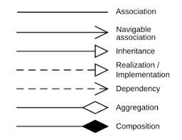

# object relationships

 
 

## association

A relationship where objects are connected but exist independently.

 
 

## aggregation

A "has-a" relationship where one object contains references to other independent objects.

 
 

## composition

A strong "owns-a" relationship where contained objects cannot exist without the container

 
 

## differences

| feature               | association   | aggregation                                               | composition                                             |
| --------------------- | ------------- | --------------------------------------------------------- | ------------------------------------------------------- |
| lifetime dependancy   | no dependancy | container and contained object have independant lifetimes | contained object is destroyed when the container ceases |
| relationship strength | weakest       | medium                                                    | strongest                                               |
| relationship type     | "knows about" | "has a"                                                   | "owns a"                                                |
| uml notation          | simple line   | line with hollow diamond                                  | line with filled diamond                                |

- uml for illustrating relationshis

  
